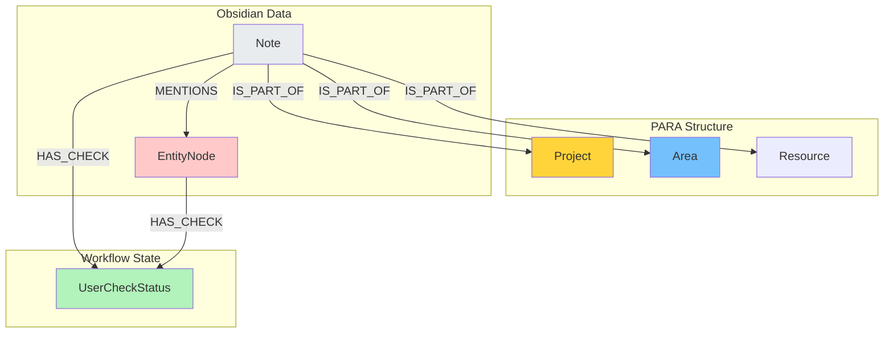

Вот полностью переработанный документ `03_GRAPH_SCHEMA.md`.

Он отражает:
1.  **No-Cache Policy:** Данные не дублируются.
2.  **Constructive Status:** Нода `UserCheckStatus` теперь хранит семантику решения (`outcome`, `final_selection`), а не просто да/нет.
3.  **Context-Aware:** Связи четко показывают структуру (L1/L2) и содержание (L3).

---
--- START OF FILE 03_GRAPH_SCHEMA.md ---

# Схема графа Neo4j

**Дата обновления:** 2025-11-18
**Статус:** Спецификация для реализации

---

## Введение

Схема графа построена на принципе **"Связи как источник истины"**. Мы не храним ID проектов внутри заметок и статусы внутри сущностей. Вся логика системы строится на навигации по ребрам графа.

---

## 1. Типы нод (Labels)

### 1.1 Контекстные Контейнеры (PARA)

Эти узлы формируют "скелет" базы знаний.

*   **`Project`**: Цель с дедлайном.
    *   `id`: UUID (unique)
    *   `name`: String
    *   `status`: "active" | "completed" | "archived"
*   **`Area`**: Сфера ответственности.
    *   `id`: UUID (unique)
    *   `name`: String
*   **`Resource`**: Тема интереса.
    *   `id`: UUID (unique)
    *   `name`: String

### 1.2 Контент (Точки входа и Смыслы)

*   **`Note`**: Файл из Obsidian.
    *   `path`: String (Primary Key, unique)
    *   `created_at`: DateTime
    *   *Примечание: Здесь НЕТ `project_id` или `para_type`.*
*   **`EntityNode`**: Извлеченный смысл.
    *   `uuid`: UUID (unique)
    *   `name`: String
    *   `labels`: List<String> (Strict Schema: `Concept`, `Task`, `Person`, `Decision`)
    *   `summary`: String (optional)

### 1.3 Метаданные (Взаимодействие)

*   **`UserCheckStatus`**: Запись о решении пользователя.
    *   `id`: UUID (unique)
    *   `timestamp`: DateTime
    *   `status`: "pending" | "resolved"
    *   `outcome`: "confirmed_proposal" | "linked_alternative" | "reclassified" | "dismissed"
    *   `system_proposal`: String (JSON snapshot того, что предлагала LLM)
    *   `user_selection`: String (JSON snapshot того, что выбрал юзер)

---

## 2. Типы связей (Relationships)

### 2.1 L1/L2: Linking (Note -> Context)

Это **единственный** способ определить, к какому проекту относится заметка.

```cypher
// Заметка привязана к Проекту
(:Note)-[:IS_PART_OF {assigned_at: datetime()}]->(:Project)

// Заметка привязана к Области
(:Note)-[:IS_PART_OF]->(:Area)
```

### 2.2 L3: Extraction (Note -> Content)

Показывает, где была найдена сущность.

```cypher
// Заметка содержит (упоминает) сущность
(:Note)-[:MENTIONS]->(:EntityNode)
```

### 2.3 Interaction History (Entity/Note -> Status)

Показывает текущий статус объекта в workflow.

```cypher
// Активный статус (последнее решение)
(:Note)-[:HAS_CHECK {is_current: true}]->(:UserCheckStatus)
(:EntityNode)-[:HAS_CHECK {is_current: true}]->(:UserCheckStatus)

// История (предыдущие решения)
(:UserCheckStatus)-[:NEXT]->(:UserCheckStatus)
```

---

## 3. Визуализация Схемы



---

## 4. Канонические запросы (Access Patterns)

Эти запросы заменяют чтение атрибутов в коде.

### 4.1 "Где лежит эта заметка?" (Get Context)

```cypher
MATCH (n:Note {path: $note_path})
OPTIONAL MATCH (n)-[:IS_PART_OF]->(container)
RETURN 
    labels(container) as type,
    container.name as name,
    container.id as id
```

### 4.2 "Какие задачи в этом проекте?" (Context-Aware Query)

Благодаря транзитивной связи `Task <- Note -> Project`, мы можем найти все задачи проекта, даже если они не связаны с ним напрямую.

```cypher
MATCH (p:Project {id: $project_id})<-[:IS_PART_OF]-(n:Note)-[:MENTIONS]->(t:EntityNode)
WHERE "Task" IN t.labels
// Исключаем отклоненные задачи
AND NOT EXISTS {
    (t)-[:HAS_CHECK {is_current: true}]->(:UserCheckStatus {outcome: "dismissed"})
}
RETURN t.name, n.path as source_note
```

### 4.3 "Что требует внимания пользователя?" (Pending Queue)

Найти все сущности или заметки, где статус `pending`.

```cypher
MATCH (any)-[:HAS_CHECK {is_current: true}]->(s:UserCheckStatus)
WHERE s.status = "pending"
RETURN any, s
```

---

## 5. Индексы и Ограничения (Constraints)

Для производительности и целостности данных.

```cypher
// Uniqueness Constraints
CREATE CONSTRAINT note_path_uniq IF NOT EXISTS FOR (n:Note) REQUIRE n.path IS UNIQUE;
CREATE CONSTRAINT entity_uuid_uniq IF NOT EXISTS FOR (e:EntityNode) REQUIRE e.uuid IS UNIQUE;
CREATE CONSTRAINT project_id_uniq IF NOT EXISTS FOR (p:Project) REQUIRE p.id IS UNIQUE;

// Indexes for Lookups
CREATE INDEX check_status_idx IF NOT EXISTS FOR (s:UserCheckStatus) ON (s.status);
CREATE INDEX entity_labels_idx IF NOT EXISTS FOR (e:EntityNode) ON (e.labels);
```

---

**Навигация:** **← Предыдущий** [02_DATA_MODELS.md](./02_DATA_MODELS.md) | **Следующий →** [04_PIPGRAPH_MANAGER_REFACTORING.md](./04_PIPGRAPH_MANAGER_REFACTORING.md)