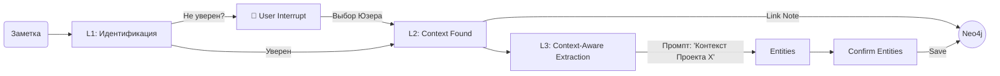

# Response Flow Clean - Документация

**Дата обновления:** 2025-11-18
**Статус:** Final Architectural Guide
**Стратегия:** Context-First & Constructive Interaction

---

## Обзор архитектуры

Эта серия документов описывает финальную архитектуру системы обработки заметок для PipGraph. Мы перешли от модели "Извлечь всё и разобрать" к модели **"Сначала найти место, потом извлечь смыслы"**.

### Ключевые принципы

1.  **Top-Down Workflow (Сверху-Вниз):**
    Мы не ищем сущности в вакууме. Сначала система определяет, к какому **Проекту или Области (L1/L2)** относится заметка. Только получив этот контекст, мы запускаем извлечение сущностей (L3).

2.  **No-Cache Policy (Чистый Граф):**
    Мы полностью отказались от дублирования данных.
    *   В ноде `Note` нет поля `project_id`.
    *   В ноде `Entity` нет поля `status`.
    *   **Источник истины — только связи** (`[:IS_PART_OF]`, `[:HAS_CHECK]`).

3.  **Constructive Interaction (Без тупиков):**
    Мы убрали кнопку "Reject" для структурных вопросов. Система предлагает гипотезу (например, "Это Проект А?"). Пользователь может согласиться или **выбрать альтернативу** ("Нет, привяжи к Области Б"). Заметка никогда не остается "сиротой".

---

## Навигация по документации

### Фундамент
*   **[01_ARCHITECTURE_DECISIONS.md](./01_ARCHITECTURE_DECISIONS.md)** — *Почему мы так решили?* Обоснование Top-Down подхода, отказа от кэша и выбора строгой схемы.
*   **[02_DATA_MODELS.md](./02_DATA_MODELS.md)** — *С чем работаем?* Pydantic-модели для кода и Workflow State.
*   **[03_GRAPH_SCHEMA.md](./03_GRAPH_SCHEMA.md)** — *Как храним?* Схема Neo4j, типы узлов и связей, индексы.

### Реализация
*   **[04_PIPGRAPH_MANAGER_REFACTORING.md](./04_PIPGRAPH_MANAGER_REFACTORING.md)** — *Инструментарий.* Список методов класса `PipGraphManager`. Разделение на `Identify` (L1/L2) и `Extract` (L3).
*   **[05_LANGGRAPH_WORKFLOW.md](./05_LANGGRAPH_WORKFLOW.md)** — *Процесс.* Схема графа LangGraph, логика узлов, точки фиксации (Commits) и управление состоянием.

### Взаимодействие и План
*   **[06_IMPLEMENTATION_ROADMAP.md](./06_IMPLEMENTATION_ROADMAP.md)** — *План действий.* Пошаговая инструкция на 8 дней разработки.
*   **[07_USER_INTERACTION_REQUIREMENTS.md](./07_USER_INTERACTION_REQUIREMENTS.md)** — *UX/UI.* Требования к плагину Obsidian. Логика "умных" уведомлений и обработки решений пользователя.

---

## Схема процесса (High-Level)

---

## Как начать работу?

1.  **Изучите [03_GRAPH_SCHEMA.md](./03_GRAPH_SCHEMA.md)**, чтобы понять, как данные будут лежать в базе. Это изменилось кардинально (связи вместо атрибутов).
2.  **Откройте [06_IMPLEMENTATION_ROADMAP.md](./06_IMPLEMENTATION_ROADMAP.md)** и начните с **Phase 1**. Ваша первая задача — научить систему просто принимать заметку и привязывать её к правильному проекту, игнорируя пока содержимое текста.
3.  **Используйте [07_USER_INTERACTION_REQUIREMENTS.md](./07_USER_INTERACTION_REQUIREMENTS.md)** при разработке фронтенда (плагина), чтобы правильно обрабатывать JSON-пейлоады от бэкенда.

---

**Статус проекта:** Готово к разработке MVP. Архитектура упрощена, риски рассинхронизации данных устранены.