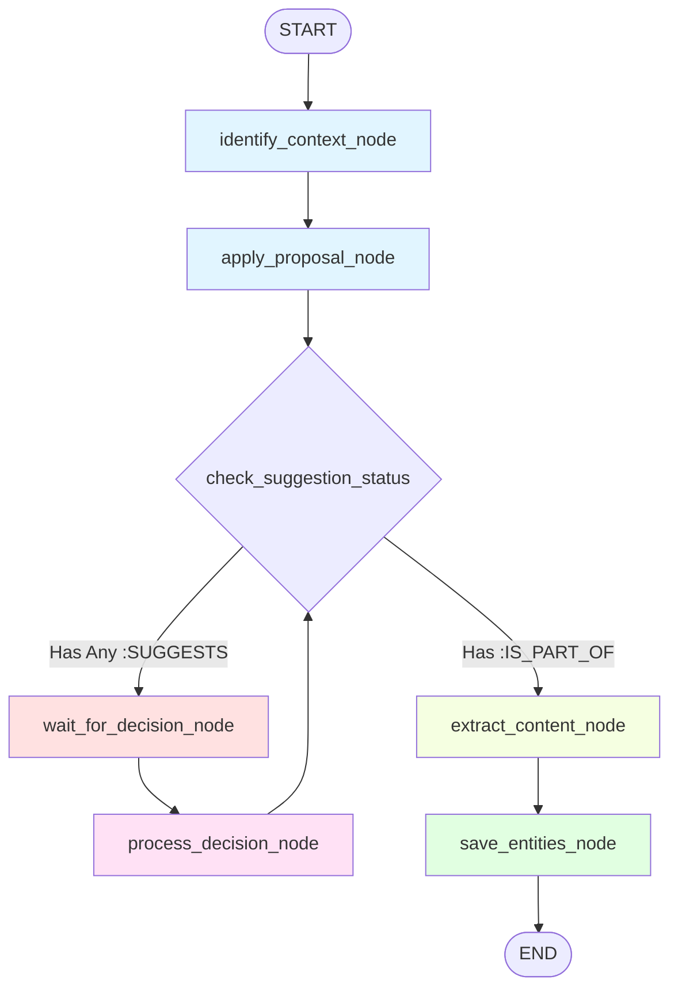

# Workflow States - Минимальный LangGraph для MVP

**Цель:** Определить упрощенный LangGraph workflow, где состояние процесса управляется типами связей в графе (`:SUGGESTS` vs `:IS_PART_OF`). Учтена поддержка детализированных предложений (multiple suggestions) с уникальными идентификаторами.

---

## Принципы Workflow

1.  **State in Graph:** Граф — единственный источник истины. Workflow проверяет наличие связей в Neo4j, чтобы решить, куда идти дальше.
2.  **Granular Suggestions:** Между заметкой и контейнером может быть несколько связей `:SUGGESTS` (например, "Link" и "Property Update").
3.  **Interrupt on Suggestion:** Процесс останавливается, если существует *хотя бы одна* активная связь `:SUGGESTS`, требующая внимания пользователя.

---

## Workflow Graph (MVP)



> **Note:** Обратите внимание на цикл `process_decision_node` -> `check_suggestion_status`. Это позволяет последовательно обрабатывать несколько предложений (например, сначала подтвердить связь, затем переименование) перед переходом к извлечению сущностей.

---

## Node Descriptions

### 1. identify_context_node
**Роль:** L1/L2 - Генерация предложения (Proposal) на основе контента.

**Input (from state):**
- `note_path: str`
- `note_content: str`

**Logic:**
```python
async def identify_context_node(state: NoteWorkflowState) -> NoteWorkflowState:
    """
    Генерирует PARAProposal для заметки.

    Steps:
    1. Classify PARA type (Project/Area/Resource).
    2. Find similar containers (top-3).
    3. LLM decision: select best match.
    4. Build proposal. Proposal может содержать несколько кандидатов 
       (например, Link + Property Update).
    """
    proposal = await pipgraph_manager.generate_para_proposal(
        note_content=state.note_content
    )

    state.system_proposal = proposal
    return state
```

**Output (to state):**
- `system_proposal: PARAProposal`

---

### 2. apply_proposal_node
**Роль:** Применение предложения к графу (Запись гипотез или фактов).

**Input (from state):**
- `note_path: str`
- `system_proposal: PARAProposal`

**Logic:**
```python
async def apply_proposal_node(state: NoteWorkflowState) -> NoteWorkflowState:
    """
    Записывает предложения в Neo4j, генерируя suggestion_id.

    Logic:
    - Iterates over proposal candidates.
    - If confidence > 0.95 AND type == 'link':
      Создает связь [:IS_PART_OF] (Fact).
    - Else:
      Создает связь [:SUGGESTS] (Hypothesis) с атрибутами:
      suggestion_id, suggestion_type, target_field, suggested_value.
    """
    await pipgraph_manager.apply_proposal_to_graph(
        episodic_path=state.note_path,
        proposal=state.system_proposal
    )
    
    logger.info(f"Applied proposal for {state.note_path}")
    return state
```

**Output (to Graph):**
- Creates relationships `(Episodic)-[:SUGGESTS]->(PARA)` OR `(Episodic)-[:IS_PART_OF]->(PARA)`.

---

### 3. check_suggestion_status (Conditional Edge)
**Роль:** Определяет, нужно ли прерывать workflow.

**Logic:**
```python
async def check_suggestion_status(state: NoteWorkflowState) -> str:
    """
    Проверяет наличие связей :SUGGESTS в графе.
    
    Logic:
    1. Получить все предложения через relationship_crud.get_suggestions().
    2. Если список не пуст -> вернуть "wait_for_decision_node".
    3. Если пуст -> проверить наличие контекста (:IS_PART_OF).
    4. Если контекст есть -> вернуть "extract_content_node".
    
    Returns:
    - "wait_for_decision_node"
    - "extract_content_node"
    """
    suggestions = await relationship_crud.get_suggestions(state.note_path)
    
    if suggestions:
        return "wait_for_decision_node"
    
    # Проверка безопасности: убедимся, что link существует
    context = await relationship_crud.get_episodic_para_context(state.note_path)
    if context:
        return "extract_content_node"
        
    # Если нет ни предложений, ни связи - это ошибка (например, Dismiss без фоллбэка)
    # Либо можно отправить в Inbox
    raise ValueError("Invalid graph state: neither SUGGESTS nor IS_PART_OF found")
```

---

### 4. wait_for_decision_node (Interrupt)
**Роль:** Точка прерывания workflow.

**Logic:**
```python
async def wait_for_decision_node(state: NoteWorkflowState) -> NoteWorkflowState:
    """
    LangGraph interrupt point.
    Ожидает ввода UserDecisionPayload.
    """
    logger.info(f"Workflow interrupted for user decision: {state.note_path}")
    return state
```

**External Action:**
- Frontend запрашивает список предложений (включая `suggestion_id`).
- Пользователь отправляет `UserDecisionPayload` с конкретным `suggestion_id` (или action="create_custom").

---

### 5. process_decision_node
**Роль:** Обработка конкретного решения и трансформация графа.

**Input (from state):**
- `user_decision: UserDecisionPayload`
- `note_path: str`

**Logic:**
```python
async def process_decision_node(state: NoteWorkflowState) -> NoteWorkflowState:
    """
    Трансформирует связи в графе на основе решения.

    Logic:
    - Uses user_decision.suggestion_id to identify specific edge.
    - Calls pipgraph_manager.process_user_decision().
    - Executes action (confirm link, confirm update, dismiss, etc.).
    """
    if not state.user_decision:
        raise ValueError("No user decision provided after interrupt")

    await pipgraph_manager.process_user_decision(
        episodic_path=state.note_path,
        user_decision=state.user_decision
    )

    # Сбрасываем decision в стейте, чтобы подготовиться к следующему (если есть цикл)
    state.user_decision = None
    return state
```

**Output (to Graph):**
- Specific `:SUGGESTS` edge deleted/transformed.
- Node properties updated (if type="property_update").
- `:IS_PART_OF` created (if type="link").

---

### 6. extract_content_node
**Роль:** L3 - Извлечение сущностей с использованием утвержденного контекста.

**Input (from state):**
- `note_path: str`

**Logic:**
```python
async def extract_content_node(state: NoteWorkflowState) -> NoteWorkflowState:
    """
    Извлекает сущности через Graphiti.

    Steps:
    1. Читает контекст: MATCH (n {name: $path})-[:IS_PART_OF]->(c).
    2. Формирует промпт с именем проекта.
    3. Вызывает Graphiti.extract().
    """
    
    para_context = await relationship_crud.get_episodic_para_context(state.note_path)
    
    if not para_context:
        raise ValueError(f"No context found for {state.note_path} before extraction")

    state.final_context = para_context

    extracted = await pipgraph_manager.extract_entities_with_context(
        episodic_path=state.note_path,
        episodic_content=state.note_content
    )

    state.extracted_entities = extracted
    return state
```

---

### 7. save_entities_node
**Роль:** Сохранение результатов L3 в граф.

**Input (from state):**
- `extracted_entities: list[ExtractedCandidate]`
- `note_path: str`

**Logic:**
```python
async def save_entities_node(state: NoteWorkflowState) -> NoteWorkflowState:
    """
    Сохраняет сущности и создает связи.
    Links via [:MENTIONS {status: "confirmed"}].
    """
    if not state.extracted_entities:
        return state

    await entity_crud.batch_save_entities(
        entities=state.extracted_entities,
        episodic_path=state.note_path
    )

    logger.info(f"Saved {len(state.extracted_entities)} entities")
    return state
```

---

## Complete LangGraph Definition

```python
from langgraph.graph import StateGraph, END
from app.workflows.state import NoteWorkflowState
# ... imports nodes ...

# Define workflow
workflow = StateGraph(NoteWorkflowState)

# Add nodes
workflow.add_node("identify_context", identify_context_node)
workflow.add_node("apply_proposal", apply_proposal_node)
workflow.add_node("wait_for_decision", wait_for_decision_node)
workflow.add_node("process_decision", process_decision_node)
workflow.add_node("extract_content", extract_content_node)
workflow.add_node("save_entities", save_entities_node)

# Entry point
workflow.set_entry_point("identify_context")

# Linear flow L1/L2
workflow.add_edge("identify_context", "apply_proposal")

# Conditional Branching based on Graph State
# Checks for ANY suggestions
workflow.add_conditional_edges(
    "apply_proposal",
    check_suggestion_status,
    {
        "wait_for_decision_node": "wait_for_decision",
        "extract_content_node": "extract_content"
    }
)

# User Interaction Loop
# After processing a decision, we check if MORE suggestions remain
workflow.add_edge("wait_for_decision", "process_decision")
workflow.add_conditional_edges(
    "process_decision",
    check_suggestion_status,
    {
        "wait_for_decision_node": "wait_for_decision",
        "extract_content_node": "extract_content"
    }
)

# L3 Flow
workflow.add_edge("extract_content", "save_entities")
workflow.add_edge("save_entities", END)

# Compile
compiled_workflow = workflow.compile()
```

---

## Workflow Execution Examples

### Example 1: Complex Scenario (Link + Rename)
1.  **identify_context:** Generates Proposal with 2 candidates:
    *   Link to "Project Alpha" (Confidence 0.8).
    *   Update property `name` to "Project Alpha V2" (Confidence 0.7).
2.  **apply_proposal:** Creates 2 relationships `:SUGGESTS` with unique UUIDs.
3.  **check_suggestion_status:** Finds suggestions -> `wait_for_decision`.
4.  **User Action 1:** Payload: `{action: "confirm", suggestion_id: "uuid-link"}`.
5.  **process_decision:** Transforms Link suggestion to `:IS_PART_OF`. Note still has "Rename" suggestion.
6.  **check_suggestion_status:** Finds remaining suggestion ("Rename") -> `wait_for_decision`.
7.  **User Action 2:** Payload: `{action: "confirm", suggestion_id: "uuid-rename"}`.
8.  **process_decision:** Updates Project name, deletes suggestion edge.
9.  **check_suggestion_status:** No suggestions, Context exists -> `extract_content`.
10. **extract_content:** Extracts using "Project Alpha V2" context.
11. **save_entities:** Done.

### Example 2: Dismissal
1.  **identify_context:** Suggests Link to "Project Beta".
2.  **apply_proposal:** Creates 1 `:SUGGESTS`.
3.  **wait_for_decision.**
4.  **User Action:** Payload: `{action: "dismiss", suggestion_id: "uuid-beta"}`.
5.  **process_decision:** Deletes suggestion. Creates `:IS_PART_OF` -> "Inbox" (Fallback logic in `process_user_decision`).
6.  **check_suggestion_status:** No suggestions, Context exists (Inbox) -> `extract_content`.
7.  **extract_content:** Extracts (Context: Inbox).
8.  **save_entities:** Done.

---