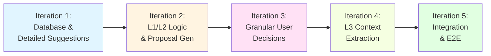

Here is the updated **README.md**.

--- START OF FILE README.md ---

# Response Flow - MVP Implementation Plan

**Дата обновления:** 2025-11-19
**Статус:** Ready for Development
**Архитектура:** Relationship-Based State & Granular Suggestions

---

## Обзор

План разработки MVP системы **Response Flow**. Система обрабатывает заметки из Obsidian, определяет их контекст (PARA) и извлекает сущности (Entities) в граф знаний Neo4j.

Мы используем подход **"State in Relationships"**: состояние обработки заметки определяется типом и атрибутами связей между ней и контейнером.

### Ключевые принципы MVP

1.  **State in Relationships:**
    *   `:SUGGESTS` — Гипотеза (требует подтверждения).
    *   `:IS_PART_OF` — Факт (утвержденный контекст).
2.  **Granular Suggestions:**
    *   Между заметкой и контейнером может быть **несколько связей** `:SUGGESTS` одновременно.
    *   Каждое ребро имеет уникальный `suggestion_id` и тип (`link`, `property_update`), что позволяет пользователю атомарно принимать решения (например, связать с проектом, но отказаться от его переименования).
3.  **Graphiti Compatibility:**
    *   Используем стандартные узлы `Episodic` и `Entity` для совместимости с Graphiti SDK.
    *   Entity узлы могут иметь composite labels (`:Entity:Concept`, `:Entity:Task`) при указании `entity_types`.
4.  **No-Cache Policy:**
    *   Граф — единственный источник истины. Никаких дублирующих полей (`project_id`) в узлах.

---

## Документация

Весь план разбит на 5 детальных документов. Читайте их в следующем порядке:

1.  **[01_MVP_SCOPE.md](./01_MVP_SCOPE.md)**
    *   *Границы проекта.* Что входит в MVP: Top-Down подход, детализированные предложения, отсутствие тупиков.
    *   *Ограничения:* Отказ от истории изменений и сложного управления сущностями.

2.  **[02_IMPLEMENTATION_STEPS.md](./02_IMPLEMENTATION_STEPS.md)**
    *   *План работ.* 5 итераций разработки с конкретными задачами.
    *   *CRUD:* Детальное описание операций с `suggestion_id`.

3.  **[03_DATA_STRUCTURES.md](./03_DATA_STRUCTURES.md)**
    *   *Схема данных.* Описание свойств узлов и детализированная схема связи `:SUGGESTS` (поля `suggestion_type`, `target_field`).
    *   *API Models:* Pydantic модели для передачи предложений и решений.

4.  **[04_WORKFLOW_STATES.md](./04_WORKFLOW_STATES.md)**
    *   *Логика процесса.* LangGraph workflow с циклом обработки решений.
    *   *Схема:* Identify → Apply Proposal → (Loop: Check Suggestions ↔ Process Decision) → Extract.

5.  **[05_TESTING_STRATEGY.md](./05_TESTING_STRATEGY.md)**
    *   *QA.* Стратегия тестирования: от Unit тестов логики предложений до E2E сценариев.

6.  **[MOCK_IMPLEMENTATION_CHECKLIST.md](./MOCK_IMPLEMENTATION_CHECKLIST.md)** ⭐ **НАЧАТЬ ОТСЮДА**
    *   *Пошаговый checklist для Mock-First подхода.*
    *   *Все LLM вызовы заменены моками для быстрой проверки архитектуры.*
    *   *Фокус на проверке данных в Neo4j Browser без написания тестов на первых этапах.*
    *   *План миграции с моков на реальные LLM по компонентам.*

---

## Roadmap (5 итераций)

### Краткое содержание итераций:

*   **Iteration 1:** Настройка Neo4j. CRUD для `Episodic` и PARA. Реализация множественных связей `:SUGGESTS` с поддержкой `suggestion_id`.
*   **Iteration 2:** Логика AI. Классификация заметки, генерация комплексных предложений (Link + Property Update).
*   **Iteration 3:** Интерактивность. LangGraph Interrupt. Атомарная обработка решений по ID предложения (трансформация связи или обновление свойства узла).
*   **Iteration 4:** Graphiti. Извлечение сущностей с использованием контекста из графа.
*   **Iteration 5:** Финал. Сборка полного пайплайна и E2E тесты.

---

## Как начать разработку?

### Рекомендованный путь: Mock-First подход ⭐

1.  **Откройте [MOCK_IMPLEMENTATION_CHECKLIST.md](./MOCK_IMPLEMENTATION_CHECKLIST.md)**
2.  **Следуйте пошаговому checklist:**
    *   Iteration 1: Создайте Neo4j схему и CRUD
    *   Iteration 2-4: Реализуйте логику с mock-методами
    *   Iteration 5: Протестируйте полный цикл вручную
3.  **Проверяйте результаты в Neo4j Browser** (без написания тестов на первых этапах)
4.  **После проверки архитектуры:** постепенно заменяйте моки на реальные LLM

### Альтернативный путь: С реальными LLM и тестами

1.  **Изучите [01_MVP_SCOPE.md](./01_MVP_SCOPE.md.md)**, чтобы понять новые возможности (Granular Suggestions).
2.  **Откройте [02_IMPLEMENTATION_STEPS.md](./02_IMPLEMENTATION_STEPS.md)**.
3.  **Начните с Iteration 1:**
    *   Поднимите локальный Neo4j.
    *   Реализуйте обновленную схему из `03_DATA_STRUCTURES.md` (обратите внимание на индексы для `suggestion_id`).
    *   Напишите тесты согласно `05_TESTING_STRATEGY.md`.

---

## Критерии успеха MVP

✅ **Чистота Графа:**
*   Нет "висячих" заметок (каждая имеет связь `:IS_PART_OF` или находится в Inbox).
*   Все предложения (`:SUGGESTS`) корректно обрабатываются и удаляются после принятия решений.

✅ **Атомарность Решений:**
*   Пользователь может принять связь с проектом, но отклонить его переименование.
*   Система корректно обрабатывает множественные ребра между двумя узлами.

✅ **Корректность Контекста:**
*   Graphiti получает в промпт актуальное имя проекта (после всех подтвержденных обновлений).

✅ **Устойчивость:**
*   Workflow корректно останавливается, пока существуют активные предложения, требующие внимания.

---

**Готово к старту!** Переходите к [02_IMPLEMENTATION_STEPS.md](./02_IMPLEMENTATION_STEPS.md) 🚀