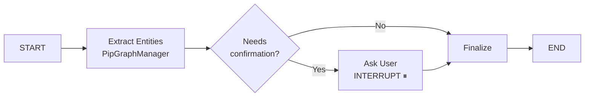

✅ Готово! LangGraph Workflow MVP реализован

Я создал минимальный рабочий каркас с LangGraph, который можно расширять. Все изменения интегрированы в текущую архитектуру без breaking changes.

## 📦 Что создано

**Новые файлы (10 файлов):**

- `app/models/workflow_state.py` - модели состояния для LangGraph
- `app/services/note_workflow.py` - workflow с 3 узлами (extract → ask → finalize)
- `app/api/websockets/workflow.py` - WebSocket endpoint
- `test_workflow_mvp.py` - автоматический тест
- `docs/WORKFLOW_MVP.md` - полное руководство
- `QUICKSTART_WORKFLOW.md` - быстрый старт
- `WORKFLOW_MVP_CHANGELOG.md` - changelog изменений

**Изменённые файлы:**

- `requirements.txt` - добавлены langgraph, aiosqlite
- `app/api/main.py` - подключен WebSocket router
- `app/api/endpoints/notes.py` - добавлены 3 REST endpoints

## 🎯 Архитектура



**3 узла:**

- `extract_entities` - использует ваш `PipGraphManager.process_note()`
- `ask_user` - один вопрос (INTERRUPT) про первую сущность
- `finalize` - завершение обработки

**Persistence:** AsyncSqliteSaver → `workflow_checkpoints.db`

## 🚀 Как запустить

### 1. Установить зависимости

```bash
cd backend/
pip install -r requirements.txt
```

### 2. Запустить сервер

```bash
uvicorn app.api.main:app --reload
```

### 3. Запустить тест

```bash
python test_workflow_mvp.py
```

Или вручную через curl:

```bash
curl -X POST http://localhost:8000/api/v1/notes/workflow/start \
  -H "Content-Type: application/json" \
  -d '{"file_path": "test.md", "content": "Meeting with John Smith."}'
```

## 📋 API Endpoints

**REST API (для тестирования):**

- `POST /api/v1/notes/workflow/start` - запустить workflow
- `POST /api/v1/notes/workflow/resume` - возобновить с ответом
- `GET /api/v1/notes/workflow/status/{thread_id}` - получить статус

**WebSocket (для production):**

- `WS /ws/workflow` - real-time коммуникация

## ✨ Ключевые особенности

### ✅ Что работает:

- Interrupt/resume механизм (workflow останавливается и ждет ответа)
- Persistence (состояние сохраняется в SQLite, можно возобновить после перезапуска)
- Интеграция с PipGraphManager (без изменений существующего кода)
- Один вопрос пользователю (L3: entity confirmation)
- Параллельная работа со старым API

### ⚠️ Что НЕ реализовано (для будущих фаз):

- L1/L2 подтверждения (PARA classification, containers)
- Множественные вопросы и приоритизация
- UserCheckStatus nodes в Neo4j
- Auto-confirm логика
- Обработка modify/reject действий

## 🔧 Изменения в текущей архитектуре

### ✅ Безопасные изменения:

- Старый API работает - `/ws/notes/process` не тронут
- Новые зависимости - `langgraph`, `aiosqlite` (опционально для workflow)
- Новые endpoints - добавлены параллельно существующим
- PipGraphManager - используется как есть, без изменений

### Предложенные улучшения:

Если хотите интегрировать workflow в основной поток обработки:

**Вариант A:** Заменить `process_and_store_note()` на `start_workflow()`

```python
# В note_processor.py
async def process_and_store_note(note: NotePayload):
    # Вместо прямого вызова PipGraphManager
    thread_id = await start_workflow(note.file_path, note.content)
    # ...
```

**Вариант B:** Добавить флаг для выбора метода

```python
async def process_and_store_note(note: NotePayload, use_workflow: bool = False):
    if use_workflow:
        return await start_workflow(note.file_path, note.content)
    else:
        # Старая логика
        ...
```

## 📖 Документация

- `QUICKSTART_WORKFLOW.md` - быстрый старт
- `docs/WORKFLOW_MVP.md` - полное руководство
- `WORKFLOW_MVP_CHANGELOG.md` - changelog

## 🎓 Как расширять

### Добавить L1 (PARA classification):

```python
# 1. Обновить state
class NoteWorkflowState(TypedDict, total=False):
    para_classification: Optional[str]  # "Project" | "Area" | "Resource"

# 2. Добавить узел
async def classify_para_node(state):
    para_type = await classify_para_type(state["content"])
    return {"para_classification": para_type}

# 3. Добавить в граф
workflow.add_node("classify_para", classify_para_node)
workflow.add_edge("extract_entities", "classify_para")
```

### Добавить приоритизацию:

```python
def prioritize_questions(questions):
    PRIORITY = {"para_classification": 1, "entity": 10}
    return sorted(questions, key=lambda q: PRIORITY[q["type"]])
```

## ❓ Следующие шаги

Что хотите сделать дальше?

### A) Протестировать MVP:

```bash
python test_workflow_mvp.py
```

### B) Добавить L1/L2 (PARA + containers):

- Классификация заметок
- Привязка к проектам
- ~1-2 недели

### C) Добавить UserCheckStatus nodes:

- История подтверждений в Neo4j
- Связи через `:NEXT`
- ~3-5 дней

### D) Что-то другое?

Напишите, что хотите попробовать первым! 🚀