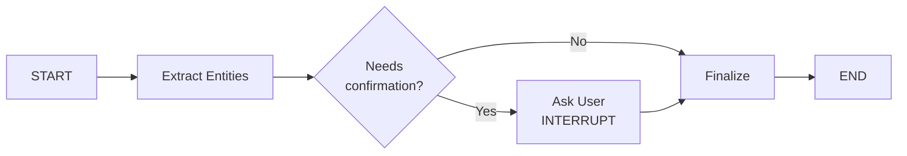

# LangGraph Workflow MVP - Руководство

**Дата создания:** 2025-11-17
**Статус:** MVP готов к тестированию
**Версия:** 0.1.0

---

## Обзор

Минимальная рабочая версия LangGraph workflow для обработки заметок с поддержкой interrupt/resume.

### Что реализовано

✅ **3 узла workflow:**
1. `extract_entities` - извлечение сущностей через PipGraphManager
2. `ask_user` - один вопрос пользователю (INTERRUPT)
3. `finalize` - завершение обработки

✅ **Persistence:** AsyncSqliteSaver сохраняет состояние в `workflow_checkpoints.db`

✅ **Два способа взаимодействия:**
- REST API (для тестирования и отладки)
- WebSocket (для real-time коммуникации)

✅ **Интеграция:** Использует существующий `PipGraphManager` без изменений

---

## Архитектура



### Файлы

```
backend/
├── app/
│   ├── models/
│   │   └── workflow_state.py          # TypedDict для состояния
│   ├── services/
│   │   └── note_workflow.py           # LangGraph workflow
│   ├── api/
│   │   ├── endpoints/
│   │   │   └── notes.py               # REST API endpoints
│   │   └── websockets/
│   │       └── workflow.py            # WebSocket endpoint
├── workflow_checkpoints.db            # SQLite для состояния
└── test_workflow_mvp.py               # Тестовый скрипт
```

---

## Использование

### Вариант 1: REST API (рекомендуется для тестирования)

#### 1. Запустить сервер

```bash
cd backend/
uvicorn app.api.main:app --reload
```

#### 2. Отправить заметку на обработку

```bash
curl -X POST http://localhost:8000/api/v1/notes/workflow/start \
  -H "Content-Type: application/json" \
  -d '{
    "file_path": "meetings/test.md",
    "content": "# Meeting with John Smith\n\nDiscussed Q4 project."
  }'
```

**Ответ:**
```json
{
  "thread_id": "note:meetings/test.md",
  "status": "processing",
  "pending_question": {
    "question_id": "abc-123",
    "question_type": "entity_confirmation",
    "question_text": "Подтвердите сущность: John Smith (Person)?",
    "entity_uuid": "ent_456",
    "entity_name": "John Smith",
    "entity_type": "Person",
    "suggested_action": "confirm",
    "confidence": 0.85
  }
}
```

#### 3. Ответить на вопрос

```bash
curl -X POST http://localhost:8000/api/v1/notes/workflow/resume \
  -H "Content-Type: application/json" \
  -d '{
    "thread_id": "note:meetings/test.md",
    "answer": {
      "question_id": "abc-123",
      "action": "confirm"
    }
  }'
```

**Ответ:**
```json
{
  "thread_id": "note:meetings/test.md",
  "status": "completed",
  "episode_uuid": "episode_789"
}
```

#### 4. Проверить статус (опционально)

```bash
curl http://localhost:8000/api/v1/notes/workflow/status/note:meetings/test.md
```

---

### Вариант 2: WebSocket (для production)

#### JavaScript пример

```javascript
const ws = new WebSocket("ws://localhost:8000/ws/workflow");

// Запустить обработку
ws.onopen = () => {
  ws.send(JSON.stringify({
    type: "start",
    file_path: "meetings/test.md",
    content: "# Meeting with John Smith\n\nDiscussed Q4 project."
  }));
};

// Получить вопрос
ws.onmessage = (event) => {
  const msg = JSON.parse(event.data);

  if (msg.type === "question") {
    console.log("Question:", msg.data);

    // Показать вопрос пользователю в UI
    // ...

    // Отправить ответ
    ws.send(JSON.stringify({
      type: "answer",
      thread_id: msg.thread_id,
      data: {
        question_id: msg.data.question_id,
        action: "confirm"
      }
    }));
  }

  if (msg.type === "completed") {
    console.log("Workflow completed:", msg.data);
    ws.close();
  }
};
```

---

### Вариант 3: Python тестовый скрипт

```bash
cd backend/
python test_workflow_mvp.py
```

Этот скрипт демонстрирует полный цикл:
1. Запуск workflow
2. Получение вопроса
3. Отправка ответа
4. Проверка статуса

---

## Типы ответов пользователя

### Confirm (подтвердить)
```json
{
  "question_id": "abc-123",
  "action": "confirm"
}
```

### Modify (изменить)
```json
{
  "question_id": "abc-123",
  "action": "modify",
  "modified_name": "John K. Smith",
  "comment": "Full name correction"
}
```

### Reject (отклонить)
```json
{
  "question_id": "abc-123",
  "action": "reject",
  "comment": "This is not a person"
}
```

### Skip (пропустить)
```json
{
  "question_id": "abc-123",
  "action": "skip",
  "comment": "Will decide later"
}
```

---

## Persistence и Resume

### Как работает сохранение состояния

1. **Во время interrupt:** LangGraph автоматически сохраняет состояние в `workflow_checkpoints.db`
2. **При перезапуске сервера:** Состояние восстанавливается из SQLite
3. **Возобновление:** Вызов `/resume` с `thread_id` продолжает выполнение

### Тест persistence

```bash
# 1. Запустить workflow
curl -X POST http://localhost:8000/api/v1/notes/workflow/start \
  -d '{"file_path": "test.md", "content": "..."}' \
  -H "Content-Type: application/json"

# Получаем thread_id: "note:test.md"

# 2. Перезапустить сервер
# Ctrl+C
uvicorn app.api.main:app --reload

# 3. Проверить статус (состояние сохранено!)
curl http://localhost:8000/api/v1/notes/workflow/status/note:test.md

# 4. Возобновить workflow
curl -X POST http://localhost:8000/api/v1/notes/workflow/resume \
  -d '{"thread_id": "note:test.md", "answer": {"action": "confirm"}}' \
  -H "Content-Type: application/json"
```

---

## Расширение MVP

### Добавление новых уровней подтверждений

Текущий MVP: только L3 (entity confirmation)

**Для добавления L1 (PARA classification):**

1. **Обновить `NoteWorkflowState`:**
```python
class NoteWorkflowState(TypedDict, total=False):
    # ... существующие поля
    para_classification: Optional[str]  # "Project" | "Area" | "Resource"
    para_confidence: Optional[float]
```

2. **Добавить узел `classify_para_node`:**
```python
async def classify_para_node(state: NoteWorkflowState) -> dict:
    # Классификация через LLM
    para_type, confidence = await classify_para_type(state["content"])
    return {
        "para_classification": para_type,
        "para_confidence": confidence
    }
```

3. **Добавить в граф:**
```python
workflow.add_node("classify_para", classify_para_node)
workflow.add_edge("extract_entities", "classify_para")
workflow.add_edge("classify_para", "ask_user")
```

4. **Обновить `ask_user_node`:**
```python
# Проверить, нужно ли спросить про PARA
if state["para_confidence"] < 0.8:
    question = {
        "question_type": "para_classification",
        "question_text": f"Тип заметки: {state['para_classification']}?",
        ...
    }
```

### Добавление приоритизации

```python
# В check_clarification_node
def prioritize_questions(questions: List[Dict]) -> List[Dict]:
    return sorted(questions, key=lambda q: PRIORITY_MAP[q["question_type"]])
```

### Миграция на Redis

```python
from langgraph.checkpoint.redis import RedisSaver

checkpointer = RedisSaver.from_conn_info(
    host="localhost",
    port=6379,
    db=0
)

app = workflow.compile(checkpointer=checkpointer)
```

---

## Отладка

### Логи

```bash
# Включить DEBUG логи
export LOG_LEVEL=DEBUG
uvicorn app.api.main:app --reload
```

Ключевые логи:
- `[extract_entities_node]` - извлечение сущностей
- `[ask_user_node]` - формирование вопроса
- `[finalize_node]` - завершение
- `[WebSocket]` - WebSocket события

### Просмотр состояния в SQLite

```bash
sqlite3 workflow_checkpoints.db

# Посмотреть все checkpoints
SELECT * FROM checkpoints;

# Посмотреть конкретный thread
SELECT * FROM checkpoints WHERE thread_id = 'note:meetings/test.md';
```

---

## Ограничения MVP

❌ **Не реализовано:**
- L1 (PARA classification) - только L3 (entity confirmation)
- L2 (container assignment)
- Приоритизация вопросов (все одинаковые)
- Auto-confirm логика
- Batch questions (несколько вопросов сразу)
- UserCheckStatus nodes в Neo4j (только извлечение сущностей)
- Модификация сущностей (action="modify" не применяется)

✅ **Реализовано:**
- Базовый workflow с interrupt/resume
- Persistence состояния (SQLite)
- Интеграция с PipGraphManager
- REST API и WebSocket endpoints
- Один вопрос на сущность

---

## Следующие шаги

### Шаг 1: Добавить L1/L2 (PARA classification + container assignment)
- Классификация заметок по PARA
- Привязка к проектам/областям
- **Длительность:** 2-3 дня

### Шаг 2: Добавить UserCheckStatus nodes
- Сохранение истории подтверждений в Neo4j
- Связи через `:NEXT`
- **Длительность:** 2-3 дня

### Шаг 3: Приоритизация и auto-confirm
- Сортировка вопросов по важности
- Автоподтверждение высокоуверенных сущностей
- **Длительность:** 2 дня

---

## FAQ

**Q: Можно ли использовать workflow вместе со старым API?**
A: Да! Старый `/ws/notes/process` и новый `/notes/workflow/start` работают параллельно.

**Q: Что произойдет, если пользователь отключится во время обработки?**
A: Состояние сохранено в SQLite. Можно возобновить через `/resume` когда угодно.

**Q: Как добавить новый тип вопроса?**
A: Обновить `question_type` в `ClarificationQuestion` и добавить обработку в `ask_user_node`.

**Q: Можно ли показывать несколько вопросов одновременно?**
A: Пока нет (MVP). Для этого нужно расширить `pending_question` → `pending_questions: List`.

---

**Готово!** Это рабочий MVP каркас, который можно расширять по мере необходимости.
