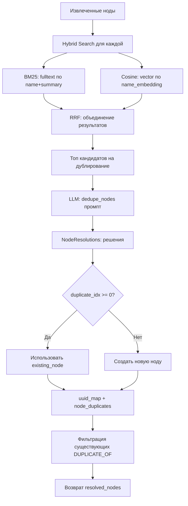

# Механизмы поиска и разрешения сущностей в Graphiti

Этот документ описывает внутренние механизмы Graphiti для entity resolution и hybrid search. Информация основана на анализе исходного кода `graphiti_core` и используется для создания кастомного функционала на основе этих механизмов.

## Содержание

1. [Entity Resolution: resolve_extracted_nodes](#entity-resolution-resolve_extracted_nodes)
2. [Hybrid Search: Архитектура](#hybrid-search-архитектура)
3. [Эмбеддинги в EntityNode](#эмбеддинги-в-entitynode)
4. [Fulltext индексы в Neo4j](#fulltext-индексы-в-neo4j)
5. [Векторный поиск](#векторный-поиск)
6. [Reranking алгоритмы](#reranking-алгоритмы)
7. [Конфигурации поиска](#конфигурации-поиска)

---

## Entity Resolution: resolve_extracted_nodes

### Назначение

Функция `resolve_extracted_nodes` решает проблему **дедупликации сущностей** (entity resolution). Когда LLM извлекает новые сущности из текста, они могут уже существовать в графе под другим именем или формулировкой.

**Расположение**: `graphiti_core/utils/maintenance/node_operations.py:184-299`

### Сигнатура

```python
async def resolve_extracted_nodes(
    clients: GraphitiClients,
    extracted_nodes: list[EntityNode],
    episode: EpisodicNode | None = None,
    previous_episodes: list[EpisodicNode] | None = None,
    entity_types: dict[str, type[BaseModel]] | None = None,
    existing_nodes_override: list[EntityNode] | None = None,
) -> tuple[list[EntityNode], dict[str, str], list[tuple[EntityNode, EntityNode]]]
```

**Возвращает**:
- `resolved_nodes` — список нод (новые или существующие)
- `uuid_map` — маппинг `{extracted_uuid -> resolved_uuid}` для переноса связей
- `node_duplicates` — список пар `(extracted, existing)` для создания `DUPLICATE_OF` edges

### Алгоритм работы

#### 1. Поиск кандидатов на дублирование (строки 195-206)

Для каждой извлеченной ноды запускается **гибридный поиск**:

```python
search_results: list[SearchResults] = await semaphore_gather(
    *[
        search(
            clients=clients,
            query=node.name,  # ⚠️ Ищем по имени новой ноды
            group_ids=[node.group_id],
            search_filter=SearchFilters(),
            config=NODE_HYBRID_SEARCH_RRF,  # ⚠️ BM25 + Cosine + RRF
        )
        for node in extracted_nodes
    ]
)
```

**Важно**: Это **НЕ точное совпадение**, а hybrid search с:
- BM25 (fulltext search)
- Cosine similarity (vector search)
- RRF reranking

#### 2. Сбор уникальных существующих нод (строки 208-216)

```python
candidate_nodes: list[EntityNode] = (
    [node for result in search_results for node in result.nodes]
    if existing_nodes_override is None
    else existing_nodes_override
)

existing_nodes_dict: dict[str, EntityNode] = {node.uuid: node for node in candidate_nodes}
existing_nodes: list[EntityNode] = list(existing_nodes_dict.values())
```

Убирает дубликаты через словарь по UUID.

#### 3. Подготовка контекста для LLM (строки 218-256)

Формирует два списка для промпта:

**Извлеченные ноды**:
```python
extracted_nodes_context = [
    {
        'id': i,
        'name': node.name,
        'entity_type': node.labels,
        'entity_type_description': entity_types_dict.get(...)
    }
    for i, node in enumerate(extracted_nodes)
]
```

**Существующие ноды**:
```python
existing_nodes_context = [
    {
        'idx': i,
        'name': candidate.name,
        'entity_types': candidate.labels,
        **candidate.attributes,  # ⚠️ Все атрибуты доступны LLM
    }
    for i, candidate in enumerate(existing_nodes)
]
```

#### 4. Вызов LLM для дедупликации (строки 258-263)

```python
llm_response = await llm_client.generate_response(
    prompt_library.dedupe_nodes.nodes(context),
    response_model=NodeResolutions,
)

node_resolutions: list[NodeDuplicate] = NodeResolutions(**llm_response).entity_resolutions
```

**Структура NodeResolutions**:
```python
class NodeDuplicate(BaseModel):
    id: int                # ID извлеченной ноды
    duplicate_idx: int     # ID существующей ноды (-1 = нет дубликата)
    duplicates: list[int]  # Список всех дубликатов

class NodeResolutions(BaseModel):
    entity_resolutions: list[NodeDuplicate]
```

#### 5. Применение решений LLM (строки 265-292)

```python
for resolution in node_resolutions:
    resolution_id: int = resolution.id
    duplicate_idx: int = resolution.duplicate_idx

    extracted_node = extracted_nodes[resolution_id]

    # Если duplicate_idx >= 0 → используем существующую ноду
    # Если duplicate_idx == -1 → оставляем новую ноду
    resolved_node = (
        existing_nodes[duplicate_idx]
        if 0 <= duplicate_idx < len(existing_nodes)
        else extracted_node
    )

    resolved_nodes.append(resolved_node)
    uuid_map[extracted_node.uuid] = resolved_node.uuid

    # Формируем список для создания DUPLICATE_OF edges
    duplicates: list[int] = resolution.duplicates
    for idx in duplicates:
        existing_node = existing_nodes[idx]
        node_duplicates.append((extracted_node, existing_node))
```

#### 6. Фильтрация существующих DUPLICATE_OF edges (строки 295-297)

```python
new_node_duplicates = await filter_existing_duplicate_of_edges(
    driver, node_duplicates
)
```

Проверяет, что `DUPLICATE_OF` edge еще не существует в БД.

### Пример работы

**Входные данные**:
```python
extracted_nodes = [
    EntityNode(name="Python developer", uuid="new-123"),
    EntityNode(name="Maria", uuid="new-456"),
]
```

**Результат hybrid search**:
```python
existing_nodes = [
    EntityNode(name="John Smith", summary="Senior Python developer at Acme..."),
    EntityNode(name="Мария Иванова", summary="Project manager..."),
]
```

**Решение LLM**:
```python
NodeResolutions(
    entity_resolutions=[
        NodeDuplicate(id=0, duplicate_idx=0, duplicates=[0]),  # "Python developer" → "John Smith"
        NodeDuplicate(id=1, duplicate_idx=1, duplicates=[1]),  # "Maria" → "Мария Иванова"
    ]
)
```

**Итоговый результат**:
```python
resolved_nodes = [existing_nodes[0], existing_nodes[1]]
uuid_map = {"new-123": "john-uuid", "new-456": "maria-uuid"}
node_duplicates = [
    (extracted_nodes[0], existing_nodes[0]),
    (extracted_nodes[1], existing_nodes[1]),
]
```

---

## Hybrid Search: Архитектура

### NODE_HYBRID_SEARCH_RRF

**Расположение**: `graphiti_core/search/search_config_recipes.py:156-161`

```python
NODE_HYBRID_SEARCH_RRF = SearchConfig(
    node_config=NodeSearchConfig(
        search_methods=[NodeSearchMethod.bm25, NodeSearchMethod.cosine_similarity],
        reranker=NodeReranker.rrf,
    )
)
```

### Два метода поиска

#### 1. BM25 (Best Matching 25)

**Алгоритм**: Полнотекстовый поиск на основе TF-IDF

**Где**: `node_fulltext_search()` в `search_utils.py:535-621`

**Cypher запрос**:
```cypher
CALL db.index.fulltext.queryNodes("node_name_and_summary", $query, {limit: $limit})
YIELD node AS n, score
WHERE n.group_id IN $group_ids
RETURN n
ORDER BY score DESC
LIMIT $limit
```

**Особенности**:
- Использует Lucene fulltext индекс
- Ищет по полям `name`, `summary`, `group_id`
- Хорошо работает для точных текстовых совпадений
- Не понимает семантику

#### 2. Cosine Similarity

**Алгоритм**: Векторный поиск через эмбеддинги

**Где**: `node_similarity_search()` в `search_utils.py:624-734`

**Cypher запрос**:
```cypher
MATCH (n:Entity)
WHERE n.group_id IN $group_ids
WITH n, vector.similarity.cosine(n.name_embedding, $search_vector) AS score
WHERE score > $min_score
RETURN n
ORDER BY score DESC
LIMIT $limit
```

**Особенности**:
- Использует vector embedding (`name_embedding`)
- Понимает семантику: "Python dev" ≈ "Python разработчик"
- Работает даже при полном несовпадении слов

### Процесс hybrid search

**Расположение**: `search()` в `search.py:68-182`

#### 1. Векторизация query (строки 87-108)

```python
if NodeSearchMethod.cosine_similarity in config.node_config.search_methods:
    search_vector = (
        query_vector
        if query_vector is not None
        else await embedder.create(input_data=[query.replace('\n', ' ')])
    )
else:
    search_vector = [0.0] * EMBEDDING_DIM
```

**Важно**: Query векторизуется **тем же embedder**, что использовался для нод.

#### 2. Параллельный запуск методов (строки 131-143)

```python
nodes, node_reranker_scores = await node_search(
    driver,
    cross_encoder,
    query,
    search_vector,  # ⚠️ Передается вектор query
    group_ids,
    config.node_config,
    search_filter,
    center_node_uuid,
    bfs_origin_node_uuids,
    config.limit,
    config.reranker_min_score,
)
```

Внутри `node_search()` (строки 324-356):
```python
search_tasks = []
if NodeSearchMethod.bm25 in config.search_methods:
    search_tasks.append(node_fulltext_search(...))
if NodeSearchMethod.cosine_similarity in config.search_methods:
    search_tasks.append(node_similarity_search(...))

search_results: list[list[EntityNode]] = list(
    await semaphore_gather(*search_tasks)  # ⚠️ Параллельно!
)
```

#### 3. Reranking с RRF (строки 376-377)

```python
if config.reranker == NodeReranker.rrf:
    reranked_uuids, node_scores = rrf(search_result_uuids, min_score=reranker_min_score)
```

---

## Эмбеддинги в EntityNode

### Модель EntityNode

**Расположение**: `graphiti_core/nodes.py:414-419`

```python
class EntityNode(Node):
    name_embedding: list[float] | None = Field(default=None, description='embedding of the name')
    summary: str = Field(description='regional summary of surrounding edges', default_factory=str)
    attributes: dict[str, Any] = Field(
        default={}, description='Additional attributes of the node. Dependent on node labels'
    )
```

### Генерация эмбеддинга

**Расположение**: `nodes.py:421-428`

```python
async def generate_name_embedding(self, embedder: EmbedderClient):
    start = time()
    text = self.name.replace('\n', ' ')
    self.name_embedding = await embedder.create(input_data=[text])
    end = time()
    logger.debug(f'embedded {text} in {end - start} ms')

    return self.name_embedding
```

**Важно**:
- Векторизуется только **имя** ноды (не summary)
- Перевод строк заменяются на пробелы
- `embedder.create()` возвращает `list[float]`

### Сохранение в Neo4j

**Расположение**: `nodes.py:452-483`

```python
async def save(self, driver: GraphDriver):
    entity_data: dict[str, Any] = {
        'uuid': self.uuid,
        'name': self.name,
        'name_embedding': self.name_embedding,  # ⚠️ Список float
        'group_id': self.group_id,
        'summary': self.summary,
        'created_at': self.created_at,
    }

    entity_data.update(self.attributes or {})
    labels = ':'.join(self.labels + ['Entity'])

    result = await driver.execute_query(
        get_entity_node_save_query(driver.provider, labels),
        entity_data=entity_data,
    )
```

**Хранение в Neo4j**:
- Property `name_embedding` типа `LIST<FLOAT>`
- Размерность зависит от модели эмбеддинга (обычно 768 или 1536)

### Загрузка эмбеддинга

**Расположение**: `nodes.py:430-450`

```python
async def load_name_embedding(self, driver: GraphDriver):
    if driver.provider == GraphProvider.NEPTUNE:
        query = """
            MATCH (n:Entity {uuid: $uuid})
            RETURN [x IN split(n.name_embedding, ",") | toFloat(x)] as name_embedding
        """
    else:
        query = """
            MATCH (n:Entity {uuid: $uuid})
            RETURN n.name_embedding AS name_embedding
        """
    records, _, _ = await driver.execute_query(query, uuid=self.uuid, routing_='r')

    if len(records) == 0:
        raise NodeNotFoundError(self.uuid)

    self.name_embedding = records[0]['name_embedding']
```

---

## Fulltext индексы в Neo4j

### Определение индекса node_name_and_summary

**Расположение**: `graphiti_core/graph_queries.py:92-93`

```cypher
CREATE FULLTEXT INDEX node_name_and_summary IF NOT EXISTS
FOR (n:Entity) ON EACH [n.name, n.summary, n.group_id]
```

**Индексируемые поля**:
1. **`n.name`** — имя сущности
2. **`n.summary`** — региональное резюме связей вокруг ноды
3. **`n.group_id`** — для фильтрации по группе

### Зачем индексировать summary?

**Summary содержит важный контекст** о сущности, который недоступен в `name`.

**Пример**:
```python
EntityNode(
    name="John Smith",
    summary="Senior Python developer at Acme Corp. Works on backend APIs. "
            "Collaborates with Maria on authentication module. "
            "Prefers FastAPI and PostgreSQL."
)
```

**Поиск**: `"FastAPI developer"`

**Результат BM25**:
- **Без summary в индексе**: не найдет ("FastAPI" отсутствует в `name`)
- **С summary в индексе**: найдет через ключевые слова в `summary`

### Формирование Lucene-запроса

**Расположение**: `search_utils.py:81-105`

```python
def fulltext_query(query: str, group_ids: list[str] | None, driver: GraphDriver):
    lucene_query = lucene_sanitize(query)  # Экранирование спецсимволов Lucene

    group_ids_filter = ''
    if group_ids is not None:
        group_ids_filter_list = [
            driver.fulltext_syntax + f'group_id:"{g}"' for g in group_ids
        ]
        for f in group_ids_filter_list:
            group_ids_filter += f if not group_ids_filter else f' OR {f}'
        group_ids_filter += ' AND '

    full_query = group_ids_filter + '(' + lucene_query + ')'
    return full_query
```

**Пример**:
```python
query = "Python developer"
group_ids = ["abc123"]

# Результат:
"+group_id:\"abc123\" AND (Python developer)"
```

### Вызов fulltext индекса

**Расположение**: `search_utils.py:596-609`

```cypher
CALL db.index.fulltext.queryNodes("node_name_and_summary", $query, {limit: $limit})
YIELD node AS n, score
WHERE n.group_id IN $group_ids
WITH n, score
ORDER BY score DESC
LIMIT $limit
RETURN n.uuid, n.name, n.summary, ...
```

**BM25 алгоритм**:
- Вычисляет TF-IDF для каждого токена в `name`, `summary`, `group_id`
- Суммирует скоры всех полей
- Возвращает отсортированный список по релевантности

---

## Векторный поиск

### Cosine Similarity в Neo4j

**Расположение**: `search_utils.py:704-734`

```cypher
MATCH (n:Entity)
WHERE n.group_id IN $group_ids
WITH n, vector.similarity.cosine(n.name_embedding, $search_vector) AS score
WHERE score > $min_score
RETURN n.uuid, n.name, n.summary, ...
ORDER BY score DESC
LIMIT $limit
```

### Функция косинусного сходства

**Расположение**: `graph_queries.py:113-121`

```python
def get_vector_cosine_func_query(vec1, vec2, provider: GraphProvider) -> str:
    if provider == GraphProvider.FALKORDB:
        return f'(2 - vec.cosineDistance({vec1}, vecf32({vec2})))/2'

    if provider == GraphProvider.KUZU:
        return f'array_cosine_similarity({vec1}, {vec2})'

    return f'vector.similarity.cosine({vec1}, {vec2})'  # Neo4j
```

**Neo4j**: Использует встроенную функцию `vector.similarity.cosine()`

**Формула**:
```
cosine_similarity(A, B) = (A · B) / (||A|| * ||B||)
```

**Диапазон значений**: от -1 до 1
- **1** = идентичные векторы (полное семантическое совпадение)
- **0** = ортогональные векторы (нет связи)
- **-1** = противоположные векторы

### Процесс векторного поиска

**Расположение**: `node_similarity_search()` в `search_utils.py:624-734`

#### 1. Подготовка query vector

```python
# В функции search() уже выполнено:
search_vector = await embedder.create(input_data=[query.replace('\n', ' ')])
```

#### 2. Cypher запрос с векторным сходством

```cypher
MATCH (n:Entity)
WHERE n.group_id IN $group_ids
WITH n, vector.similarity.cosine(n.name_embedding, $search_vector) AS score
WHERE score > $min_score  -- Обычно 0.7
RETURN n
ORDER BY score DESC
LIMIT $limit
```

#### 3. Возврат результатов

```python
nodes = [get_entity_node_from_record(record, driver.provider) for record in records]
return nodes
```

### Примеры семантического поиска

**Query**: `"Python developer"`

**Найденные сущности** (с косинусным сходством):
```
0.95 - "Python разработчик"
0.92 - "Senior Python Developer"
0.89 - "Backend dev on Python"
0.85 - "Разработчик на питоне"
0.78 - "Pythonista"
```

**Не найдет** (низкое сходство < 0.7):
```
0.45 - "Java developer"
0.32 - "Project Manager"
0.15 - "Database Administrator"
```

---

## Reranking алгоритмы

### RRF (Reciprocal Rank Fusion)

**Расположение**: `search_utils.py` (функция `rrf`)

**Назначение**: Объединение результатов из нескольких поисковых методов в единый ранжированный список.

**Формула**:
```
RRF_score(item) = sum(1 / (rank_in_result_i + k))
где k = 60 (константа)
```

**Алгоритм**:
```python
def rrf(search_result_uuids: list[list[str]], min_score: float = 0):
    k = 60
    item_scores = defaultdict(float)

    for result_list in search_result_uuids:
        for rank, uuid in enumerate(result_list):
            item_scores[uuid] += 1 / (rank + k)

    sorted_items = sorted(item_scores.items(), key=lambda x: x[1], reverse=True)

    reranked_uuids = [uuid for uuid, score in sorted_items if score >= min_score]
    scores = [score for uuid, score in sorted_items if score >= min_score]

    return reranked_uuids, scores
```

**Пример**:

**BM25 результаты**:
```
1. node_A (rank=0)
2. node_B (rank=1)
3. node_C (rank=2)
```

**Cosine similarity результаты**:
```
1. node_B (rank=0)
2. node_D (rank=1)
3. node_A (rank=2)
```

**RRF scores**:
```
node_B: 1/60 + 1/61 = 0.0333
node_A: 1/60 + 1/62 = 0.0328
node_D: 1/61 = 0.0164
node_C: 1/62 = 0.0161
```

**Итоговый порядок**: `[node_B, node_A, node_D, node_C]`

### Другие rerankers

#### MMR (Maximal Marginal Relevance)

**Назначение**: Уменьшает похожесть результатов, увеличивает разнообразие.

**Расположение**: `search_utils.py` (функция `maximal_marginal_relevance`)

**Формула**:
```
MMR = λ * similarity(query, doc) - (1-λ) * max(similarity(doc, selected_docs))
```

**Параметры**:
- `mmr_lambda` — баланс между релевантностью и разнообразием (обычно 0.5-1.0)

#### Cross Encoder

**Назначение**: Использует специализированную модель для точного ре-ранжирования.

**Расположение**: `node_search()` в `search.py:389-398`

```python
elif config.reranker == NodeReranker.cross_encoder:
    name_to_uuid_map = {node.name: node.uuid for node in list(node_uuid_map.values())}

    reranked_node_names = await cross_encoder.rank(query, list(name_to_uuid_map.keys()))
    reranked_uuids = [
        name_to_uuid_map[name]
        for name, score in reranked_node_names
        if score >= reranker_min_score
    ]
    node_scores = [score for _, score in reranked_node_names if score >= reranker_min_score]
```

**Особенности**:
- Медленнее, чем RRF/MMR
- Более точный (учитывает взаимодействие query-document)
- Требует отдельную модель (обычно BERT-based)

#### Node Distance

**Назначение**: Ранжирует результаты по расстоянию в графе от центральной ноды.

**Расположение**: `search.py:403-411`

**Использование**:
```python
reranked_uuids, node_scores = await node_distance_reranker(
    driver,
    candidate_uuids,
    center_node_uuid,  # ⚠️ Требует центральную ноду
    min_score=reranker_min_score,
)
```

---

## Конфигурации поиска

### Доступные конфигурации для нод

**Расположение**: `search_config_recipes.py:156-198`

#### NODE_HYBRID_SEARCH_RRF (по умолчанию)

```python
NODE_HYBRID_SEARCH_RRF = SearchConfig(
    node_config=NodeSearchConfig(
        search_methods=[NodeSearchMethod.bm25, NodeSearchMethod.cosine_similarity],
        reranker=NodeReranker.rrf,
    )
)
```

**Использование**: Универсальный вариант для большинства задач.

#### NODE_HYBRID_SEARCH_MMR

```python
NODE_HYBRID_SEARCH_MMR = SearchConfig(
    node_config=NodeSearchConfig(
        search_methods=[NodeSearchMethod.bm25, NodeSearchMethod.cosine_similarity],
        reranker=NodeReranker.mmr,
    )
)
```

**Использование**: Когда нужно разнообразие в результатах.

#### NODE_HYBRID_SEARCH_CROSS_ENCODER

```python
NODE_HYBRID_SEARCH_CROSS_ENCODER = SearchConfig(
    node_config=NodeSearchConfig(
        search_methods=[
            NodeSearchMethod.bm25,
            NodeSearchMethod.cosine_similarity,
            NodeSearchMethod.bfs,  # ⚠️ Breadth-First Search по графу
        ],
        reranker=NodeReranker.cross_encoder,
    ),
    limit=10,
)
```

**Использование**: Максимальная точность, но медленнее.

#### NODE_HYBRID_SEARCH_NODE_DISTANCE

```python
NODE_HYBRID_SEARCH_NODE_DISTANCE = SearchConfig(
    node_config=NodeSearchConfig(
        search_methods=[NodeSearchMethod.bm25, NodeSearchMethod.cosine_similarity],
        reranker=NodeReranker.node_distance,
    )
)
```

**Использование**: Когда важно расстояние в графе от известной ноды.

#### NODE_HYBRID_SEARCH_EPISODE_MENTIONS

```python
NODE_HYBRID_SEARCH_EPISODE_MENTIONS = SearchConfig(
    node_config=NodeSearchConfig(
        search_methods=[NodeSearchMethod.bm25, NodeSearchMethod.cosine_similarity],
        reranker=NodeReranker.episode_mentions,
    )
)
```

**Использование**: Приоритет нодам, которые часто упоминаются в эпизодах.

### Параметры конфигурации

#### SearchConfig

```python
class SearchConfig(BaseModel):
    node_config: NodeSearchConfig | None = None
    edge_config: EdgeSearchConfig | None = None
    episode_config: EpisodeSearchConfig | None = None
    community_config: CommunitySearchConfig | None = None
    limit: int = DEFAULT_SEARCH_LIMIT  # 10
    reranker_min_score: float = 0
```

#### NodeSearchConfig

```python
class NodeSearchConfig(BaseModel):
    search_methods: list[NodeSearchMethod]
    reranker: NodeReranker
    mmr_lambda: float = 0.5  # Только для MMR
    bfs_max_depth: int = 2   # Только для BFS
    sim_min_score: float = 0.7  # Минимальный score для cosine similarity
```

#### NodeSearchMethod (Enum)

```python
class NodeSearchMethod(str, Enum):
    bm25 = "bm25"                      # Fulltext search
    cosine_similarity = "cosine_similarity"  # Vector search
    bfs = "bfs"                        # Breadth-First Search по графу
```

#### NodeReranker (Enum)

```python
class NodeReranker(str, Enum):
    rrf = "rrf"                        # Reciprocal Rank Fusion
    mmr = "mmr"                        # Maximal Marginal Relevance
    cross_encoder = "cross_encoder"    # Cross-encoder модель
    node_distance = "node_distance"    # Расстояние в графе
    episode_mentions = "episode_mentions"  # Частота упоминаний в эпизодах
```

---

## Полный flow: resolve_extracted_nodes

### Шаг за шагом



### Код в псевдо-формате

```python
# 1. Hybrid search для кандидатов
for node in extracted_nodes:
    # 1.1. Векторизация query
    query_vector = await embedder.create([node.name])

    # 1.2. BM25 search
    bm25_results = await node_fulltext_search(
        query=node.name,
        index="node_name_and_summary"  # name + summary + group_id
    )

    # 1.3. Cosine similarity search
    cosine_results = await node_similarity_search(
        query_vector=query_vector,
        field="name_embedding"
    )

    # 1.4. RRF reranking
    candidates = rrf([bm25_results, cosine_results])

# 2. Подготовка контекста для LLM
context = {
    'extracted_nodes': [
        {'id': 0, 'name': 'Python developer', ...},
        {'id': 1, 'name': 'Maria', ...},
    ],
    'existing_nodes': [
        {'idx': 0, 'name': 'John Smith', 'summary': 'Senior Python dev...', ...},
        {'idx': 1, 'name': 'Мария Иванова', ...},
    ],
}

# 3. Вызов LLM
llm_response = await llm_client.generate_response(
    prompt_library.dedupe_nodes.nodes(context),
    response_model=NodeResolutions,
)

# 4. Применение решений
for resolution in llm_response.entity_resolutions:
    if resolution.duplicate_idx >= 0:
        # Дубликат найден
        resolved_node = existing_nodes[resolution.duplicate_idx]
        uuid_map[extracted_node.uuid] = resolved_node.uuid
        node_duplicates.append((extracted_node, resolved_node))
    else:
        # Новая нода
        resolved_node = extracted_node

# 5. Фильтрация существующих DUPLICATE_OF edges
new_duplicates = await filter_existing_duplicate_of_edges(driver, node_duplicates)

return resolved_nodes, uuid_map, new_duplicates
```

---

## Применение для кастомного функционала

### Рекомендации

1. **Entity Resolution**:
   - Используйте `NODE_HYBRID_SEARCH_RRF` как базовую конфигурацию
   - Настройте `sim_min_score` (по умолчанию 0.7) под свои данные
   - Добавьте custom attributes в `existing_nodes_context` для улучшения LLM решений

2. **Кастомный поиск**:
   - Комбинируйте BM25 + Cosine similarity для лучших результатов
   - Используйте MMR, если нужно разнообразие
   - Cross-encoder для критических задач (медленнее, но точнее)

3. **Fulltext индексы**:
   - Включайте в индекс все текстовые поля, по которым нужен поиск
   - `summary` критически важен для entity resolution
   - Используйте Lucene query syntax для сложных запросов

4. **Эмбеддинги**:
   - Векторизуйте ключевые текстовые поля (name, summary, description)
   - Используйте одну и ту же модель для всех эмбеддингов
   - Кешируйте эмбеддинги для production

5. **Reranking**:
   - RRF — универсальный выбор (быстро, надежно)
   - MMR — для увеличения разнообразия
   - Cross-encoder — для финального ре-ранжирования топ-10

---

## Исходный код

### Ключевые файлы

```
graphiti_core/
├── utils/maintenance/
│   └── node_operations.py          # resolve_extracted_nodes
├── search/
│   ├── search.py                   # Главная функция search()
│   ├── search_utils.py             # node_fulltext_search, node_similarity_search, rrf
│   └── search_config_recipes.py    # Предопределенные конфигурации
├── nodes.py                        # EntityNode, generate_name_embedding
└── graph_queries.py                # Fulltext индексы, vector functions
```

### Версия

Документация основана на анализе `graphiti_core` версии, установленной в:
```
/home/anton/pipgraph/backend/.venv/lib/python3.12/site-packages/graphiti_core/
```

---

## История изменений

- **2026-01-04**: Создан документ на основе анализа исходного кода Graphiti
