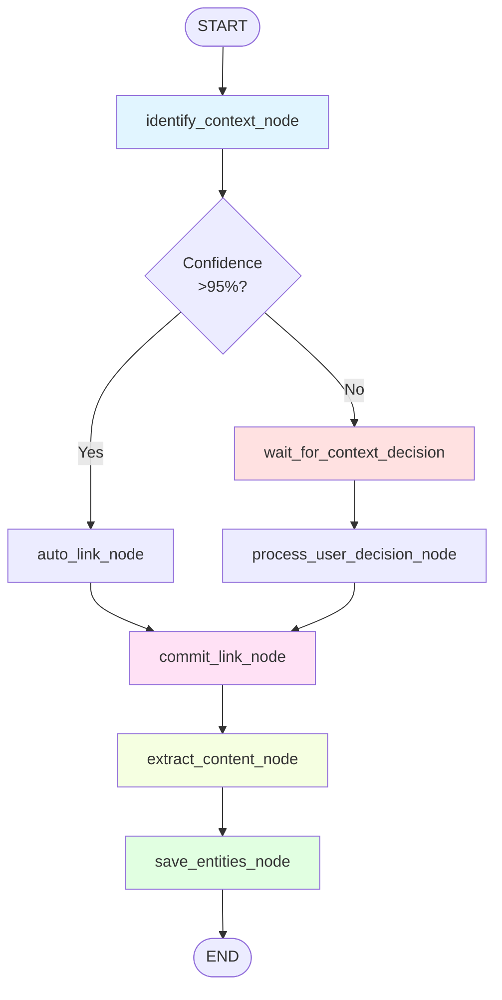

# Workflow States - Минимальный LangGraph для MVP

**Цель:** Определить упрощенный LangGraph workflow с фокусом на ключевые узлы и переходы.

---

## Принципы упрощения

1. **Минимум узлов** - только критичные для демонстрации архитектуры
2. **Простая логика ветвления** - избегаем сложных conditional edges
3. **Один checkpoint** - фиксация только после L1/L2 decision

---

## Workflow Graph (MVP)



---

## Node Descriptions

### 1. identify_context_node
**Роль:** L1/L2 - Идентификация PARA контекста для заметки.

**Input (from state):**
- `episodic_path: str`
- `episodic_content: str`

**Logic:**
```python
async def identify_context_node(state: EpisodicWorkflowState) -> EpisodicWorkflowState:
    """
    Генерирует PARAProposal для episodic.

    Steps:
    1. Classify PARA type (Project/Area/Resource)
    2. Find similar containers (top-3)
    3. LLM decision: select best match
    4. Build proposal with primary + alternatives
    """
    proposal = await pipgraph_manager.generate_para_proposal(
        episodic_content=state["episodic_content"]
    )

    state["system_proposal"] = proposal
    return state
```

**Output (to state):**
- `system_proposal: PARAProposal`

**Tests:**
- `test_identify_context_creates_proposal()`
- `test_identify_context_has_alternatives()`

---

### 2. auto_link_node (conditional)
**Роль:** Автоматическая привязка при высокой уверенности.

**Condition:** `primary_candidate.confidence > 0.95`

**Logic:**
```python
async def auto_link_node(state: EpisodicWorkflowState) -> EpisodicWorkflowState:
    """
    Автоматически линкует episodic к primary candidate.

    Only called if confidence is very high (>95%).
    """
    primary = state["system_proposal"].primary_candidate

    await pipgraph_manager.auto_link_episodic(
        episodic_path=state["episodic_path"],
        container_id=primary.id,
        container_type=state["system_proposal"].para_type
    )

    state["final_context"] = {
        "id": primary.id,
        "name": primary.name,
        "type": state["system_proposal"].para_type
    }

    logger.info(f"Auto-linked note to {primary.name} (confidence: {primary.confidence})")
    return state
```

**Output (to state):**
- `final_context: dict`

**Tests:**
- `test_auto_link_high_confidence()`

---

### 3. wait_for_context_decision (interrupt node)
**Роль:** Прерывание workflow для получения решения пользователя.

**Condition:** `primary_candidate.confidence <= 0.95`

**Logic:**
```python
async def wait_for_context_decision(state: EpisodicWorkflowState) -> EpisodicWorkflowState:
    """
    LangGraph interrupt point.

    Создает UserCheckStatus узел со статусом "pending" и ждет user input.
    """
    # Create pending check in Neo4j
    check = await user_check_crud.create_check(
        check_id=f"check-{state['episodic_path']}-{timestamp}",
        timestamp=datetime.utcnow(),
        status="pending",
        outcome="pending",
        comment=None
    )

    # Link check to episodic
    await user_check_crud.link_check_to_episodic(
        check_id=check["id"],
        episodic_path=state["episodic_path"],
        is_current=True
    )

    logger.info(f"Workflow interrupted for user decision (episodic: {state['episodic_path']})")

    # LangGraph handles interrupt here
    return state
```

**Output (to state):**
- (none, waits for external input)

**External Action:**
- WebSocket sends notification to frontend
- Frontend displays PARAProposal with action buttons
- User selects action → WebSocket receives UserDecisionPayload
- Workflow resumes with updated state

**Tests:**
- `test_interrupt_creates_pending_check()`
- `test_interrupt_pauses_workflow()`

---

### 4. process_user_decision_node
**Роль:** Обработка решения пользователя после resume.

**Input (from state):**
- `user_decision: UserDecisionPayload`

**Logic:**
```python
async def process_user_decision_node(state: EpisodicWorkflowState) -> EpisodicWorkflowState:
    """
    Обрабатывает решение пользователя.

    Actions:
    - "confirm" → link to primary_candidate
    - "link_to_alternative" → link to selected_container_id
    - "create_custom" → create new container + link
    - "dismiss" → skip L3, end workflow
    """
    decision = state["user_decision"]

    if decision.action == "confirm":
        primary = state["system_proposal"].primary_candidate
        await pipgraph_manager.auto_link_episodic(
            episodic_path=state["episodic_path"],
            container_id=primary.id,
            container_type=state["system_proposal"].para_type
        )
        state["final_context"] = {"id": primary.id, "name": primary.name}

    elif decision.action == "link_to_alternative":
        await pipgraph_manager.auto_link_episodic(
            episodic_path=state["episodic_path"],
            container_id=decision.selected_container_id,
            container_type=state["system_proposal"].para_type
        )
        # Find alternative name from proposal
        alt = next(a for a in state["system_proposal"].alternatives if a.id == decision.selected_container_id)
        state["final_context"] = {"id": alt.id, "name": alt.name}

    elif decision.action == "create_custom":
        new_container = await pipgraph_manager.create_para_container(
            name=decision.custom_container_name,
            para_type=decision.custom_container_type or state["system_proposal"].para_type
        )
        await pipgraph_manager.auto_link_episodic(
            episodic_path=state["episodic_path"],
            container_id=new_container["id"],
            container_type=new_container["type"]
        )
        state["final_context"] = {"id": new_container["id"], "name": new_container["name"]}

    elif decision.action == "dismiss":
        logger.info("User dismissed proposal, skipping extraction")
        state["final_context"] = None  # Signal to skip L3

    # Update UserCheckStatus to "confirmed"
    await user_check_crud.update_check_status(
        episodic_path=state["episodic_path"],
        status="confirmed",
        outcome=decision.action,
        comment=decision.comment
    )

    return state
```

**Output (to state):**
- `final_context: dict | None`

**Tests:**
- `test_process_decision_confirm()`
- `test_process_decision_link_alternative()`
- `test_process_decision_create_custom()`
- `test_process_decision_dismiss()`

---

### 5. commit_link_node
**Роль:** Точка фиксации - "no return" после привязки заметки.

**Input (from state):**
- `final_context: dict`

**Logic:**
```python
async def commit_link_node(state: EpisodicWorkflowState) -> EpisodicWorkflowState:
    """
    Финализирует привязку заметки к PARA контейнеру.

    Это точка невозврата - после этого узла заметка имеет контекст в графе.
    """
    if state["final_context"] is None:
        logger.warning("No context to commit (user dismissed), ending workflow")
        return state

    # Verify link exists in graph
    para_context = await relationship_crud.get_episodic_para_context(state["episodic_path"])

    if para_context is None:
        raise ValueError(f"Failed to verify link for episodic {state['episodic_path']}")

    logger.info(f"✅ Committed link: {state['episodic_path']} → {para_context['name']}")

    return state
```

**Output (to state):**
- (validation only, no new state)

**Tests:**
- `test_commit_link_verifies_graph_state()`
- `test_commit_link_fails_if_no_link()`

---

### 6. extract_content_node
**Роль:** L3 - Извлечение сущностей с учетом PARA контекста.

**Input (from state):**
- `episodic_path: str`
- `episodic_content: str`
- `final_context: dict`

**Logic:**
```python
async def extract_content_node(state: EpisodicWorkflowState) -> EpisodicWorkflowState:
    """
    Извлекает сущности через Graphiti с context injection.

    Context injection example:
    "Context: This note belongs to Project 'Website Redesign'"
    """
    if state["final_context"] is None:
        logger.info("Skipping extraction (no context)")
        return state

    context_text = f"Context: This note belongs to {state['final_context']['type']} '{state['final_context']['name']}'"

    extracted_entities = await pipgraph_manager.extract_entities_with_context(
        episodic_path=state["episodic_path"],
        episodic_content=state["episodic_content"],
        context=context_text
    )

    state["extracted_entities"] = extracted_entities

    logger.info(f"Extracted {len(extracted_entities)} entities with context: {context_text}")

    return state
```

**Output (to state):**
- `extracted_entities: list[ExtractedCandidate]`

**Tests:**
- `test_extract_with_context_injection()`
- `test_extract_skipped_if_no_context()`

---

### 7. save_entities_node
**Роль:** Сохранение извлеченных сущностей в граф.

**Input (from state):**
- `extracted_entities: list[ExtractedCandidate]`
- `episodic_path: str`

**Logic:**
```python
async def save_entities_node(state: EpisodicWorkflowState) -> EpisodicWorkflowState:
    """
    Сохраняет сущности в Neo4j.

    Steps:
    1. Batch save Entity узлов
    2. Create [:MENTIONS] relationships
    3. Create UserCheckStatus for each entity (auto-confirmed in MVP)
    4. Return list of saved UUIDs
    """
    if not state["extracted_entities"]:
        logger.info("No entities to save")
        return state

    await entity_crud.batch_save_entities(
        entities=state["extracted_entities"],
        episodic_path=state["episodic_path"]
    )

    # Auto-confirm all entities in MVP (no second interrupt)
    entity_uuids = [e.uuid for e in state["extracted_entities"]]
    await pipgraph_manager.confirm_entities(
        episodic_path=state["episodic_path"],
        entity_uuids=entity_uuids
    )

    state["confirmed_entity_uuids"] = entity_uuids

    logger.info(f"✅ Saved {len(entity_uuids)} entities to graph")

    return state
```

**Output (to state):**
- `confirmed_entity_uuids: list[str]`

**Tests:**
- `test_save_entities_creates_nodes()`
- `test_save_entities_creates_mentions_relationships()`
- `test_save_entities_auto_confirms()`

---

## Conditional Edges Logic

### should_interrupt_for_context
**Роль:** Решает, прерывать ли workflow для L1/L2 decision.

**Logic:**
```python
def should_interrupt_for_context(state: EpisodicWorkflowState) -> str:
    """
    Returns node name based on confidence threshold.

    - High confidence (>95%) → "auto_link_node"
    - Low confidence (<=95%) → "wait_for_context_decision"
    """
    if state["system_proposal"].primary_candidate.confidence > 0.95:
        return "auto_link_node"
    else:
        return "wait_for_context_decision"
```

**Tests:**
- `test_interrupt_logic_high_confidence()`
- `test_interrupt_logic_low_confidence()`

---

### should_proceed_to_extraction
**Роль:** Решает, продолжать ли workflow после L1/L2 decision.

**Logic:**
```python
def should_proceed_to_extraction(state: EpisodicWorkflowState) -> bool:
    """
    Returns True if we have final_context (i.e., user didn't dismiss).

    - final_context exists → continue to L3
    - final_context is None → end workflow (user dismissed)
    """
    return state["final_context"] is not None
```

**Tests:**
- `test_proceed_if_context_exists()`
- `test_end_if_dismissed()`

---

## Complete LangGraph Definition

```python
from langgraph.graph import StateGraph, END
from app.workflows.state import EpisodicWorkflowState
from app.workflows.nodes import (
    identify_context_node,
    auto_link_node,
    wait_for_context_decision,
    process_user_decision_node,
    commit_link_node,
    extract_content_node,
    save_entities_node
)
from app.workflows.conditions import (
    should_interrupt_for_context,
    should_proceed_to_extraction
)

# Define workflow
workflow = StateGraph(EpisodicWorkflowState)

# Add nodes
workflow.add_node("identify_context", identify_context_node)
workflow.add_node("auto_link", auto_link_node)
workflow.add_node("wait_context_decision", wait_for_context_decision)
workflow.add_node("process_decision", process_user_decision_node)
workflow.add_node("commit_link", commit_link_node)
workflow.add_node("extract_content", extract_content_node)
workflow.add_node("save_entities", save_entities_node)

# Entry point
workflow.set_entry_point("identify_context")

# L1/L2 branching
workflow.add_conditional_edges(
    "identify_context",
    should_interrupt_for_context,
    {
        "auto_link": "auto_link",
        "wait_context_decision": "wait_context_decision"
    }
)

# After interrupt, process decision
workflow.add_edge("wait_context_decision", "process_decision")

# Both paths converge to commit
workflow.add_edge("auto_link", "commit_link")
workflow.add_edge("process_decision", "commit_link")

# L3 branching
workflow.add_conditional_edges(
    "commit_link",
    should_proceed_to_extraction,
    {
        True: "extract_content",
        False: END
    }
)

# L3 pipeline
workflow.add_edge("extract_content", "save_entities")
workflow.add_edge("save_entities", END)

# Compile
compiled_workflow = workflow.compile()
```

---

## Workflow Execution Examples

### Example 1: High Confidence (Auto-Link)
```python
# Input
initial_state = {
    "episodic_path": "Notes/daily/2025-11-19.md",
    "episodic_content": "Today I completed the homepage redesign mockups..."
}

# Execute
result = await compiled_workflow.ainvoke(initial_state)

# Flow:
# identify_context → (confidence: 0.97) → auto_link → commit_link → extract_content → save_entities → END

# Output
assert result["final_context"]["name"] == "Website Redesign"
assert len(result["confirmed_entity_uuids"]) > 0
```

---

### Example 2: Low Confidence (User Interrupt)
```python
# Input
initial_state = {
    "episodic_path": "Notes/ideas/random-thought.md",
    "episodic_content": "Maybe we should consider blockchain..."
}

# Execute (first pass - до interrupt)
result = await compiled_workflow.ainvoke(initial_state)

# Flow:
# identify_context → (confidence: 0.65) → wait_context_decision → [INTERRUPT]

# Verify interrupt
assert result["system_proposal"] is not None
assert result["user_decision"] is None  # Waiting for input

# User provides decision
user_decision = UserDecisionPayload(
    action="link_to_alternative",
    selected_container_id="area-tech-research",
    comment="This is exploratory research"
)

# Resume workflow
result = await compiled_workflow.ainvoke({
    ...result,
    "user_decision": user_decision
})

# Flow (continued):
# process_decision → commit_link → extract_content → save_entities → END

# Output
assert result["final_context"]["id"] == "area-tech-research"
assert len(result["confirmed_entity_uuids"]) > 0
```

---

### Example 3: User Dismisses
```python
# Input
initial_state = {
    "episodic_path": "Notes/scratch.md",
    "episodic_content": "Random temporary notes..."
}

# Execute → Interrupt → User dismisses
result = await compiled_workflow.ainvoke(initial_state)

user_decision = UserDecisionPayload(action="dismiss")

result = await compiled_workflow.ainvoke({
    ...result,
    "user_decision": user_decision
})

# Flow:
# identify_context → wait_context_decision → process_decision → commit_link → (no context) → END

# Output
assert result["final_context"] is None
assert result["extracted_entities"] == []
assert result["confirmed_entity_uuids"] == []
```

---

## Simplified vs Original Architecture

### Упрощения в MVP

| Original | MVP Simplification |
|----------|-------------------|
| Multiple interrupt points (L1/L2 + L3 entity confirmation) | Only one interrupt (L1/L2) |
| Complex conditional logic with retry loops | Linear flow with simple branching |
| Separate nodes for "propose" and "confirm" | Combined in single nodes |
| Entity-level user confirmation | Auto-confirm all extracted entities |
| History chain via `[:NEXT]` relationships | Single `[:HAS_CHECK]` per entity |

### Что откладываем

1. **L3 Entity Confirmation Interrupt** - в MVP автоматически подтверждаем все извлеченные сущности
2. **Retry Logic** - если LLM падает, workflow падает (нет retry)
3. **Partial Save** - либо сохраняем все сущности, либо ничего (нет частичного сохранения)
4. **Multi-round Extraction** - один проход Graphiti, нет итеративного уточнения

---

## State Persistence (Checkpoints)

### LangGraph Checkpointer Configuration
```python
from langgraph.checkpoint.sqlite import SqliteSaver

# Initialize checkpointer
checkpointer = SqliteSaver.from_conn_string("checkpoints.db")

# Compile with checkpointer
compiled_workflow = workflow.compile(checkpointer=checkpointer)

# Execute with thread_id for persistence
result = await compiled_workflow.ainvoke(
    initial_state,
    config={"configurable": {"thread_id": "note-processing-123"}}
)
```

**Когда сохраняются checkpoints:**
- После каждого узла автоматически
- При interrupt явно (LangGraph управляет этим)

**Восстановление после interrupt:**
```python
# Resume from last checkpoint
result = await compiled_workflow.ainvoke(
    {"user_decision": user_decision_payload},
    config={"configurable": {"thread_id": "note-processing-123"}}
)
```

---

## Error Handling Strategy

### Try/Except в узлах
```python
async def identify_context_node(state: EpisodicWorkflowState) -> EpisodicWorkflowState:
    try:
        proposal = await pipgraph_manager.generate_para_proposal(...)
        state["system_proposal"] = proposal
    except Exception as e:
        logger.error(f"Failed to identify context: {e}", exc_info=True)
        state["error"] = str(e)
        # Return state with error - workflow ends

    return state
```

### Conditional Edge на ошибку
```python
def has_error(state: EpisodicWorkflowState) -> bool:
    return state.get("error") is not None

workflow.add_conditional_edges(
    "identify_context",
    lambda s: "error_node" if has_error(s) else should_interrupt_for_context(s),
    {
        "error_node": "error_handler_node",
        "auto_link": "auto_link",
        "wait_context_decision": "wait_context_decision"
    }
)
```

**MVP Simplification:** В MVP просто логируем ошибку и возвращаем state с полем `error`. Workflow останавливается.

---

## Next Steps

После прочтения этого документа:
- **Используйте эту схему** при реализации Iteration 3-5
- **Следуйте структуре узлов** (не добавляйте новые узлы без необходимости)
- **Тестируйте каждый узел изолированно** перед интеграцией
- **Сверяйтесь с [02_IMPLEMENTATION_STEPS.md](./02_IMPLEMENTATION_STEPS.md)** для деталей реализации

**Помните:** Workflow - это оркестратор, а не бизнес-логика. Вся логика должна быть в PipGraphManager.
