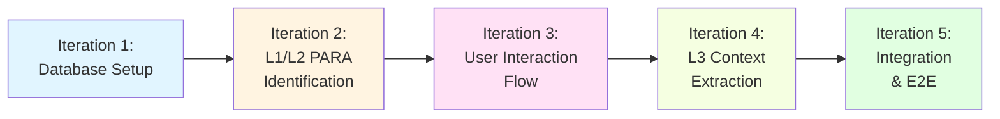

# Response Flow - MVP Implementation Plan

**Дата создания:** 2025-11-19
**Статус:** Ready for Development
**Стратегия:** Minimal Viable Product with Iterative Delivery

---

## Обзор плана

Этот план описывает **пошаговую реализацию** архитектуры Response Flow с фокусом на **минимальную рабочую функциональность**. Мы разбили разработку на 5 итераций, каждая из которых добавляет работающий слой системы.

### Принципы MVP

1. **Iterative Delivery** - каждая итерация дает работающую функцию
2. **Test-Driven** - тесты пишутся параллельно с кодом
3. **Simplify Now, Extend Later** - откладываем сложные кейсы
4. **One Thing at a Time** - фокус на одной задаче за раз

---

## Навигация

### Фундамент плана
- **[01_MVP_SCOPE.md](./01_MVP_SCOPE.md)** - *Что входит в MVP?* Границы функциональности, критерии готовности, технические упрощения.

### Реализация
- **[02_IMPLEMENTATION_STEPS.md](./02_IMPLEMENTATION_STEPS.md)** - *Что делаем?* 5 итераций разработки с конкретными задачами, методами и DoD.
- **[03_DATA_STRUCTURES.md](./03_DATA_STRUCTURES.md)** - *Какие модели нужны?* Упрощенные Pydantic модели и GraphSchema для MVP.
- **[04_WORKFLOW_STATES.md](./04_WORKFLOW_STATES.md)** - *Как работает процесс?* Минимальный LangGraph граф и логика узлов.

### Тестирование
- **[05_TESTING_STRATEGY.md](./05_TESTING_STRATEGY.md)** - *Как проверяем?* Тестовая стратегия для каждой итерации.

---

## Roadmap (5 итераций)

### Iteration 1: Database Setup (1-2 дня)
**Цель:** Развернуть Neo4j схему, создать базовые CRUD операции.
**Результат:** Можем создавать PARA контейнеры и заметки в графе.

### Iteration 2: L1/L2 PARA Identification (2-3 дня)
**Цель:** Реализовать Top-Down идентификацию контекста.
**Результат:** Система предлагает правильный проект/область для заметки.

### Iteration 3: User Interaction Flow (2 дня)
**Цель:** Добавить прерывания workflow и обработку решений пользователя.
**Результат:** Пользователь может подтвердить, выбрать альтернативу или создать новый контейнер.

### Iteration 4: L3 Context Extraction (2-3 дня)
**Цель:** Извлекать сущности с учетом контекста проекта.
**Результат:** Graphiti получает контекст в промпте, создает сущности по whitelist.

### Iteration 5: Integration & E2E (1-2 дня)
**Цель:** Связать все части, протестировать полный цикл.
**Результат:** End-to-end тест от приема заметки до сохранения сущностей.

**Total:** 8-12 дней разработки

---

## Как начать?

1. **Прочитайте [01_MVP_SCOPE.md](./01_MVP_SCOPE.md)**, чтобы понять, что мы НЕ делаем в MVP.
2. **Откройте [02_IMPLEMENTATION_STEPS.md](./02_IMPLEMENTATION_STEPS.md)** и начните с **Iteration 1**.
3. **Используйте [05_TESTING_STRATEGY.md](./05_TESTING_STRATEGY.md)** для написания тестов параллельно с кодом.
4. **Сверяйтесь с [03_DATA_STRUCTURES.md](./03_DATA_STRUCTURES.md)** при создании моделей.
5. **Изучите [04_WORKFLOW_STATES.md](./04_WORKFLOW_STATES.md)** перед работой с LangGraph.

---

## Критерии успеха MVP

✅ **Работает базовый цикл:**
- Заметка → L1/L2 Identification → User Confirmation → Link to PARA → L3 Extraction → Save Entities

✅ **Нет тупиков:**
- Каждое прерывание дает пользователю конструктивные опции

✅ **Чистый граф:**
- Нет дублированных данных в свойствах узлов
- Вся информация в связях (`:IS_PART_OF`, `:HAS_CHECK`)

✅ **Контекст работает:**
- Graphiti получает имя проекта в промпте
- Извлечение меняется в зависимости от контекста

---

## Связь с исходной документацией

Этот план основан на архитектуре из `backend/TODO/response_flow_draft/`:
- Мы сохранили **все ключевые принципы** (Top-Down, No-Cache, Constructive)
- Мы **упростили реализацию** (меньше полей в моделях, проще логика прерываний)
- Мы **отложили продвинутые фичи** (аналитика решений, история изменений, дедупликация)

**После MVP** вы сможете вернуться к исходному roadmap (`06_IMPLEMENTATION_ROADMAP.md`) и добавить продвинутые функции.

---

**Готово к старту!** Переходите к [02_IMPLEMENTATION_STEPS.md](./02_IMPLEMENTATION_STEPS.md) 🚀
