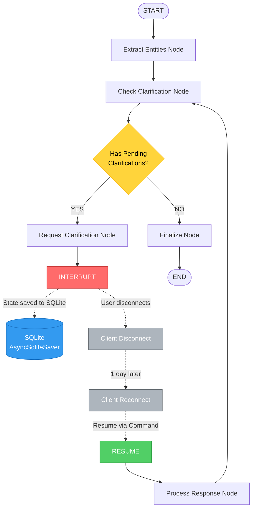
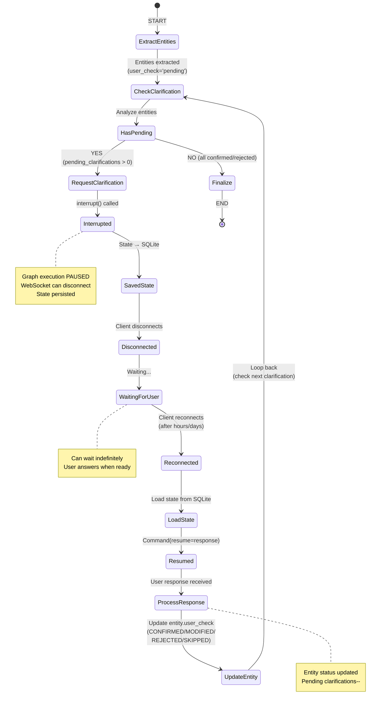
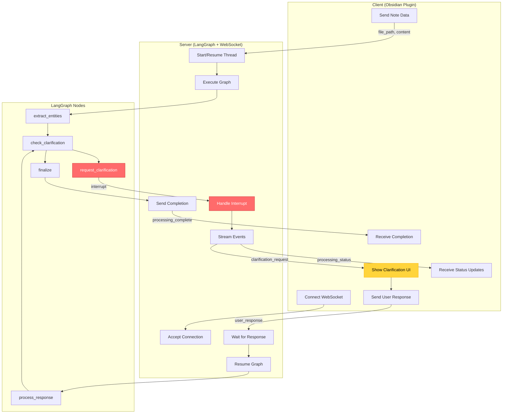
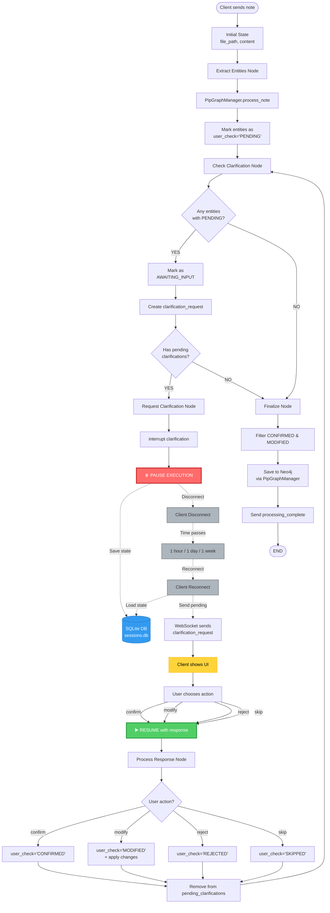
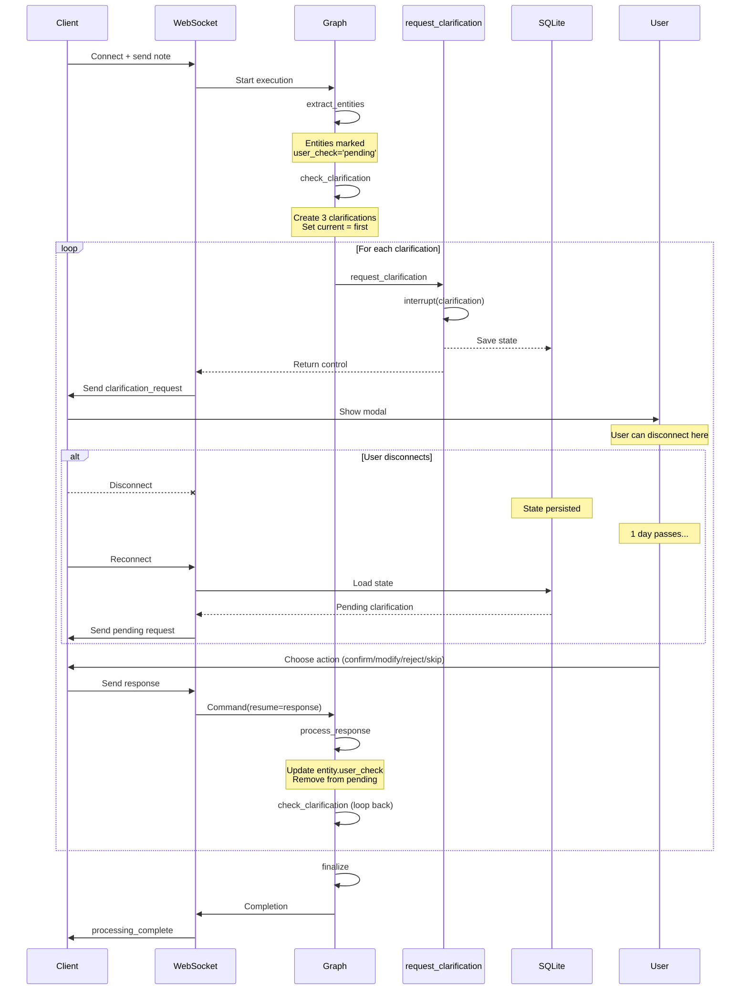

# Feedback Graph v0.1 - LangGraph Structure

**Дата создания:** 2025-11-09
**Версия:** 0.1
**Источник:** [user_check_mvp_plan.md](./user_check_mvp_plan.md)

---

## Общий граф взаимодействия



---

## Детальная структура с состояниями



---

## Граф с типами сообщений WebSocket



---

## Детальный flow с user_check статусами



---

## Циклический процесс clarifications



---

## Легенда

### Цвета нод

- 🟥 **Красный** (`#ff6b6b`) - INTERRUPT (pause execution)
- ▶️ **Зеленый** (`#51cf66`) - RESUME (continue execution)
- 💾 **Синий** (`#339af0`) - Persistent storage (SQLite)
- ⚠️ **Желтый** (`#ffd43b`) - Conditional decision / User interaction
- ⏸️ **Серый** (`#adb5bd`) - Client lifecycle events

### Типы соединений

- **Сплошная линия** (`-->`) - Прямой переход между нодами
- **Пунктирная линия** (`-.->`) - Асинхронные события (disconnect/reconnect/save)
- **Стрелка** в обе стороны - Цикл (loop back)

### Статусы user_check

1. `PENDING` - Извлечено, не показано пользователю
2. `AWAITING_INPUT` - Запрошено подтверждение, ждем ответа
3. `CONFIRMED` - Пользователь подтвердил
4. `MODIFIED` - Пользователь отредактировал
5. `REJECTED` - Пользователь отклонил
6. `SKIPPED` - Пользователь пропустил

---

## Использование

### Просмотр в VSCode

1. Установить расширение "Markdown Preview Mermaid Support"
2. Открыть файл в Preview режиме (Ctrl+Shift+V)

### Экспорт диаграмм

```bash
# Install mermaid-cli
npm install -g @mermaid-js/mermaid-cli

# Export to PNG
mmdc -i feedback_graph_v01.md -o graph.png

# Export to SVG
mmdc -i feedback_graph_v01.md -o graph.svg
```

### Online редактор

https://mermaid.live - для быстрого просмотра и редактирования

---

## См. также

- [user_check_mvp_plan.md](./user_check_mvp_plan.md) - Полный план MVP
- [state_serialization_details.md](./state_serialization_details.md) - Детали сериализации state
- [Session Management](./user_check_mvp_plan.md#session-management) - Управление сессиями

---

**Документ создан:** 2025-11-09
**Автор:** Claude Code
**Статус:** Ready for review
