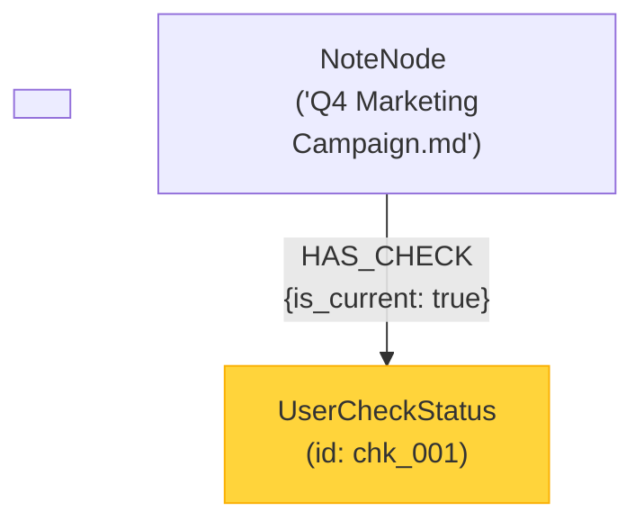
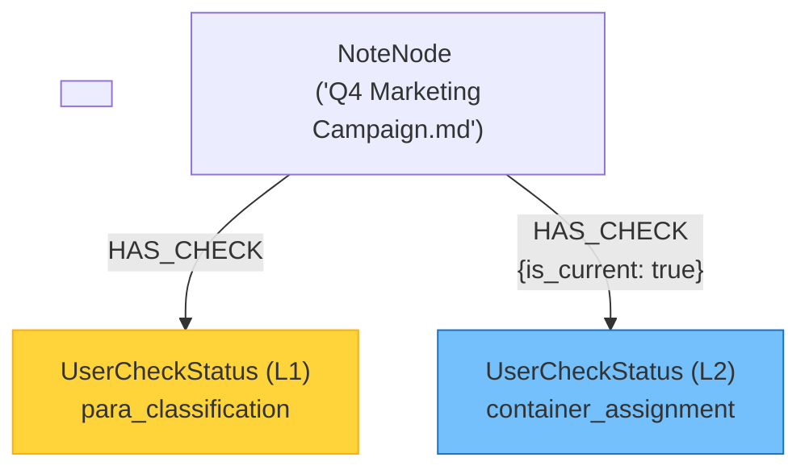
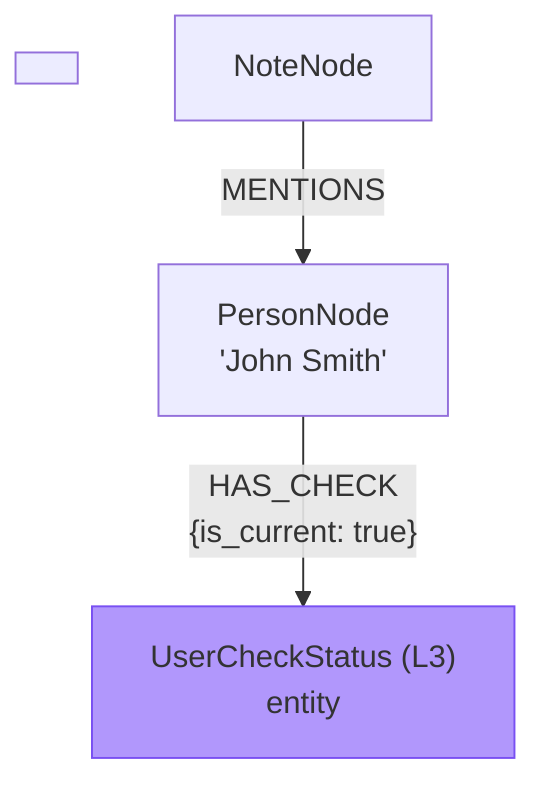
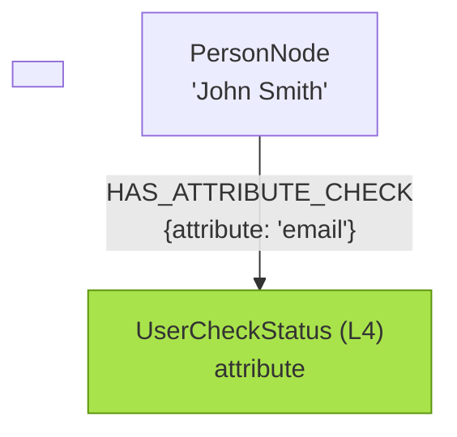
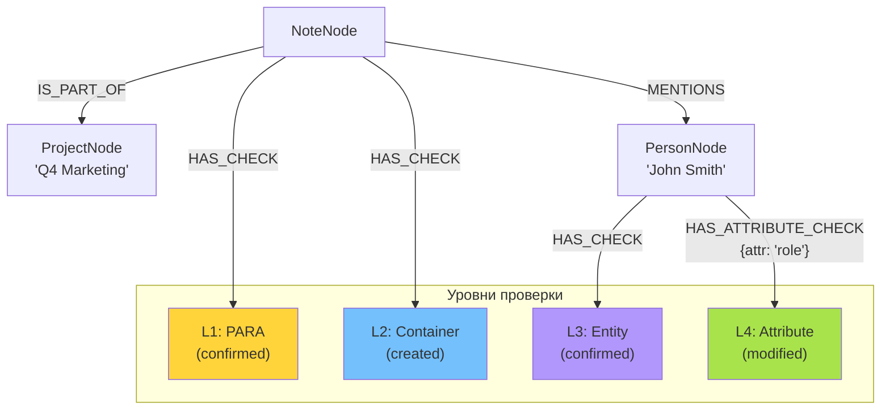

Отличный вопрос! Это именно та проверка, которая показывает, насколько гибка и надежна выбранная архитектура.

Ответ: **Подход с "Нодой Статуса" не просто работает с многоуровневой системой, он для нее идеально создан.** Он позволяет элегантно и эффективно управлять каждым уровнем гранулярности как независимым, но связанным событием.

Давайте разберем, как именно это будет выглядеть для каждого уровня из вашего документа `user_check_granularity_proposal.md`.

### Ключевой принцип: "Проверяемый объект" и "Уровень проверки"

В нашей архитектуре (`Подход B`) `UserCheckStatus` нода всегда связана с тем объектом, который она проверяет. А поле `confirmation_level` внутри этой ноды указывает на *тип* проверки.

Это позволяет нам создать чистую и понятную модель.

---

### Уровень 1: PARA Classification

*   **Что проверяется?** Сама нода `Note`.
*   **Что храним?** Статус классификации заметки.

**Структура в графе:**



**Данные в ноде `UserCheckStatus` (chk_001):**
```json
{
    "id": "chk_001",
    "status": "modified", // Пользователь изменил Project на Area
    "confirmation_level": "para_classification", // ← Указываем уровень!
    "timestamp": "2025-11-09T12:00:00Z",
    "user_action": "modify",
    "original_suggestion": "Project",
    "user_choice": "Area",
    "reasoning": "This is an ongoing responsibility, not a project with a deadline."
}
```
**Преимущество:** Статус классификации заметки живет отдельно. Мы можем в любой момент запросить все заметки, которые еще не прошли L1 проверку, или те, где система ошиблась.

---

### Уровень 2: Container Assignment

*   **Что проверяется?** Опять же, нода `Note` — а именно, к какому контейнеру (`Project`, `Area`) она должна быть привязана.
*   **Что храним?** Результат этого решения.

**Структура в графе:**

Теперь у одной и той же ноды `Note` будет *две* связанные ноды `UserCheckStatus`, каждая для своего уровня.


**Данные в ноде `UserCheckStatus` (L2):**
```json
{
    "id": "chk_002",
    "status": "created", // Пользователь создал новый проект
    "confirmation_level": "container_assignment", // ← Указываем уровень!
    "timestamp": "2025-11-09T12:02:00Z",
    "user_action": "create_new",
    "container_type": "Project",
    "container_id": "proj_new_123", // UUID созданного узла Project
    "container_name": "Q4 Marketing Campaign 2024"
}
```
**Преимущество:** Проверки L1 и L2 независимы. Мы можем видеть, что пользователь согласился с типом `Project`, но решил привязать заметку не к предложенному, а к новому проекту. Это ценнейшая информация для обучения системы.

---

### Уровень 3: Entity Confirmation

*   **Что проверяется?** Нода конкретной сущности (`Person`, `Organization`), которая была извлечена из `Note`.
*   **Что храним?** Статус подтверждения этой сущности.

**Структура в графе:**

Связь `HAS_CHECK` теперь идет от `EntityNode`, а не от `Note`.


**Данные в ноде `UserCheckStatus` (L3):**
```json
{
    "id": "chk_003",
    "status": "confirmed",
    "confirmation_level": "entity", // ← Указываем уровень!
    "timestamp": "2025-11-09T12:05:00Z",
    "user_action": "confirm",
    "confidence": 0.90, // Уверенность системы, которую подтвердил пользователь
    "system_suggestion": "Person: John Smith"
}
```
**Преимущество:** Жизненный цикл проверки сущности полностью отделен от жизненного цикла проверки заметки. Если мы позже найдем эту же сущность в другой заметке, у нее уже будет статус `confirmed`.

---

### Уровень 4: Attribute Validation

*   **Что проверяется?** Конкретный *атрибут* на `EntityNode`.
*   **Что храним?** Статус валидации этого атрибута.

Это самый интересный случай. Мы можем смоделировать его еще более точно, используя свойства на отношении.

**Структура в графе:**


**Данные в ноде `UserCheckStatus` (L4):**
```json
{
    "id": "chk_004",
    "status": "modified",
    "confirmation_level": "attribute", // ← Указываем уровень!
    "timestamp": "2025-11-09T12:08:00Z",
    "user_action": "modify",
    "modifications": [
        {
            "field_name": "email",
            "original_value": "john@example.com",
            "new_value": "john.smith@techcorp.com"
        }
    ]
}
```
**Преимущество:** Мы получаем максимально гранулярный аудит. Мы точно знаем, что пользователь подтвердил сущность "John Smith", но исправил его email. Типизированное отношение `HAS_ATTRIBUTE_CHECK` позволяет делать очень мощные запросы, например: "Найди все email-адреса, которые были исправлены пользователями".

### Полная картина: Как все это работает вместе

Представьте себе полный граф после всех этапов проверки. Он будет выглядеть так:



### Как эта архитектура поддерживает ваш Workflow

Ваш пошаговый workflow из `user_check_granularity_proposal.md` теперь управляется простыми запросами к графу:

1.  **"Нужна ли PARA clarification (L1)?"**
    *   **Запрос:** `MATCH (n:Note {path: '...'}) WHERE NOT (n)-[:HAS_CHECK]->(:UserCheckStatus {confirmation_level: 'para_classification'}) RETURN n`
    *   (Найди мне заметки, у которых нет ноды проверки уровня 'para_classification')

2.  **"Нужно ли container assignment (L2), если L1 пройден?"**
    *   **Запрос:** `MATCH (n:Note)-[:HAS_CHECK]->(c:UserCheckStatus) WHERE c.confirmation_level = 'para_classification' AND c.status IN ['confirmed', 'modified'] AND NOT (n)-[:HAS_CHECK]->(:UserCheckStatus {confirmation_level: 'container_assignment'}) RETURN n`
    *   (Найди заметки, где L1 завершен, но L2 еще нет)

3.  **"Какие сущности в этой заметке требуют подтверждения (L3)?"**
    *   **Запрос:** `MATCH (:Note {path: '...'})-[:MENTIONS]->(e:Entity) WHERE NOT (e)-[:HAS_CHECK]->(:UserCheckStatus {confirmation_level: 'entity'}) RETURN e ORDER BY e.priority`
    *   (Найди все сущности в заметке, у которых еще нет проверки уровня 'entity')

Состояние всего сложного workflow хранится прямо в графе, и система в любой момент может понять, какой следующий вопрос задать пользователю, просто сделав запрос к базе данных.

### Вывод

Подход с **"Нодой Статуса"** — это не компромисс, а идеальная основа для вашей многоуровневой системы. Он обеспечивает:

*   **Унифицированную модель:** Один тип ноды `UserCheckStatus` используется для всех уровней, что упрощает код.
*   **Разделение ответственности:** Статус заметки, статус ее классификации и статус ее сущностей — это независимые, атомарные факты.
*   **Полную гранулярную историю:** Вы получаете полный аудит-трейл по каждому клику и исправлению пользователя на любом уровне.
*   **Workflow, управляемый данными:** Логика "что спросить дальше" становится результатом простого запроса к графу, а не сложным конечным автоматом в коде.