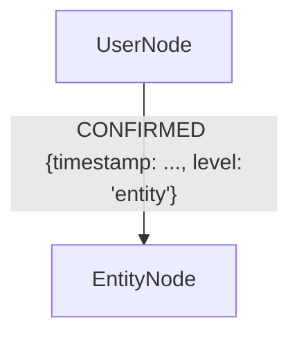

### Анализ текущего предложения (хранение в атрибутах)

Изначальное предложение backend/docs/attend/response_flow/user_check_granularity_proposal.md


Вы предлагаете хранить `UserCheckDetail` как сложный JSON-объект (или словарь в Python) внутри свойства `user_check` на самой ноде `EntityNode`.

```python
entity.attributes['user_check'] = {
    'status': 'modified',
    'confirmation_level': 'entity',
    'modifications': [...]
    # ... и т.д.
}
```

**Преимущества этого подхода:**

1.  **Простота:** Вся информация о сущности находится в одном месте. При извлечении ноды вы сразу получаете всю связанную с ней информацию о проверке, не требуя дополнительных запросов.
2.  **Атомарность:** Обновление статуса — это обновление одного свойства на одной ноде. Просто и транзакционно.
3.  **Минимализм:** Граф не "засоряется" мелкими мета-нодами, что делает его визуально чище.

**Недостатки (именно те, о которых вы беспокоитесь):**

1.  **Эффективность запросов:** Это главная проблема. Большинство графовых баз данных (включая Neo4j) **не могут эффективно индексировать и запрашивать данные внутри JSON-объектов**, хранящихся как строковое свойство.
    *   Запрос "Найди мне все сущности со статусом `pending`" превратится в `MATCH (n) WHERE n.user_check.status = 'pending'`. Если `user_check` — это просто строка, это сработает, но если это сложный объект, база данных может не поддерживать такую точечную нотацию или будет выполнять полное сканирование (full scan) всех нод, что катастрофически медленно.
    *   Запрос "Найди все сущности, измененные пользователем за последнюю неделю" потребует разбора JSON на стороне базы данных или на стороне клиента, что сводит на нет преимущества индексации.

2.  **Отсутствие истории:** В вашем `modifications` есть история изменений полей, но нет истории изменения *статусов*. Например: `pending` -> `skipped` -> `awaiting_input` -> `confirmed`. Ваш подход хранит только конечное состояние. Для аналитики и обучения это может быть критично.

3.  **Сложность аналитических запросов:** Как ответить на вопрос "Какие типы сущностей пользователи чаще всего пропускают (`skipped`)?" или "Как часто первоначальное предположение системы (`system_suggestion`) оказывается верным?". Сделать это, агрегируя данные из JSON- blobs по всей базе, будет очень сложно и медленно.

### Лучшие практики и альтернативные архитектурные решения

Чтобы решить эти проблемы, нужно мыслить более "графово". Метаданные, особенно те, по которым вы хотите делать запросы, должны быть первоклассными гражданами графа — то есть, нодами или отношениями.

Вот три основных альтернативных подхода, от простого к наиболее мощному.

---

#### Вариант 1: Гибридный подход (Улучшение текущего предложения)

Это наименее радикальное изменение, которое частично решает проблему.

**Идея:** "Вынести" самые важные для индексации поля из JSON-объекта на верхний уровень атрибутов ноды, а полный объект оставить для деталей.

**Структура:**
```python
entity.attributes = {
    # --- Поля для индексации и быстрых запросов ---
    'user_check_status': 'modified',
    'user_check_timestamp': '2025-11-09T12:05:00Z',
    'user_check_priority': 2,
    
    # --- Полный объект для получения деталей ---
    'user_check_details': {
        'status': 'modified',
        'confirmation_level': 'attribute',
        'modifications': [...],
        # ...
    }
}
```

**Запросы:**
```cypher
// Быстрый поиск всех ожидающих подтверждения Person
CREATE INDEX ON :Person(user_check_status);
MATCH (p:Person {user_check_status: 'pending'}) RETURN p;

// Поиск всех высокоприоритетных задач, пропущенных пользователем
MATCH (t:Task {user_check_status: 'skipped'}) WHERE t.user_check_priority <= 2 RETURN t;
```

*   **Плюсы:**
    *   ✅ Решает проблему производительности для *самых частых* запросов.
    *   ✅ Легко реализовать. Минимальные изменения в текущей логике.
    *   ✅ Сохраняет простоту извлечения полной информации.
*   **Минусы:**
    *   ❌ Не решает проблему с запросами по вложенным данным (например, `modifications`).
    *   ❌ Не решает проблему с хранением истории статусов.
    *   ❌ Негибко: если завтра понадобится искать по `confirmation_level`, придется снова менять схему и выносить еще одно поле.

---

#### Вариант 2: Подход с "Нодой Статуса" (Наиболее "графовый" и гибкий)

**Идея:** Каждое событие `user_check` — это отдельная нода в графе. Это самый мощный и масштабируемый подход.

**Структура:**
```mermaid
graph TD
    Entity[EntityNode: Person "John Smith"] -->|HAS_CHECK| Check1
    Check1 -- PREVIOUS_CHECK --> Check2

    subgraph " "
        Check1[UserCheckNode {status: 'confirmed', level: 'entity', timestamp: ...}]
        Check2[UserCheckNode {status: 'pending', level: 'entity', timestamp: ...}]
    end
```

*   **`UserCheckNode`** хранит все детали из вашей модели `UserCheckDetail`.
*   Связь **`PREVIOUS_CHECK`** создает связанный список (историю) всех проверок для данной сущности.
*   Связь **`HAS_CHECK`** всегда указывает на *актуальный* статус.

**Запросы:**
```cypher
// Найти все сущности, ожидающие подтверждения
MATCH (c:UserCheck {status: 'pending'})<-[:HAS_CHECK]-(entity)
RETURN entity;

// Найти все сущности, которые были изменены (modified) после того, как были пропущены (skipped)
MATCH (current:UserCheck {status: 'modified'})<-[:HAS_CHECK]-(entity),
      (current)-[:PREVIOUS_CHECK*]->(previous:UserCheck {status: 'skipped'})
RETURN entity;

// Найти все модификации, сделанные для сущности
MATCH (entity {uuid: 'ent_123'})-[:HAS_CHECK]->(check:UserCheck)-[:PREVIOUS_CHECK*0..]->(history_check)
WHERE history_check.status = 'modified'
RETURN history_check.modifications;
```

*   **Плюсы:**
    *   ✅ **Максимальная производительность запросов:** Все поля на `UserCheckNode` могут быть проиндексированы. Запросы по статусам, датам, уровням — всё будет работать мгновенно.
    *   ✅ **Полная история (Audit Trail):** Вся цепочка изменений сохраняется и доступна для анализа. Это бесценно для отладки, аналитики и обучения ML-моделей.
    *   ✅ **Гибкость и расширяемость:** Легко добавить новые типы проверок или метаданных, просто добавив свойства в `UserCheckNode`.
    *   ✅ **Гранулярность:** Этот же подход можно применить и к атрибутам, если это необходимо. `(EntityNode)-[:HAS_ATTRIBUTE_CHECK {field: 'email'}]->(UserCheckNode)`.
*   **Минусы:**
    *   ❌ **Усложнение графа:** Количество нод в базе данных увеличится. Однако графовые БД оптимизированы именно для этого. Это не является реальной проблемой производительности, а скорее вопросом сложности модели.
    *   ❌ **Усложнение логики записи:** Вместо обновления одного свойства нужно создать новую ноду `UserCheck`, создать связь `PREVIOUS_CHECK` к старому статусу и перенаправить связь `HAS_CHECK` на новую ноду. Это требует транзакций.

---

#### Вариант 3: Подход с "Типизированными Отношениями"

**Идея:** Использовать тип отношения для обозначения статуса.

**Структура:**

Вместо `CONFIRMED` могут быть `:MODIFIED`, `:REJECTED`, `:SKIPPED`. Пользователь (`UserNode`) или Система (`SystemNode`) является источником отношения.

*   **Плюсы:**
    *   ✅ **Семантически очень выразительно:** Запрос `MATCH (u:User)-[r:CONFIRMED]->(e:Entity)` очень легко читается.
    *   ✅ Высокая производительность запросов по типам отношений.
*   **Минусы:**
    *   ❌ **Плохо подходит для истории:** При смене статуса пришлось бы удалить старое отношение (`:SKIPPED`) и создать новое (`:CONFIRMED`), теряя историю. Создавать "исторические" отношения типа `:WAS_SKIPPED` быстро приведет к хаосу.
    *   ❌ **Перегрузка отношений:** Если у нас много статусов, это приведет к большому количеству типов отношений, что может усложнить схему.
    *   ❌ **Менее гибко:** Все статусы должны иметь одинаковую семантику "кто-то сделал что-то с сущностью".

---

### Сравнительная таблица и Рекомендация

| Критерий | Вариант 0 (Proposal) | Вариант 1 (Гибридный) | **Вариант 2 (Нода Статуса)** | Вариант 3 (Отношения) |
| :--- | :---: | :---: | :---: | :---: |
| **Производительность запросов** | 🔴 Плохо | 🟡 Средне | ✅ **Отлично** | ✅ Отлично |
| **Хранение истории/Audit Trail** | 🔴 Нет | 🔴 Нет | ✅ **Отлично** | 🔴 Плохо |
| **Гибкость аналитики** | 🔴 Плохо | 🟡 Средне | ✅ **Отлично** | 🟡 Средне |
| **Сложность реализации** | ✅ Просто | ✅ Просто | 🟡 Средне | 🟡 Средне |
| **"Графовость" подхода** | 🔴 Низкая | 🟡 Средняя | ✅ **Высокая** | ✅ Высокая |

### Рекомендация

**Я настоятельно рекомендую использовать Вариант 2: "Нода Статуса".**

Несмотря на кажущуюся сложность, этот подход является наиболее правильным с точки зрения архитектуры графовых баз данных. Он решает вашу главную проблему — производительность запросов — и дает вам "бесплатно" две критически важные для вашей системы вещи: **полноценный аудит-трейл** и **возможности для глубокой аналитики**.

Ваша система, построенная на "human-in-the-loop", будет генерировать огромное количество ценных данных о том, где LLM ошибается, что пользователь исправляет, что пропускает. Эти данные — золотая жила для будущего улучшения системы. Архитектура, которая не позволяет эффективно запрашивать и анализировать эти данные, будет серьезным техническим долгом.

Ваш первоначальный документ-предложение — это превосходный фундамент. Вам нужно лишь переосмыслить *способ хранения* `UserCheckDetail` — не как свойства, а как отдельной, связанной сущности (`UserCheckNode`). Вся логика уровней, полей и workflow, которую вы описали, остается в силе и прекрасно ложится на эту архитектуру.