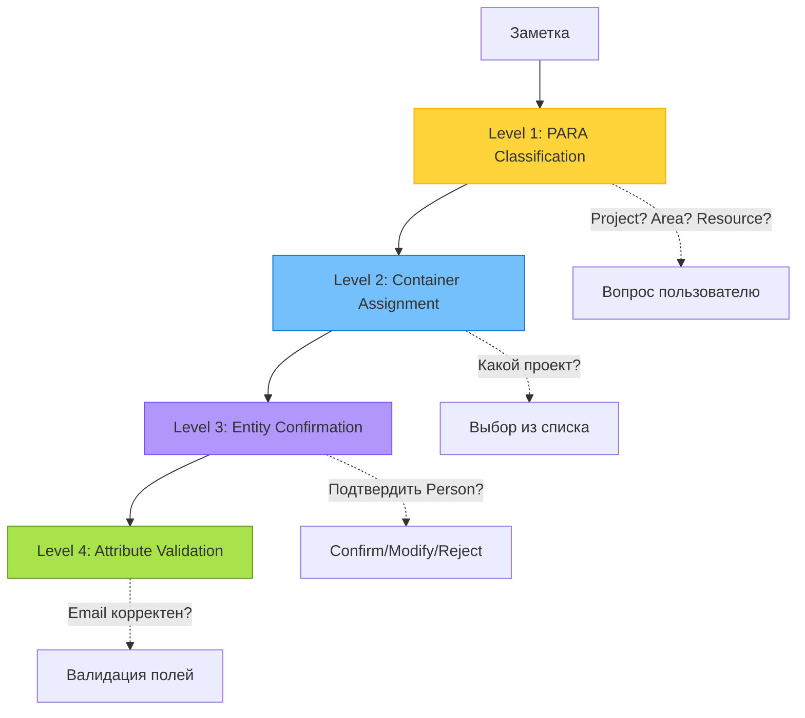
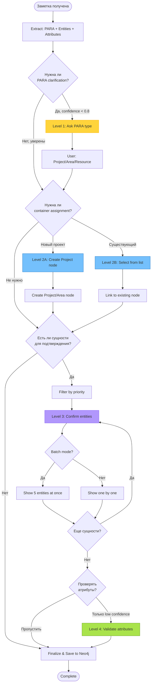

# User Check Granularity: Детализация статусов подтверждения

**Дата создания:** 2025-11-09
**Статус:** Proposal
**Связанные документы:**
- [user_check_mvp_plan.md](./user_check_mvp_plan.md) - базовая схема
- [PARA_TYPES_ARCHITECTURE.md](../PARA_TYPES_ARCHITECTURE.md) - архитектура графа
- [para_entities.py](../../app/models/para_entities.py) - типы сущностей

---

## Оглавление

1. [Проблематика текущей схемы](#1-проблематика-текущей-схемы)
2. [Уровни подтверждения](#2-уровни-подтверждения-granularity-layers)
3. [Предложение: Расширенная структура user_check](#3-предложение-расширенная-структура-user_check)
4. [Архитектурный вопрос: Ноды vs Атрибуты для PARA](#4-архитектурный-вопрос-ноды-vs-атрибуты-для-para)
5. [Пошаговый workflow clarifications](#5-пошаговый-workflow-clarifications)
6. [Технические детали реализации](#6-технические-детали-реализации)
7. [Сценарии использования](#7-сценарии-использования)

---

## 1. Проблематика текущей схемы

### 1.1 Текущая реализация (из MVP)

```python
class UserCheckStatus(str, Enum):
    PENDING = "pending"
    AWAITING_INPUT = "awaiting_input"
    CONFIRMED = "confirmed"
    MODIFIED = "modified"      # ← ПРОБЛЕМА: слишком общий
    REJECTED = "rejected"
    SKIPPED = "skipped"
```

**Использование:**
```python
entity.attributes['user_check'] = UserCheckStatus.CONFIRMED
entity.attributes['user_check_timestamp'] = utc_now().isoformat()
```

### 1.2 Проблемы

#### Проблема 1: Потеря информации при MODIFIED

```python
# ЧТО изменено?
entity.attributes['user_check'] = 'modified'  # ← Неясно!

# Возможные изменения:
# - Имя сущности: "John" → "John Smith"
# - Тип: "Person" → "Organization"
# - Атрибуты: добавлен email, изменена роль
# - Связи: добавлена связь с проектом
```

**Последствия:**
- ❌ Невозможно понять что именно пользователь изменил
- ❌ Нет истории изменений для audit trail
- ❌ Сложно показать diff в UI
- ❌ Не можем обучить систему на основе корректировок

#### Проблема 2: Единый статус для всей сущности

```python
entity = EntityNode(
    name="John Smith",
    labels=["Person"],
    attributes={
        'role': 'CEO',           # ← Пользователь подтвердил
        'email': 'j@example.com', # ← Не проверялось!
        'user_check': 'confirmed' # ← Относится ко ВСЕЙ сущности
    }
)
```

**Вопрос:** Пользователь подтвердил сущность или каждый атрибут?

#### Проблема 3: Отсутствие гранулярности уточнений

В текущей схеме все сущности имеют одинаковый приоритет:

```python
# Извлечено из заметки:
entities = [
    Person("John Smith"),        # Важно подтвердить
    Organization("TechCorp"),     # Важно подтвердить
    Task("Prepare slides"),       # Менее важно
    Source("https://example.com") # Можно пропустить
]

# MVP: все получают одинаковый статус
for e in entities:
    e.attributes['user_check'] = 'pending'  # ← Одинаковая обработка
```

**Проблема:** Нет приоритизации, пользователь тратит время на неважные уточнения.

---

## 2. Уровни подтверждения (Granularity Layers)

### 2.1 Иерархия уточнений



### 2.2 Level 1: PARA Classification

**Цель:** Определить тип заметки в методе PARA.

**Вопрос системы:**
```
Какой тип заметки?
[ ] Project - цель с дедлайном
[ ] Area - сфера ответственности
[ ] Resource - справочный материал
[ ] Archive - завершенное/неактуальное
```

**Пример clarification:**
```json
{
  "level": "para_classification",
  "question": "Определите тип заметки 'Q4 Marketing Campaign'",
  "options": [
    {
      "value": "Project",
      "label": "Проект (есть цель и дедлайн)",
      "confidence": 0.85,
      "reasoning": "Упоминается Q4 - квартальный период"
    },
    {
      "value": "Area",
      "label": "Область (постоянная обязанность)",
      "confidence": 0.10
    },
    {
      "value": "Resource",
      "label": "Ресурс (справочная информация)",
      "confidence": 0.05
    }
  ],
  "suggested": "Project"
}
```

**Статус после ответа:**
```python
note.attributes['para_type_user_check'] = {
    'status': 'confirmed',
    'original_suggestion': 'Project',
    'user_choice': 'Project',  # или 'Area' если изменено
    'confidence': 0.85,
    'timestamp': '2025-11-09T12:00:00Z'
}
```

### 2.3 Level 2: Container Assignment

**Цель:** Привязать заметку к конкретному проекту/области.

**Сценарий 1: Новый проект**
```json
{
  "level": "container_assignment",
  "question": "Создать новый проект 'Q4 Marketing Campaign'?",
  "options": [
    {
      "action": "create_new",
      "label": "Создать новый проект",
      "project_name": "Q4 Marketing Campaign",
      "deadline": "2024-12-31"
    },
    {
      "action": "link_existing",
      "label": "Добавить к существующему проекту",
      "existing_projects": [
        {"id": "proj_123", "name": "Marketing Strategy 2024"},
        {"id": "proj_456", "name": "Q3 Marketing Campaign"}
      ]
    }
  ]
}
```

**Сценарий 2: Выбор существующего**
```json
{
  "level": "container_assignment",
  "question": "К какому проекту отнести заметку?",
  "suggestions": [
    {
      "project_id": "proj_789",
      "project_name": "Marketing Strategy 2024",
      "confidence": 0.75,
      "reason": "Упоминается маркетинг и 2024 год"
    },
    {
      "project_id": "proj_890",
      "project_name": "Social Media Campaign",
      "confidence": 0.20
    }
  ],
  "options": [
    {"action": "select", "label": "Выбрать из предложенных"},
    {"action": "search", "label": "Найти другой проект"},
    {"action": "create_new", "label": "Создать новый проект"}
  ]
}
```

### 2.4 Level 3: Entity Confirmation

**Цель:** Подтвердить извлеченные сущности.

**Приоритизация сущностей:**
```python
ENTITY_PRIORITY = {
    'Project': 1,      # Высший приоритет - структура PARA
    'Area': 1,
    'Person': 2,       # Важные сущности
    'Organization': 2,
    'Task': 3,         # Средний приоритет
    'Decision': 3,
    'Idea': 4,         # Низкий приоритет - можно пропустить
    'Source': 4,
    'Question': 5
}
```

**Пример:**
```json
{
  "level": "entity_confirmation",
  "priority": 2,
  "entity": {
    "uuid": "ent_123",
    "type": "Person",
    "name": "John Smith",
    "confidence": 0.70
  },
  "question": "Подтвердите сущность 'John Smith' (Person)?",
  "context": {
    "mentioned_in": "Meeting notes with John Smith about API design",
    "extracted_attributes": {
      "role": "API Lead"
    }
  },
  "options": [
    {"action": "confirm", "label": "Подтвердить"},
    {"action": "modify", "label": "Изменить имя/тип"},
    {"action": "reject", "label": "Не является сущностью"},
    {"action": "skip", "label": "Решить позже"}
  ]
}
```

### 2.5 Level 4: Attribute Validation

**Цель:** Проверить конкретные атрибуты сущности.

**Пример:**
```json
{
  "level": "attribute_validation",
  "entity": "Person: John Smith",
  "attribute": "email",
  "question": "Подтвердите email для John Smith",
  "extracted_value": "john@example.com",
  "confidence": 0.50,
  "validation_status": "low_confidence",
  "options": [
    {"action": "confirm", "label": "Корректен"},
    {"action": "modify", "label": "Исправить", "placeholder": "john@example.com"},
    {"action": "remove", "label": "Удалить (некорректное извлечение)"},
    {"action": "skip", "label": "Пропустить"}
  ]
}
```

---

## 3. Предложение: Расширенная структура user_check

### 3.1 Базовая схема

Вместо простой строки, используем структурированный объект:

```python
from typing import Optional, Dict, List
from datetime import datetime
from pydantic import BaseModel

class FieldModification(BaseModel):
    """Описание изменения одного поля"""
    field_name: str
    original_value: Optional[str]
    new_value: str
    timestamp: datetime

class UserCheckDetail(BaseModel):
    """Детальная информация о подтверждении пользователя"""

    # Основной статус (как в MVP)
    status: str  # "pending" | "confirmed" | "modified" | "rejected" | "skipped"

    # Уровень подтверждения
    confirmation_level: str  # "para_classification" | "container_assignment" | "entity" | "attribute"

    # История изменений (только если status='modified')
    modified_fields: Optional[List[str]] = None
    modifications: Optional[List[FieldModification]] = None

    # Метаданные
    confidence: Optional[float] = None  # Уверенность системы (0.0-1.0)
    timestamp: datetime
    user_action: Optional[str] = None  # "confirm" | "modify" | "reject" | "skip"

    # Reasoning (опционально)
    user_comment: Optional[str] = None
    system_suggestion: Optional[str] = None
```

### 3.2 Использование в EntityNode

```python
# Извлеченная сущность
entity = EntityNode(
    uuid="ent_123",
    name="John Smith",
    labels=["Person"],
    attributes={
        'role': 'CEO',
        'email': 'john@example.com',
        'phone': '+1234567890'
    }
)

# Добавляем user_check
entity.attributes['user_check'] = {
    'status': 'modified',
    'confirmation_level': 'entity',
    'confidence': 0.75,
    'timestamp': '2025-11-09T12:00:00Z',
    'user_action': 'modify',
    'modified_fields': ['name'],  # ← ЧТО изменено
    'modifications': [
        {
            'field_name': 'name',
            'original_value': 'John',
            'new_value': 'John Smith',
            'timestamp': '2025-11-09T12:00:00Z'
        }
    ],
    'user_comment': 'Added full name for clarity'
}
```

### 3.3 Примеры для разных статусов

#### Confirmed (без изменений)
```python
entity.attributes['user_check'] = {
    'status': 'confirmed',
    'confirmation_level': 'entity',
    'confidence': 0.85,
    'timestamp': '2025-11-09T12:00:00Z',
    'user_action': 'confirm',
    'system_suggestion': 'Person: John Smith'
}
```

#### Modified (с детализацией)
```python
entity.attributes['user_check'] = {
    'status': 'modified',
    'confirmation_level': 'attribute',
    'confidence': 0.60,
    'timestamp': '2025-11-09T12:05:00Z',
    'user_action': 'modify',
    'modified_fields': ['email', 'role'],
    'modifications': [
        {
            'field_name': 'email',
            'original_value': 'j@example.com',
            'new_value': 'john.smith@techcorp.com',
            'timestamp': '2025-11-09T12:05:00Z'
        },
        {
            'field_name': 'role',
            'original_value': 'Developer',
            'new_value': 'CEO',
            'timestamp': '2025-11-09T12:05:30Z'
        }
    ],
    'user_comment': 'Corrected email domain and title'
}
```

#### Skipped (отложено)
```python
entity.attributes['user_check'] = {
    'status': 'skipped',
    'confirmation_level': 'entity',
    'confidence': 0.50,
    'timestamp': '2025-11-09T12:10:00Z',
    'user_action': 'skip',
    'user_comment': 'Will verify contact details later'
}
```

### 3.4 PARA-specific статусы

Для уровней 1-2 (PARA classification и container assignment):

```python
# Level 1: PARA type
note.attributes['para_classification_check'] = {
    'status': 'confirmed',
    'confirmation_level': 'para_classification',
    'original_suggestion': 'Project',
    'user_choice': 'Area',  # ← Пользователь изменил!
    'confidence': 0.70,
    'timestamp': '2025-11-09T12:00:00Z',
    'reasoning': 'Changed to Area because this is ongoing responsibility'
}

# Level 2: Container assignment
note.attributes['container_assignment_check'] = {
    'status': 'confirmed',
    'confirmation_level': 'container_assignment',
    'action': 'create_new',  # или 'link_existing'
    'container_type': 'Project',
    'container_id': 'proj_new_123',
    'container_name': 'Q4 Marketing Campaign 2024',
    'timestamp': '2025-11-09T12:02:00Z'
}
```

---

## 4. Архитектурный вопрос: Ноды vs Атрибуты для PARA

### 4.1 Вопрос

**Как хранить информацию о проектах/областях?**

- **Вариант A:** Отдельные ноды `Project`, `Area`, `Resource` в Neo4j
- **Вариант B:** Атрибуты на заметке (`para_type`, `project_name`)

### 4.2 Вариант A: Отдельные ноды (Graph-First Approach)

#### Структура

```cypher
// Ноды
(n:Note {path: "meetings/sync.md"})
(p:Project {id: "proj_123", name: "Q4 Marketing", deadline: "2024-12-31"})
(a:Area {id: "area_456", name: "Team Management"})

// Связи
(n)-[:IS_PART_OF]->(p)
(n)-[:RELATES_TO]->(a)
```

#### Преимущества ✅

1. **Один проект = один узел** (no duplication)
   ```cypher
   // Все заметки одного проекта
   MATCH (n:Note)-[:IS_PART_OF]->(p:Project {name: "Q4 Marketing"})
   RETURN n
   ```

2. **Метаданные на узле проекта**
   ```cypher
   (p:Project {
       id: "proj_123",
       name: "Q4 Marketing Campaign",
       status: "active",
       deadline: "2024-12-31",
       goal: "Increase signups by 20%",
       created_at: "2024-10-01"
   })
   ```

3. **Мощные графовые запросы**
   ```cypher
   // Все активные проекты с дедлайном в этом месяце
   MATCH (p:Project {status: "active"})
   WHERE p.deadline >= date() AND p.deadline <= date() + duration({months: 1})
   RETURN p

   // Все задачи в проекте, назначенные на Person
   MATCH (p:Project {name: "Q4 Marketing"})<-[:IS_PART_OF]-(n:Note)
   -[:CONTAINS_TASK]->(t:Task)-[:IS_ASSIGNED_TO]->(person:Person)
   RETURN person.name, collect(t.description)
   ```

4. **Изменение проекта = обновление одного узла**
   ```cypher
   MATCH (p:Project {id: "proj_123"})
   SET p.deadline = "2025-01-15", p.status = "extended"
   // Все связанные заметки автоматически видят обновление
   ```

5. **Архивация без потери связей**
   ```cypher
   MATCH (p:Project {id: "proj_123"})
   SET p.status = "archived", p.archived_at = datetime()
   // Связи (n)-[:IS_PART_OF]->(p) сохраняются для истории
   ```

6. **Соответствует PARA_TYPES_ARCHITECTURE.md**
   > "метод PARA — это не просто система папок, а **набор высокоуровневых узлов-агрегаторов**"

#### Недостатки ❌

1. **Более сложная структура графа**
   - Нужно управлять lifecycle нод Project/Area
   - Больше кода для CRUD операций

2. **Вопрос создания проектов**
   - Кто создает узел: система или пользователь?
   - Как избежать дублирования ("Q4 Marketing" vs "Q4 marketing campaign")?

### 4.3 Вариант B: Атрибуты на заметке (Document-First Approach)

#### Структура

```cypher
(n:Note {
    path: "meetings/sync.md",
    para_type: "Project",
    project_name: "Q4 Marketing Campaign",
    project_deadline: "2024-12-31",
    project_status: "active"
})
```

#### Преимущества ✅

1. **Простая структура**
   - Меньше узлов в графе
   - Не нужно управлять отдельными Project-нодами

2. **Легкая миграция из Obsidian**
   - Frontmatter YAML → атрибуты ноды
   ```yaml
   ---
   para_type: Project
   project: Q4 Marketing Campaign
   deadline: 2024-12-31
   ---
   ```

3. **Быстрые запросы по заметкам**
   ```cypher
   MATCH (n:Note {para_type: "Project", project_name: "Q4 Marketing"})
   RETURN n
   ```

#### Недостатки ❌

1. **Дублирование данных**
   - Каждая заметка хранит `project_name: "Q4 Marketing"`
   - Изменение названия проекта = обновление всех заметок

2. **Нет единого источника истины для проекта**
   ```cypher
   // Разные заметки могут иметь разные дедлайны!
   (n1:Note {project_name: "Q4 Marketing", project_deadline: "2024-12-31"})
   (n2:Note {project_name: "Q4 Marketing", project_deadline: "2024-12-15"})
   ```

3. **Сложные запросы**
   ```cypher
   // Какие проекты активны?
   MATCH (n:Note {para_type: "Project"})
   WITH DISTINCT n.project_name AS project, collect(n) AS notes
   // Нужно агрегировать по каждому проекту
   ```

4. **Невозможно хранить метаданные проекта отдельно**
   - Где хранить `goal`, `completion_criteria`, `team_members`?

5. **Противоречит PARA_TYPES_ARCHITECTURE.md**

### 4.4 Сравнительная таблица

| Критерий | Вариант A: Ноды | Вариант B: Атрибуты |
|----------|-----------------|---------------------|
| **Целостность данных** | ✅ Один узел = источник истины | ❌ Дублирование |
| **Сложность графа** | ❌ Больше узлов, сложнее | ✅ Меньше узлов |
| **Запросы** | ✅ Мощные графовые traversals | ⚠️ Нужна агрегация |
| **Масштабируемость** | ✅ Легко добавлять поля к Project | ❌ Раздувает Note |
| **Изменение проекта** | ✅ Обновление 1 узла | ❌ Обновление N заметок |
| **Архитектурное соответствие** | ✅ По PARA_TYPES_ARCHITECTURE | ❌ Упрощение |
| **Реализация** | ❌ Больше кода | ✅ Проще |
| **Поиск "orphan notes"** | ✅ `MATCH (n:Note) WHERE NOT (n)-[:IS_PART_OF]->()` | ⚠️ Фильтр по атрибутам |

### 4.5 Рекомендация: Вариант A (Отдельные ноды)

**Обоснование:**

1. **Соответствует архитектуре** из PARA_TYPES_ARCHITECTURE.md:
   > "Высокоуровневые (PARA) Узлы-Агрегаторы"

2. **Гибкость и масштабируемость:**
   - Можно добавлять атрибуты к Project (team, budget, milestones)
   - Связи между проектами: `(p1:Project)-[:DEPENDS_ON]->(p2:Project)`

3. **Целостность:**
   - Изменение deadline = одна операция
   - Невозможно создать inconsistent state

4. **Мощные запросы:**
   - "Все задачи по активным проектам с дедлайном в ноябре"
   - "Проекты, где работает John Smith"
   - "Заметки без привязки к проекту (orphans)"

**Дополнительное предложение: Hybrid подход**

```cypher
// Узел Project - источник истины
(p:Project {
    id: "proj_123",
    name: "Q4 Marketing Campaign",
    deadline: "2024-12-31",
    status: "active"
})

// Заметка с кешированием для быстрого доступа
(n:Note {
    path: "meetings/sync.md",
    para_type: "Project",  // ← Кешированный тип
    project_id: "proj_123" // ← Ссылка на узел
})

// Связь
(n)-[:IS_PART_OF {
    assigned_at: "2024-11-01",
    user_confirmed: true
}]->(p)
```

**Преимущества hybrid:**
- ✅ Быстрые фильтры по `para_type` без JOIN
- ✅ Источник истины в Project-ноде
- ✅ Можно восстановить кеш: `MATCH (n)-[:IS_PART_OF]->(p) SET n.project_id = p.id`

---

## 5. Пошаговый workflow clarifications

### 5.1 Принципы приоритизации

1. **Важность → Уверенность → Зависимости**
   ```python
   def calculate_priority(clarification):
       score = 0
       score += LEVEL_WEIGHTS[clarification.level]  # L1 > L2 > L3 > L4
       score -= clarification.confidence * 10       # Низкая уверенность = выше приоритет
       score += len(clarification.dependencies) * 5 # Блокирует другие вопросы
       return score
   ```

2. **Последовательность уровней:**
   - L1 (PARA type) → L2 (Container) → L3 (Entities) → L4 (Attributes)
   - Нельзя спрашивать L3, не закончив L1

3. **Batching похожих вопросов:**
   - Все Person-сущности вместе
   - Все Task-сущности вместе

### 5.2 Workflow диаграмма



### 5.3 Пример последовательности вопросов

**Исходная заметка:**
```markdown
# Meeting with John Smith - Q4 Planning

Discussed marketing campaign for Q4. John (CEO at TechCorp) suggested:
- Launch by December 15th
- Budget: $50k
- Target: 20% user growth

Action items:
- [ ] Prepare presentation (@anna)
- [ ] Research competitors
```

**Извлечено системой:**
```python
{
    'para_suggestion': ('Project', 0.75),  # Низкая уверенность
    'container_suggestion': None,          # Не определено
    'entities': [
        {'type': 'Person', 'name': 'John Smith', 'confidence': 0.90},
        {'type': 'Organization', 'name': 'TechCorp', 'confidence': 0.85},
        {'type': 'Person', 'name': 'Anna', 'confidence': 0.60},  # Только упоминание
        {'type': 'Task', 'name': 'Prepare presentation', 'confidence': 0.95},
        {'type': 'Task', 'name': 'Research competitors', 'confidence': 0.95}
    ],
    'attributes': {
        'deadline': ('2024-12-15', 0.90),
        'budget': ('$50k', 0.85),
        'john_role': ('CEO', 0.80)
    }
}
```

**Clarification sequence:**

#### Round 1: PARA Classification (L1)
```json
{
  "round": 1,
  "level": "para_classification",
  "question": "Определите тип заметки",
  "suggested": "Project",
  "confidence": 0.75,
  "options": ["Project", "Area", "Resource"]
}
```
**User response:** `Project` ✅

#### Round 2: Container Assignment (L2)
```json
{
  "round": 2,
  "level": "container_assignment",
  "question": "К какому проекту отнести заметку?",
  "context": {
    "detected_project_name": "Q4 Marketing Campaign",
    "deadline": "2024-12-15"
  },
  "options": [
    {
      "action": "create_new",
      "label": "Создать новый проект 'Q4 Marketing Campaign'"
    },
    {
      "action": "link_existing",
      "label": "Добавить к существующему",
      "suggestions": [
        {"id": "proj_111", "name": "Marketing 2024", "confidence": 0.40},
        {"id": "proj_222", "name": "Q3 Campaign", "confidence": 0.20}
      ]
    }
  ]
}
```
**User response:** `create_new` → Project node создан ✅

#### Round 3: Entity Confirmation - High Priority (L3)
```json
{
  "round": 3,
  "level": "entity_confirmation",
  "batch_mode": true,
  "entities": [
    {
      "uuid": "ent_1",
      "type": "Person",
      "name": "John Smith",
      "confidence": 0.90,
      "context": "CEO at TechCorp, discussed campaign"
    },
    {
      "uuid": "ent_2",
      "type": "Organization",
      "name": "TechCorp",
      "confidence": 0.85,
      "context": "John's company"
    }
  ],
  "question": "Подтвердите извлеченные сущности",
  "options_per_entity": ["confirm", "modify", "reject", "skip"]
}
```
**User response:**
- `ent_1`: confirm ✅
- `ent_2`: confirm ✅

#### Round 4: Entity Confirmation - Low Confidence (L3)
```json
{
  "round": 4,
  "level": "entity_confirmation",
  "entity": {
    "uuid": "ent_3",
    "type": "Person",
    "name": "Anna",
    "confidence": 0.60,
    "context": "Mentioned in task '@anna'"
  },
  "question": "Подтвердите сущность 'Anna' (Person)?",
  "warning": "Низкая уверенность - только упоминание в задаче",
  "options": [
    {"action": "confirm", "label": "Это Person"},
    {"action": "modify", "label": "Указать полное имя"},
    {"action": "reject", "label": "Не извлекать как сущность"},
    {"action": "skip", "label": "Решить позже"}
  ]
}
```
**User response:** `modify` → `Anna Petrova` ✅

#### Round 5: Tasks (Auto-confirm)
```json
{
  "round": 5,
  "level": "entity_confirmation",
  "info": "Автоматически подтверждены задачи с высокой уверенностью",
  "entities": [
    {"type": "Task", "name": "Prepare presentation", "status": "auto_confirmed"},
    {"type": "Task", "name": "Research competitors", "status": "auto_confirmed"}
  ],
  "question": "Подтверждаете автоматическое извлечение задач?",
  "options": [
    {"action": "confirm_all", "label": "Подтвердить все"},
    {"action": "review", "label": "Проверить каждую"}
  ]
}
```
**User response:** `confirm_all` ✅

#### Round 6: Attributes (Optional - только если низкая уверенность)
```json
{
  "round": 6,
  "level": "attribute_validation",
  "entity": "Person: John Smith",
  "attributes_to_check": [
    {
      "field": "role",
      "value": "CEO",
      "confidence": 0.80,
      "source": "Extracted from 'John (CEO at TechCorp)'"
    }
  ],
  "question": "Проверить извлеченные атрибуты?",
  "options": [
    {"action": "skip_all", "label": "Пропустить - уверенность высокая"},
    {"action": "review", "label": "Проверить"}
  ]
}
```
**User response:** `skip_all` (уверенность 0.80 достаточна) ✅

**Итого: 6 раундов, ~2 минуты взаимодействия**

### 5.4 Skip/Defer механизм

**Типы skip:**

1. **Skip entity** - пропустить подтверждение конкретной сущности
   ```python
   entity.attributes['user_check'] = {
       'status': 'skipped',
       'reason': 'user_deferred',
       'can_ask_again': True,
       'skip_count': 1
   }
   ```

2. **Skip level** - пропустить весь уровень (например, все атрибуты)
   ```python
   state['skip_level_4'] = True  # Больше не спрашивать про атрибуты в этой сессии
   ```

3. **Defer to later** - отложить на следующий раз
   ```python
   entity.attributes['user_check'] = {
       'status': 'deferred',
       'defer_until': '2025-11-10',  # Спросить в следующий раз
       'defer_reason': 'Need to verify with team'
   }
   ```

**Auto-skip условия:**
```python
def should_auto_skip(entity, clarification):
    # Пропускаем если:
    if clarification.confidence > 0.95:
        return True  # Очень высокая уверенность

    if entity.type in ['Source', 'Question'] and clarification.confidence > 0.70:
        return True  # Низкоприоритетные сущности

    if state.get('skip_low_priority') and entity.priority > 3:
        return True  # Пользователь выбрал "только важное"

    return False
```

---

## 6. Технические детали реализации

### 6.1 Расширенные Pydantic модели

```python
# backend/app/models/user_check.py

from typing import Optional, List, Literal
from datetime import datetime
from pydantic import BaseModel, Field

class FieldModification(BaseModel):
    """Изменение одного поля сущности"""
    field_name: str
    original_value: Optional[str] = None
    new_value: str
    timestamp: datetime = Field(default_factory=datetime.utcnow)

class UserCheckDetail(BaseModel):
    """Детальная информация о user_check для сущности"""

    status: Literal[
        "pending",
        "awaiting_input",
        "confirmed",
        "modified",
        "rejected",
        "skipped",
        "deferred",
        "auto_confirmed"
    ]

    confirmation_level: Literal[
        "para_classification",
        "container_assignment",
        "entity",
        "attribute"
    ]

    # Изменения
    modified_fields: Optional[List[str]] = None
    modifications: Optional[List[FieldModification]] = None

    # Метаданные
    confidence: Optional[float] = Field(None, ge=0.0, le=1.0)
    priority: Optional[int] = Field(None, ge=1, le=5)
    timestamp: datetime = Field(default_factory=datetime.utcnow)

    # User action
    user_action: Optional[Literal["confirm", "modify", "reject", "skip", "defer"]] = None
    user_comment: Optional[str] = None

    # System
    system_suggestion: Optional[str] = None
    auto_confirmed: bool = False
    skip_count: int = 0

    # Defer
    defer_until: Optional[datetime] = None
    defer_reason: Optional[str] = None


class PARAClassificationCheck(BaseModel):
    """User check для PARA классификации заметки"""

    status: Literal["pending", "confirmed", "modified"]

    original_suggestion: Literal["Project", "Area", "Resource", "Archive"]
    user_choice: Literal["Project", "Area", "Resource", "Archive"]

    confidence: float = Field(ge=0.0, le=1.0)
    timestamp: datetime = Field(default_factory=datetime.utcnow)

    reasoning: Optional[str] = None
    changed: bool = Field(default=False)

    def model_post_init(self, __context):
        self.changed = self.original_suggestion != self.user_choice
        if self.changed:
            self.status = "modified"


class ContainerAssignmentCheck(BaseModel):
    """User check для привязки к проекту/области"""

    status: Literal["pending", "confirmed", "created"]

    action: Literal["create_new", "link_existing", "skip"]

    container_type: Literal["Project", "Area", "Resource"]
    container_id: str  # UUID созданного/выбранного контейнера
    container_name: str

    # Если create_new
    created_new: bool = False
    project_metadata: Optional[dict] = None  # deadline, goal, etc.

    timestamp: datetime = Field(default_factory=datetime.utcnow)
```

### 6.2 Изменения в LangGraph nodes

#### Modified `check_clarification_node`

```python
async def check_clarification_node(state: NoteProcessingState) -> dict:
    """
    Проверяет какие уточнения нужны на ВСЕХ уровнях.
    Создает приоритизированную очередь clarifications.
    """
    logger.info("Checking clarification needs across all levels")

    pending_clarifications = []

    # === LEVEL 1: PARA Classification ===
    if not state.get('para_classification_check'):
        para_type, confidence = await classify_para_type(state['content'])

        if confidence < 0.80:  # Низкая уверенность
            pending_clarifications.append({
                'level': 'para_classification',
                'priority': 1,  # Highest priority
                'question': f"Определите тип заметки '{state['file_path']}'",
                'suggested': para_type,
                'confidence': confidence,
                'options': ['Project', 'Area', 'Resource', 'Archive']
            })

    # === LEVEL 2: Container Assignment ===
    if state.get('para_classification_check'):
        para_type = state['para_classification_check']['user_choice']

        if not state.get('container_assignment_check'):
            # Попытка найти существующий контейнер
            suggestions = await find_matching_containers(
                para_type=para_type,
                content=state['content'],
                file_path=state['file_path']
            )

            pending_clarifications.append({
                'level': 'container_assignment',
                'priority': 2,
                'question': f"К какому {para_type} отнести заметку?",
                'suggestions': suggestions,
                'options': [
                    {'action': 'create_new', 'label': f'Создать новый {para_type}'},
                    {'action': 'link_existing', 'label': 'Выбрать существующий'},
                    {'action': 'skip', 'label': 'Пропустить'}
                ]
            })

    # === LEVEL 3: Entity Confirmation ===
    for entity in state['entities']:
        user_check = entity.attributes.get('user_check', {})

        # Skip if already processed
        if user_check.get('status') in ['confirmed', 'modified', 'rejected', 'auto_confirmed']:
            continue

        # Auto-confirm high confidence + low priority
        if should_auto_confirm(entity, user_check):
            entity.attributes['user_check'] = UserCheckDetail(
                status='auto_confirmed',
                confirmation_level='entity',
                confidence=user_check.get('confidence', 0.95),
                auto_confirmed=True
            ).dict()
            continue

        # Need user confirmation
        priority = ENTITY_PRIORITY.get(entity.labels[0], 5)

        pending_clarifications.append({
            'level': 'entity_confirmation',
            'priority': priority + (10 - user_check.get('confidence', 0.5) * 10),
            'entity_uuid': entity.uuid,
            'entity_name': entity.name,
            'entity_type': entity.labels[0],
            'confidence': user_check.get('confidence', 0.5),
            'question': f"Подтвердите {entity.labels[0]}: '{entity.name}'?",
            'options': ['confirm', 'modify', 'reject', 'skip']
        })

    # === LEVEL 4: Attribute Validation (optional) ===
    if state.get('validate_attributes', False):
        for entity in state['entities']:
            if entity.attributes.get('user_check', {}).get('status') not in ['confirmed', 'modified']:
                continue

            # Check low-confidence attributes
            for attr_name, attr_value in entity.attributes.items():
                if attr_name.startswith('_') or attr_name == 'user_check':
                    continue

                confidence = entity.attributes.get(f'_{attr_name}_confidence', 1.0)

                if confidence < 0.60:
                    pending_clarifications.append({
                        'level': 'attribute_validation',
                        'priority': 20,  # Lowest priority
                        'entity_uuid': entity.uuid,
                        'entity_name': entity.name,
                        'attribute': attr_name,
                        'value': attr_value,
                        'confidence': confidence,
                        'question': f"Проверьте {attr_name} для {entity.name}",
                        'options': ['confirm', 'modify', 'remove', 'skip']
                    })

    # Sort by priority (lower number = higher priority)
    pending_clarifications.sort(key=lambda x: x['priority'])

    # Pick first clarification for this round
    current = pending_clarifications[0] if pending_clarifications else None

    return {
        'pending_clarifications': pending_clarifications,
        'current_clarification': current,
        'entities': state['entities']
    }
```

#### Modified `process_response_node`

```python
async def process_response_node(state: NoteProcessingState) -> dict:
    """
    Обрабатывает ответ пользователя в зависимости от уровня clarification.
    """
    user_response = state.get('user_response')
    current_clarification = state['current_clarification']

    if not user_response or not current_clarification:
        return {}

    level = current_clarification['level']

    # === LEVEL 1: PARA Classification ===
    if level == 'para_classification':
        check = PARAClassificationCheck(
            status='confirmed',
            original_suggestion=current_clarification['suggested'],
            user_choice=user_response['choice'],
            confidence=current_clarification['confidence'],
            reasoning=user_response.get('comment')
        )

        return {
            'para_classification_check': check.dict(),
            'pending_clarifications': state['pending_clarifications'][1:],  # Remove first
            'current_clarification': state['pending_clarifications'][1] if len(state['pending_clarifications']) > 1 else None
        }

    # === LEVEL 2: Container Assignment ===
    elif level == 'container_assignment':
        action = user_response['action']

        if action == 'create_new':
            # Create new Project/Area node
            container_node = await create_container_node(
                container_type=state['para_classification_check']['user_choice'],
                name=user_response.get('container_name'),
                metadata=user_response.get('metadata', {})
            )

            check = ContainerAssignmentCheck(
                status='created',
                action='create_new',
                container_type=container_node.labels[0],
                container_id=container_node.uuid,
                container_name=container_node.name,
                created_new=True,
                project_metadata=container_node.attributes
            )

        elif action == 'link_existing':
            container_id = user_response['selected_container_id']
            container = await load_container_node(container_id)

            check = ContainerAssignmentCheck(
                status='confirmed',
                action='link_existing',
                container_type=container.labels[0],
                container_id=container.uuid,
                container_name=container.name
            )

        return {
            'container_assignment_check': check.dict(),
            'pending_clarifications': state['pending_clarifications'][1:],
            'current_clarification': state['pending_clarifications'][1] if len(state['pending_clarifications']) > 1 else None
        }

    # === LEVEL 3: Entity Confirmation ===
    elif level == 'entity_confirmation':
        entity_uuid = current_clarification['entity_uuid']
        entity = next((e for e in state['entities'] if e.uuid == entity_uuid), None)

        if not entity:
            logger.error(f"Entity not found: {entity_uuid}")
            return {}

        action = user_response['action']

        if action == 'confirm':
            entity.attributes['user_check'] = UserCheckDetail(
                status='confirmed',
                confirmation_level='entity',
                confidence=current_clarification['confidence'],
                user_action='confirm',
                system_suggestion=f"{entity.labels[0]}: {entity.name}"
            ).dict()

        elif action == 'modify':
            # Track modifications
            modifications = []
            original_name = entity.name

            # Apply modifications
            if 'new_name' in user_response:
                entity.name = user_response['new_name']
                modifications.append(FieldModification(
                    field_name='name',
                    original_value=original_name,
                    new_value=entity.name
                ))

            if 'new_type' in user_response:
                original_type = entity.labels[0]
                entity.labels = [user_response['new_type']]
                modifications.append(FieldModification(
                    field_name='type',
                    original_value=original_type,
                    new_value=entity.labels[0]
                ))

            # Attribute changes
            for attr_name, new_value in user_response.get('attribute_changes', {}).items():
                original_value = entity.attributes.get(attr_name)
                entity.attributes[attr_name] = new_value
                modifications.append(FieldModification(
                    field_name=attr_name,
                    original_value=str(original_value) if original_value else None,
                    new_value=str(new_value)
                ))

            entity.attributes['user_check'] = UserCheckDetail(
                status='modified',
                confirmation_level='entity',
                confidence=current_clarification['confidence'],
                user_action='modify',
                modified_fields=[m.field_name for m in modifications],
                modifications=[m.dict() for m in modifications],
                user_comment=user_response.get('comment')
            ).dict()

        elif action == 'reject':
            entity.attributes['user_check'] = UserCheckDetail(
                status='rejected',
                confirmation_level='entity',
                user_action='reject',
                user_comment=user_response.get('comment', 'User rejected entity')
            ).dict()

        elif action == 'skip':
            skip_count = entity.attributes.get('user_check', {}).get('skip_count', 0)
            entity.attributes['user_check'] = UserCheckDetail(
                status='skipped',
                confirmation_level='entity',
                user_action='skip',
                skip_count=skip_count + 1,
                user_comment=user_response.get('comment')
            ).dict()

        return {
            'entities': state['entities'],
            'pending_clarifications': state['pending_clarifications'][1:],
            'current_clarification': state['pending_clarifications'][1] if len(state['pending_clarifications']) > 1 else None
        }

    # === LEVEL 4: Attribute Validation ===
    elif level == 'attribute_validation':
        entity_uuid = current_clarification['entity_uuid']
        entity = next((e for e in state['entities'] if e.uuid == entity_uuid), None)

        attr_name = current_clarification['attribute']
        action = user_response['action']

        if action == 'confirm':
            # Just mark as validated
            entity.attributes[f'_{attr_name}_validated'] = True

        elif action == 'modify':
            original_value = entity.attributes[attr_name]
            entity.attributes[attr_name] = user_response['new_value']

            # Update user_check modifications
            user_check = UserCheckDetail(**entity.attributes.get('user_check', {}))
            user_check.modifications = user_check.modifications or []
            user_check.modifications.append(FieldModification(
                field_name=attr_name,
                original_value=str(original_value),
                new_value=str(user_response['new_value'])
            ).dict())
            user_check.modified_fields = user_check.modified_fields or []
            user_check.modified_fields.append(attr_name)
            user_check.status = 'modified'

            entity.attributes['user_check'] = user_check.dict()

        elif action == 'remove':
            del entity.attributes[attr_name]

        return {
            'entities': state['entities'],
            'pending_clarifications': state['pending_clarifications'][1:],
            'current_clarification': state['pending_clarifications'][1] if len(state['pending_clarifications']) > 1 else None
        }

    return {}
```

### 6.3 Helper functions

```python
# backend/app/services/clarification_helpers.py

from app.models.para_entities import Project, Area, Resource

ENTITY_PRIORITY = {
    'Project': 1,
    'Area': 1,
    'Resource': 1,
    'Person': 2,
    'Organization': 2,
    'Decision': 3,
    'Task': 3,
    'Idea': 4,
    'Source': 4,
    'Question': 5
}

def should_auto_confirm(entity: EntityNode, user_check: dict) -> bool:
    """
    Определяет нужно ли автоматически подтвердить сущность.

    Критерии:
    - Confidence > 0.95 + low priority (Source, Question)
    - Confidence > 0.90 + mid priority (Task, Idea)
    """
    confidence = user_check.get('confidence', 0.0)
    priority = ENTITY_PRIORITY.get(entity.labels[0], 5)

    if confidence > 0.95 and priority >= 4:
        return True  # Very high confidence + low priority

    if confidence > 0.90 and priority >= 3:
        return True  # High confidence + mid priority

    return False


async def classify_para_type(content: str) -> tuple[str, float]:
    """
    Классифицирует заметку по типу PARA.

    Returns:
        (type, confidence): ("Project" | "Area" | "Resource", 0.0-1.0)
    """
    # TODO: LLM-based classification with prompting
    # For now, simple heuristics

    if 'deadline' in content.lower() or 'due' in content.lower():
        return ('Project', 0.80)

    if 'ongoing' in content.lower() or 'responsibility' in content.lower():
        return ('Area', 0.75)

    return ('Resource', 0.60)  # Default to Resource with low confidence


async def find_matching_containers(
    para_type: str,
    content: str,
    file_path: str
) -> list[dict]:
    """
    Находит существующие Project/Area/Resource ноды, подходящие к заметке.

    Returns:
        List of {id, name, confidence, reason}
    """
    # TODO: Neo4j query + embedding similarity
    # For now, placeholder
    return []


async def create_container_node(
    container_type: str,
    name: str,
    metadata: dict
) -> EntityNode:
    """
    Создает новый узел Project/Area/Resource в графе.
    """
    if container_type == 'Project':
        node = EntityNode(
            name=name,
            labels=['Project'],
            attributes={
                'status': 'active',
                'deadline': metadata.get('deadline'),
                'goal': metadata.get('goal'),
                'created_at': utc_now().isoformat()
            }
        )
    elif container_type == 'Area':
        node = EntityNode(
            name=name,
            labels=['Area'],
            attributes={
                'goal': metadata.get('goal'),
                'review_frequency': metadata.get('review_frequency')
            }
        )
    elif container_type == 'Resource':
        node = EntityNode(
            name=name,
            labels=['Resource'],
            attributes={
                'topic': name,
                'category': metadata.get('category')
            }
        )

    # TODO: Save to Neo4j via PipGraphManager

    return node
```

---

## 7. Сценарии использования

### 7.1 Сценарий 1: Новая заметка о проекте

**Входные данные:**
```markdown
# Q4 Marketing Campaign

Launch new product marketing campaign by December 31st.

Team:
- John Smith (Marketing Lead)
- Anna Petrova (Designer)

Goal: Increase signups by 20%
```

**Workflow:**

#### Step 1: Extraction
```python
{
    'para_suggestion': ('Project', 0.85),
    'entities': [
        {'type': 'Person', 'name': 'John Smith', 'role': 'Marketing Lead', 'confidence': 0.90},
        {'type': 'Person', 'name': 'Anna Petrova', 'role': 'Designer', 'confidence': 0.90}
    ],
    'deadline': '2024-12-31'
}
```

#### Step 2: Clarification Round 1 (L1 - PARA)
```
Q: Подтвердите тип заметки: Project?
Confidence: 85%
Reasoning: Есть дедлайн (Dec 31) и конкретная цель (20% signups)

User: ✅ Подтвердить
```

#### Step 3: Clarification Round 2 (L2 - Container)
```
Q: Создать новый проект "Q4 Marketing Campaign"?
Options:
  [ ] Создать новый проект
  [ ] Добавить к "Marketing Strategy 2024" (40% match)

User: ✅ Создать новый
  - Название: Q4 Marketing Campaign
  - Дедлайн: 2024-12-31
  - Цель: Increase signups by 20%
```

**Результат:** Создан узел
```cypher
(p:Project {
    id: "proj_123",
    name: "Q4 Marketing Campaign",
    status: "active",
    deadline: "2024-12-31",
    goal: "Increase signups by 20%"
})

(n:Note {path: "Q4 Marketing Campaign.md"})
-[:IS_PART_OF]->(p)
```

#### Step 4: Clarification Round 3 (L3 - Entities)
```
Q: Подтвердите извлеченные сущности (показаны обе сразу):

1. Person: John Smith (Marketing Lead) - confidence 90%
   [ ] Подтвердить  [x] Изменить  [ ] Отклонить

2. Person: Anna Petrova (Designer) - confidence 90%
   [x] Подтвердить  [ ] Изменить  [ ] Отклонить

User:
  1. Подтвердить ✅
  2. Подтвердить ✅
```

**Финальный граф:**
```cypher
(p:Project {name: "Q4 Marketing Campaign"})
<-[:IS_PART_OF]-(n:Note)
-[:MENTIONS]->(john:Person {name: "John Smith", role: "Marketing Lead"})
-[:MENTIONS]->(anna:Person {name: "Anna Petrova", role: "Designer"})

(john)-[:ASSIGNED_TO]->(p)
(anna)-[:ASSIGNED_TO]->(p)
```

### 7.2 Сценарий 2: Добавление к существующему проекту

**Входные данные:**
```markdown
# Meeting Notes - Dec 5

Discussed marketing campaign progress with John.
Budget approved: $50k.
```

**Workflow:**

#### Step 1: Extraction
```python
{
    'para_suggestion': ('Project', 0.70),  # Средняя уверенность
    'entities': [
        {'type': 'Person', 'name': 'John', 'confidence': 0.60}  # Неполное имя
    ]
}
```

#### Step 2: Clarification Round 1 (L2 - Container, L1 пропущен т.к. тип понятен)
```
Q: К какому проекту отнести заметку?
Suggestions:
  [x] Q4 Marketing Campaign (75% match - упоминается marketing + John)
  [ ] Q3 Marketing (20% match)
  [ ] Создать новый проект

User: ✅ Q4 Marketing Campaign
```

**Результат:**
```cypher
(n:Note {path: "Meeting Notes - Dec 5.md"})
-[:IS_PART_OF]->(p:Project {name: "Q4 Marketing Campaign"})
```

#### Step 3: Clarification Round 2 (L3 - Entity resolution)
```
Q: "John" упоминается в заметке. Это:
  [x] John Smith (Marketing Lead) из проекта "Q4 Marketing Campaign"
  [ ] Другой человек (создать новую сущность)

User: ✅ John Smith
```

**Результат:**
```cypher
(n:Note {path: "Meeting Notes - Dec 5.md"})
-[:MENTIONS]->(john:Person {name: "John Smith"})
```

**user_check:**
```python
john.attributes['user_check'] = {
    'status': 'modified',
    'confirmation_level': 'entity',
    'modified_fields': ['name'],
    'modifications': [
        {
            'field_name': 'name',
            'original_value': 'John',
            'new_value': 'John Smith',  # Resolved to full name
            'timestamp': '2025-11-09T14:00:00Z'
        }
    ],
    'user_comment': 'Linked to existing Person from project'
}
```

### 7.3 Сценарий 3: Reclassification (Resource → Project)

**Входные данные:**
```markdown
# API Design Best Practices

(Initially created as Resource - just collecting info)

... 2 weeks later ...

UPDATE: We're turning this into a real project!
Deadline: Implement new API by Jan 15th
Team: Anna, Mike
```

**Workflow:**

#### Step 1: System detects change
```python
# Старая классификация
old_para_check = {
    'user_choice': 'Resource',
    'status': 'confirmed'
}

# Новый анализ после UPDATE
new_para_suggestion = ('Project', 0.90)  # Высокая уверенность из-за "Deadline"
```

#### Step 2: Clarification
```
Q: Заметка была классифицирована как "Resource", но теперь содержит признаки проекта:
  - Дедлайн: Jan 15th
  - Команда: Anna, Mike
  - Конкретная цель: Implement new API

Изменить тип на "Project"?
  [x] Да, сделать проектом
  [ ] Нет, оставить ресурсом

User: ✅ Да
```

#### Step 3: Container creation
```
Q: Создать новый проект "API Design Implementation"?
  Дедлайн: 2025-01-15
  Команда: Anna, Mike

User: ✅ Создать
```

**Результат - граф обновлен:**
```cypher
// Before
(n:Note)-[:IS_PART_OF]->(r:Resource {topic: "API Design"})

// After
(n:Note)-[:IS_PART_OF]->(p:Project {
    name: "API Design Implementation",
    deadline: "2025-01-15"
})

// Resource сохраняется как связь
(p)-[:BASED_ON]->(r:Resource {topic: "API Design"})
```

**user_check:**
```python
note.attributes['para_classification_check'] = {
    'status': 'modified',
    'original_suggestion': 'Resource',
    'user_choice': 'Project',
    'changed': True,
    'reasoning': 'Content updated with deadline and team - converted to active project',
    'reclassified_at': '2025-11-09T15:00:00Z'
}
```

---

## 8. Выводы и рекомендации

### 8.1 Итоговые рекомендации

1. **Расширить структуру user_check:**
   - ✅ Использовать `UserCheckDetail` вместо простой строки
   - ✅ Отслеживать `modified_fields` и `modifications`
   - ✅ Сохранять `confidence` и `priority`

2. **Реализовать 4 уровня clarifications:**
   - ✅ L1: PARA classification
   - ✅ L2: Container assignment
   - ✅ L3: Entity confirmation
   - ✅ L4: Attribute validation (опционально)

3. **Использовать отдельные ноды для PARA контейнеров:**
   - ✅ `(p:Project)`, `(a:Area)`, `(r:Resource)`
   - ✅ Связи `(Note)-[:IS_PART_OF]->(Project)`
   - ✅ Hybrid подход с кешированием `para_type` на заметке

4. **Приоритизация и batching:**
   - ✅ Сортировка по `priority` и `confidence`
   - ✅ Auto-confirm для высокоуверенных + низкоприоритетных
   - ✅ Batch mode для похожих сущностей

5. **Skip/defer механизм:**
   - ✅ `status: 'skipped'` с `skip_count`
   - ✅ `status: 'deferred'` с `defer_until`
   - ✅ Возможность вернуться к вопросу позже

### 8.2 Roadmap реализации

#### Phase 1: Базовая гранулярность (1-2 недели)
- [ ] Реализовать `UserCheckDetail` модель
- [ ] Обновить `process_response_node` для tracking modifications
- [ ] Добавить L1 (PARA classification) в workflow
- [ ] Тесты для modified_fields tracking

#### Phase 2: PARA контейнеры (1-2 недели)
- [ ] Создать ноды Project/Area/Resource в Neo4j
- [ ] Реализовать L2 (container assignment)
- [ ] CRUD для контейнеров
- [ ] Миграция существующих заметок

#### Phase 3: Приоритизация (1 неделя)
- [ ] Реализовать priority calculation
- [ ] Auto-confirm логика
- [ ] Batch mode для сущностей
- [ ] UI для отображения приоритетов

#### Phase 4: Advanced features (2 недели)
- [ ] L4 (attribute validation)
- [ ] Skip/defer механизм
- [ ] Reclassification support
- [ ] History tracking и analytics

### 8.3 Open Questions

1. **UI/UX в Obsidian:**
   - Как показывать batch entities (таблица? список? cards)?
   - Keyboard shortcuts для быстрого подтверждения?

2. **Performance:**
   - Сколько clarifications показывать в одном batch (5? 10?)?
   - Timeout для deferred clarifications?

3. **Machine Learning:**
   - Обучать модель на user corrections?
   - Персональные preferences (user всегда пропускает Source)?

---

**Документ создан:** 2025-11-09
**Автор:** Claude Code
**Версия:** 1.0
**Статус:** Proposal - Ready for Review
