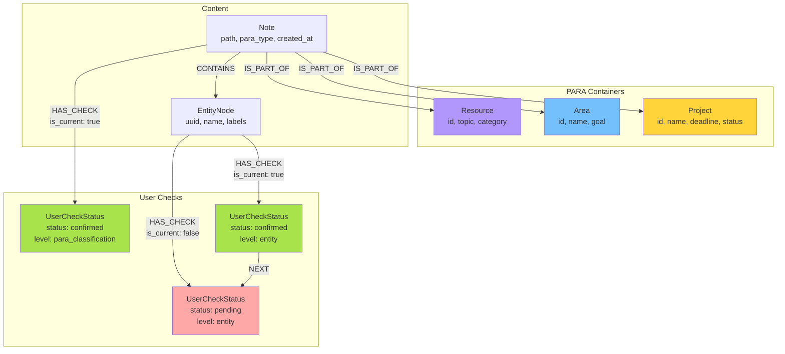
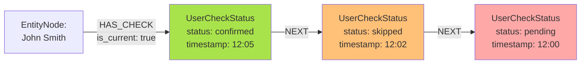

# Схема графа Neo4j

**Дата создания:** 2025-11-17
**Статус:** Спецификация для реализации
**Версия:** 1.0

---

## Введение

Этот документ описывает **полную схему графа Neo4j** для системы многоуровневых подтверждений. Включает типы нод, связи, свойства, индексы и визуальные диаграммы.

---

## 1. Типы нод (Labels)

### 1.1 UserCheckStatus

**Назначение:** Событие подтверждения пользователя

**Ключевые свойства:**
```cypher
{
    id: string,
    status: string,                    // "pending" | "confirmed" | "modified" | ...
    confirmation_level: string,         // "para_classification" | "container_assignment" | "entity"
    confidence: float,
    timestamp: datetime,
    user_action: string,
    modified_fields: [string],
    modifications: string,              // JSON
    user_comment: string,
    system_suggestion: string,
    auto_confirmed: boolean
}
```

**Кардинальность:** Множество (одна нода на каждое действие пользователя)

---

### 1.2 Project

**Назначение:** PARA контейнер — проект с дедлайном

**Ключевые свойства:**
```cypher
{
    id: string,
    name: string,
    status: string,                    // "active" | "completed" | "archived" | "on_hold"
    deadline: date,
    goal: string,
    created_at: datetime,
    completed_at: datetime,
    team: [string],                    // UUID Person nodes
    budget: float
}
```

**Кардинальность:** Множество (один проект = одна нода)

---

### 1.3 Area

**Назначение:** PARA контейнер — сфера ответственности

**Ключевые свойства:**
```cypher
{
    id: string,
    name: string,
    goal: string,
    review_frequency: string,          // "weekly" | "monthly" | "quarterly"
    created_at: datetime,
    active: boolean
}
```

**Кардинальность:** Множество

---

### 1.4 Resource

**Назначение:** PARA контейнер — справочный материал

**Ключевые свойства:**
```cypher
{
    id: string,
    topic: string,
    category: string,
    created_at: datetime,
    tags: [string]
}
```

**Кардинальность:** Множество

---

### 1.5 Note

**Назначение:** Заметка из Obsidian

**Ключевые свойства:**
```cypher
{
    path: string,                      // Уникальный путь к файлу
    created_at: datetime,
    updated_at: datetime,

    // Кешированные PARA атрибуты (для быстрых фильтров)
    para_type: string,                 // "Project" | "Area" | "Resource" | null
    project_id: string,                // UUID связанного контейнера
    area_id: string,
    resource_id: string,

    // Кешированные статусы
    _para_check_status: string,
    _container_check_status: string
}
```

**Кардинальность:** Множество (один файл = одна нода)

---

### 1.6 EntityNode

**Назначение:** Извлеченная сущность (Person, Organization, Task и др.)

**Существующие свойства + расширения:**
```cypher
{
    uuid: string,                      // Уникальный ID сущности
    name: string,
    labels: [string],                  // ["Person"] или ["Organization"] и т.д.
    attributes: {                      // Вложенный объект
        // Атрибуты сущности (role, email и т.д.)
        ...

        // Опциональные кешированные данные
        _current_check_status: string,
        _current_check_timestamp: datetime,
        _check_priority: int,
        _confidence: float
    }
}
```

**Кардинальность:** Множество

---

## 2. Типы связей (Relationships)

### 2.1 HAS_CHECK

**Назначение:** Связь между сущностью/заметкой и статусом подтверждения

**Направление:** `(Entity|Note)-[:HAS_CHECK]->(UserCheckStatus)`

**Свойства:**
```cypher
{
    is_current: boolean                // true для текущего статуса, false для истории
}
```

**Примеры:**
```cypher
// Текущий статус
(entity:EntityNode)-[:HAS_CHECK {is_current: true}]->(check:UserCheckStatus)

// Исторический статус
(entity:EntityNode)-[:HAS_CHECK {is_current: false}]->(old_check:UserCheckStatus)
```

**Кардинальность:** Множество (одна сущность → много статусов)

---

### 2.2 NEXT

**Назначение:** Цепочка истории подтверждений (от нового к старому)

**Направление:** `(NewerCheck)-[:NEXT]->(OlderCheck)`

**Свойства:** Нет

**Пример:**
```cypher
(current:UserCheckStatus)-[:NEXT]->(previous:UserCheckStatus)
-[:NEXT]->(older:UserCheckStatus)
```

**Семантика:** "Текущий статус пришел ПОСЛЕ предыдущего"

**Кардинальность:** 1-to-1 (каждый статус может иметь только одного предшественника)

---

### 2.3 IS_PART_OF

**Назначение:** Связь заметки с PARA контейнером

**Направление:** `(Note)-[:IS_PART_OF]->(Project|Area|Resource)`

**Свойства:**
```cypher
{
    assigned_at: datetime,             // Когда была создана связь
    user_confirmed: boolean            // true если пользователь подтвердил
}
```

**Примеры:**
```cypher
(n:Note)-[:IS_PART_OF {assigned_at: datetime(), user_confirmed: true}]->(p:Project)
(n:Note)-[:IS_PART_OF]->(a:Area)
```

**Кардинальность:** Many-to-1 (заметка может быть частью только одного PARA контейнера)

---

### 2.4 Существующие связи (из Graphiti)

Эти связи уже существуют в системе и не изменяются:

- `(Note)-[:CONTAINS]->(EntityNode)` — заметка содержит сущность
- `(EntityNode)-[:MENTIONS]->(Person|Organization)` — сущность упоминает другую
- `(Task)-[:ASSIGNED_TO]->(Person)` — задача назначена на человека
- `(Person)-[:WORKS_AT]->(Organization)` — человек работает в организации

---

## 3. Индексы для MVP

### 3.1 Критичные индексы

```cypher
// 1. Поиск по статусу (для dashboards)
CREATE INDEX check_status FOR (c:UserCheckStatus) ON (c.status);

// 2. Поиск по времени (для аналитики)
CREATE INDEX check_timestamp FOR (c:UserCheckStatus) ON (c.timestamp);

// 3. Композитный индекс для частых запросов
CREATE INDEX check_status_timestamp FOR (c:UserCheckStatus)
ON (c.status, c.timestamp);

// 4. Поиск сущностей по UUID
CREATE INDEX entity_uuid FOR (e:EntityNode) ON (e.uuid);

// 5. Поиск PARA контейнеров по ID
CREATE INDEX project_id FOR (p:Project) ON (p.id);
CREATE INDEX area_id FOR (a:Area) ON (a.id);
CREATE INDEX resource_id FOR (r:Resource) ON (r.id);

// 6. Поиск заметок по пути
CREATE INDEX note_path FOR (n:Note) ON (n.path);
```

### 3.2 Опциональные индексы (пост-MVP)

```cypher
// Полнотекстовый поиск
CREATE FULLTEXT INDEX project_name_fulltext FOR (p:Project) ON EACH [p.name, p.goal];
CREATE FULLTEXT INDEX note_path_fulltext FOR (n:Note) ON EACH [n.path];

// Индексы на уровни подтверждения
CREATE INDEX check_level FOR (c:UserCheckStatus) ON (c.confirmation_level);

// Композитный для аналитики
CREATE INDEX check_level_status FOR (c:UserCheckStatus)
ON (c.confirmation_level, c.status);
```

---

## 4. Визуальные диаграммы

### 4.1 Общая схема графа



---

### 4.2 История подтверждений (цепочка NEXT)



**Чтение слева направо:** Текущий → Предыдущий → Самый старый

**Запрос для получения истории:**
```cypher
MATCH (e:EntityNode {uuid: 'ent_123'})-[:HAS_CHECK]->(current)-[:NEXT*0..]->(history)
RETURN current, history
ORDER BY current.timestamp DESC
```

---

### 4.3 Пример полного графа для заметки

```mermaid
graph TB
    Note[Note:<br/>"meetings/sync.md"<br/>para_type: Project]

    Project[Project:<br/>"Q4 Marketing"<br/>deadline: 2024-12-31]

    Person1[EntityNode:<br/>John Smith<br/>Person]
    Person2[EntityNode:<br/>Anna Petrova<br/>Person]
    Task1[EntityNode:<br/>Prepare slides<br/>Task]

    CheckNote[UserCheckStatus<br/>level: container_assignment<br/>status: confirmed]
    CheckP1[UserCheckStatus<br/>level: entity<br/>status: confirmed]
    CheckP2[UserCheckStatus<br/>level: entity<br/>status: modified]
    CheckT1[UserCheckStatus<br/>level: entity<br/>status: auto_confirmed]

    Note -->|IS_PART_OF| Project
    Note -->|CONTAINS| Person1
    Note -->|CONTAINS| Person2
    Note -->|CONTAINS| Task1

    Note -->|HAS_CHECK<br/>is_current: true| CheckNote
    Person1 -->|HAS_CHECK<br/>is_current: true| CheckP1
    Person2 -->|HAS_CHECK<br/>is_current: true| CheckP2
    Task1 -->|HAS_CHECK<br/>is_current: true| CheckT1

    Task1 -->|ASSIGNED_TO| Person2

    style Project fill:#ffd43b
    style CheckNote fill:#a9e34b
    style CheckP1 fill:#a9e34b
    style CheckP2 fill:#74c0fc
    style CheckT1 fill:#d0bfff
```

---

## 5. Канонические паттерны запросов

### 5.1 Получить текущий статус сущности

```cypher
MATCH (e:EntityNode {uuid: $entity_uuid})-[:HAS_CHECK {is_current: true}]->(check:UserCheckStatus)
RETURN check
```

**Использование:** Dashboard, UI

**Производительность:** O(1) с индексом на `entity.uuid`

---

### 5.2 Получить полную историю сущности

```cypher
MATCH (e:EntityNode {uuid: $entity_uuid})-[:HAS_CHECK]->(current)-[:NEXT*0..]->(history:UserCheckStatus)
RETURN current, history
ORDER BY current.timestamp DESC
```

**Использование:** Audit trail, аналитика

**Производительность:** O(N) где N = количество статусов для сущности (обычно < 10)

---

### 5.3 Найти все pending сущности

```cypher
MATCH (e:EntityNode)-[:HAS_CHECK {is_current: true}]->(c:UserCheckStatus {status: 'pending'})
RETURN e, c
ORDER BY c.confidence ASC, c.timestamp ASC
LIMIT 20
```

**Использование:** Dashboard "Что нужно подтвердить?"

**Производительность:** O(log N) с индексом на `check.status`

---

### 5.4 Найти все заметки проекта

```cypher
MATCH (n:Note)-[:IS_PART_OF]->(p:Project {id: $project_id})
RETURN n
ORDER BY n.updated_at DESC
```

**Использование:** Просмотр содержимого проекта

**Производительность:** O(log N + K) где K = количество заметок в проекте

---

### 5.5 Статистика по типам сущностей

```cypher
MATCH (e:EntityNode)-[:HAS_CHECK {is_current: true}]->(c:UserCheckStatus)
RETURN labels(e)[0] AS entity_type, c.status, count(*) AS count
ORDER BY entity_type, count DESC
```

**Использование:** Аналитика

**Производительность:** O(N) где N = количество сущностей

---

### 5.6 Обновление статуса (транзакция)

```cypher
// 1. Найти текущий статус и сбросить is_current
MATCH (entity:EntityNode {uuid: $entity_uuid})-[r:HAS_CHECK {is_current: true}]->(old_check:UserCheckStatus)
SET r.is_current = false

// 2. Создать новый статус
CREATE (new_check:UserCheckStatus {
    id: $new_check_id,
    status: $status,
    confirmation_level: $level,
    timestamp: datetime(),
    // ... другие свойства
})

// 3. Связать с entity
CREATE (entity)-[:HAS_CHECK {is_current: true}]->(new_check)

// 4. Связать с историей
CREATE (new_check)-[:NEXT]->(old_check)

RETURN new_check
```

**Важно:** Весь блок выполняется в одной транзакции для атомарности.

---

## 6. Ограничения схемы (Constraints)

### 6.1 Уникальность

```cypher
// Уникальность UUID сущностей
CREATE CONSTRAINT entity_uuid_unique FOR (e:EntityNode) REQUIRE e.uuid IS UNIQUE;

// Уникальность ID для UserCheckStatus
CREATE CONSTRAINT check_id_unique FOR (c:UserCheckStatus) REQUIRE c.id IS UNIQUE;

// Уникальность ID для PARA контейнеров
CREATE CONSTRAINT project_id_unique FOR (p:Project) REQUIRE p.id IS UNIQUE;
CREATE CONSTRAINT area_id_unique FOR (a:Area) REQUIRE a.id IS UNIQUE;
CREATE CONSTRAINT resource_id_unique FOR (r:Resource) REQUIRE r.id IS UNIQUE;

// Уникальность пути заметки
CREATE CONSTRAINT note_path_unique FOR (n:Note) REQUIRE n.path IS UNIQUE;
```

### 6.2 Обязательные поля

```cypher
// UserCheckStatus должен иметь status и timestamp
CREATE CONSTRAINT check_status_exists FOR (c:UserCheckStatus) REQUIRE c.status IS NOT NULL;
CREATE CONSTRAINT check_timestamp_exists FOR (c:UserCheckStatus) REQUIRE c.timestamp IS NOT NULL;

// Project должен иметь name
CREATE CONSTRAINT project_name_exists FOR (p:Project) REQUIRE p.name IS NOT NULL;
```

---

## 7. Размер и производительность (ориентиры для MVP)

### Ожидаемые объемы

| Тип ноды | Ожидаемое количество (MVP) | Макс. для Neo4j |
|----------|----------------------------|-----------------|
| **UserCheckStatus** | 1,000 - 10,000 | 100,000+ |
| **EntityNode** | 500 - 5,000 | 50,000+ |
| **Project/Area/Resource** | 10 - 100 | 1,000+ |
| **Note** | 100 - 1,000 | 10,000+ |

### Целевая производительность

| Операция | Целевое время | Требования |
|----------|---------------|------------|
| Получить текущий статус | < 50ms | Индекс на `uuid` |
| Найти все pending | < 100ms | Индекс на `status` |
| Полная история (10 статусов) | < 100ms | Обход `[:NEXT]` |
| Создать новый статус | < 50ms | Транзакция |
| Статистика по типам | < 500ms | Агрегация |

---

## 8. Миграция и версионирование схемы

### Текущая версия: 1.0 (MVP)

**Что включено:**
- UserCheckStatus nodes
- PARA container nodes (Project/Area/Resource)
- Базовые связи (HAS_CHECK, NEXT, IS_PART_OF)
- Критичные индексы
- Constraints на уникальность

**Что не включено (пост-MVP):**
- Level 4 (Attribute Validation) связи
- Полнотекстовые индексы
- Расширенные constraints
- Векторные индексы для semantic search

### Стратегия обновления (для будущего)

При добавлении новых полей/связей:
1. Создать новое поле с дефолтным значением
2. Обновить существующие ноды batch-операцией
3. Создать индекс (если нужно)
4. Обновить код приложения

**Не требуется для MVP**, но полезно иметь в виду.

---

**Следующий документ:** [04_LANGGRAPH_WORKFLOW.md](./04_LANGGRAPH_WORKFLOW.md)
