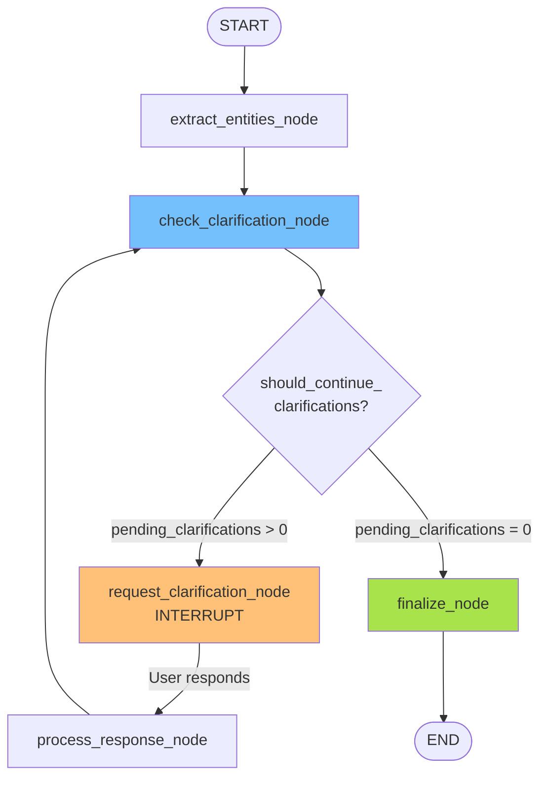

# LangGraph Workflow

**Дата создания:** 2025-11-17
**Статус:** Спецификация для реализации
**Версия:** 1.0

---

## Введение

Этот документ описывает **интеграцию LangGraph** для управления асинхронным workflow обработки заметок с многоуровневыми подтверждениями. Включает архитектуру графа, узлы, состояние, логику interrupt/resume и приоритизацию.

---

## 1. Технологический стек

### 1.1 Основные компоненты

- **LangGraph**: Orchestration framework для построения stateful workflows
- **AsyncSqliteSaver**: Persistent checkpointer для хранения состояния (MVP)
- **FastAPI WebSocket**: Real-time communication с клиентом
- **PipGraphManager**: Wrapper над Graphiti для извлечения сущностей

### 1.2 Зависимости

```python
# requirements.txt
langgraph>=0.2.0
langchain-core>=0.3.0
aiosqlite>=0.20.0  # Для AsyncSqliteSaver
```

---

## 2. Состояние (NoteProcessingState)

### 2.1 TypedDict определение

```python
from typing import TypedDict, Optional, List, Dict, Any
from app.models.para_entities import EntityNode

class NoteProcessingState(TypedDict):
    """Состояние обработки заметки в LangGraph"""

    # === Входные данные ===
    file_path: str                                # Путь к заметке
    content: str                                  # Содержимое заметки

    # === Извлеченные данные ===
    entities: List[EntityNode]                    # Извлеченные сущности
    para_suggestion: Optional[tuple]              # (type, confidence) для L1
    container_suggestions: Optional[List[Dict]]   # Предложения для L2

    # === Clarifications (уточнения) ===
    pending_clarifications: List[Dict]            # Очередь вопросов
    current_clarification: Optional[Dict]         # Текущий вопрос
    user_response: Optional[Dict]                 # Ответ пользователя

    # === User Check Status ===
    para_classification_check: Optional[Dict]     # L1 check
    container_assignment_check: Optional[Dict]    # L2 check

    # === Настройки ===
    validate_attributes: bool                     # Включить L4 (default: False для MVP)
    skip_low_priority: bool                       # Пропускать низкоприоритетные (default: False)

    # === Метаданные ===
    processing_started_at: str                    # ISO timestamp начала обработки
    last_updated_at: str                          # ISO timestamp последнего обновления
```

### 2.2 Пример состояния

```python
{
    "file_path": "meetings/Q4 Planning.md",
    "content": "# Meeting with John Smith...",

    "entities": [
        EntityNode(uuid="ent_1", name="John Smith", labels=["Person"], ...),
        EntityNode(uuid="ent_2", name="TechCorp", labels=["Organization"], ...)
    ],

    "para_suggestion": ("Project", 0.75),
    "container_suggestions": [
        {"id": "proj_111", "name": "Marketing 2024", "confidence": 0.40}
    ],

    "pending_clarifications": [
        {"level": "para_classification", "priority": 1, ...},
        {"level": "entity_confirmation", "priority": 5, ...}
    ],
    "current_clarification": {"level": "para_classification", ...},
    "user_response": None,

    "para_classification_check": None,
    "container_assignment_check": None,

    "validate_attributes": False,
    "skip_low_priority": False,

    "processing_started_at": "2025-11-17T12:00:00Z",
    "last_updated_at": "2025-11-17T12:00:00Z"
}
```

---

## 3. Узлы графа (Nodes)

### 3.1 extract_entities_node

**Назначение:** Извлечение сущностей из текста заметки

**Входные данные:**
```python
{
    "file_path": "meetings/sync.md",
    "content": "# Meeting notes..."
}
```

**Действия:**
1. Инициализировать `PipGraphManager` (или использовать существующий)
2. Вызвать `await pipgraph.add_episode(content)`
3. Извлечь сущности из результата
4. Пометить все сущности как `pending` (создать UserCheckStatus nodes)
5. Классифицировать заметку по PARA (L1) → `para_suggestion`
6. Найти похожие PARA контейнеры (L2) → `container_suggestions`

**Выходные данные:**
```python
{
    "entities": [EntityNode(...), EntityNode(...), ...],
    "para_suggestion": ("Project", 0.75),
    "container_suggestions": [...]
}
```

**Особенности:**
- Создает начальные `UserCheckStatus` ноды со статусом `pending`
- Рассчитывает `confidence` для каждой сущности
- Определяет `priority` на основе типа сущности

---

### 3.2 check_clarification_node

**Назначение:** Проверка необходимости уточнений

**Входные данные:** Полное состояние

**Действия:**
1. Собрать все pending уточнения на всех уровнях (L1, L2, L3)
2. Приоритизировать вопросы (L1 → L2 → L3, затем по priority)
3. Применить auto-confirm логику для высокоуверенных сущностей
4. Выбрать первый вопрос из очереди

**Выходные данные:**
```python
{
    "pending_clarifications": [
        {"level": "para_classification", "priority": 1, ...},
        {"level": "entity_confirmation", "priority": 5, ...}
    ],
    "current_clarification": {"level": "para_classification", ...}
}
```

**Логика приоритизации:**
```python
def calculate_priority(clarification):
    # Базовый приоритет уровня
    level_weight = {
        "para_classification": 1,
        "container_assignment": 2,
        "entity": 10,
        "attribute": 20
    }

    score = level_weight[clarification["level"]]

    # Низкая уверенность → выше приоритет
    score += (1.0 - clarification.get("confidence", 0.5)) * 10

    # Зависимости (блокирующие вопросы)
    score -= len(clarification.get("dependencies", [])) * 5

    return score  # Меньше = выше приоритет
```

---

### 3.3 request_clarification_node

**Назначение:** Запрос уточнения у пользователя (interrupt)

**Входные данные:**
```python
{
    "current_clarification": {"level": "para_classification", ...}
}
```

**Действия:**
1. Получить `current_clarification` из состояния
2. Вызвать `interrupt(current_clarification)`
3. **Workflow останавливается**, ждет ответа пользователя
4. Пользователь отправляет ответ через WebSocket
5. Workflow возобновляется с `user_response` в состоянии

**Выходные данные:**
```python
{
    "user_response": {"action": "confirm", "choice": "Project", ...}
}
```

**Особенности:**
- Это единственный узел, вызывающий `interrupt()`
- Состояние автоматически сохраняется в AsyncSqliteSaver
- Workflow может быть возобновлен спустя дни/недели

---

### 3.4 process_response_node

**Назначение:** Обработка ответа пользователя

**Входные данные:**
```python
{
    "current_clarification": {"level": "para_classification", ...},
    "user_response": {"action": "confirm", "choice": "Project"}
}
```

**Действия (зависят от уровня):**

#### L1 (PARA Classification):
1. Создать `UserCheckStatus` ноду для заметки
2. Установить `para_type` на заметке (кеш)
3. Обновить `para_classification_check` в состоянии

#### L2 (Container Assignment):
1. Если `action = "create_new"`: создать Project/Area/Resource ноду
2. Если `action = "link_existing"`: найти существующую ноду
3. Создать связь `(Note)-[:IS_PART_OF]->(Container)`
4. Создать `UserCheckStatus` для container assignment
5. Обновить `container_assignment_check` в состоянии

#### L3 (Entity Confirmation):
1. Найти сущность по `entity_uuid`
2. Если `action = "confirm"`: создать UserCheckStatus со статусом `confirmed`
3. Если `action = "modify"`:
   - Обновить поля сущности
   - Создать `FieldModification` объекты
   - Создать UserCheckStatus со статусом `modified`
4. Если `action = "reject"`: создать UserCheckStatus со статусом `rejected`
5. Если `action = "skip"`: создать UserCheckStatus со статусом `skipped`

**Выходные данные:**
```python
{
    "para_classification_check": {...},  # Если L1
    "container_assignment_check": {...}, # Если L2
    "entities": [...]  # Обновленные, если L3
}
```

---

### 3.5 finalize_node

**Назначение:** Завершение обработки и сохранение в Neo4j

**Входные данные:** Полное состояние

**Действия:**
1. Собрать все confirmed/modified сущности
2. Сохранить в Neo4j через `PipGraphManager`
3. Создать финальные связи между сущностями
4. Логировать результаты

**Выходные данные:**
```python
{
    "processing_completed_at": "2025-11-17T12:30:00Z",
    "status": "completed"
}
```

---

## 4. Условная логика (Conditional Edges)

### 4.1 should_continue_clarifications

```python
def should_continue_clarifications(state: NoteProcessingState) -> str:
    """Определяет следующий шаг после check_clarification"""

    if len(state["pending_clarifications"]) == 0:
        return "finalize"  # Нет вопросов → завершение

    return "request_clarification"  # Есть вопросы → запросить уточнение
```

### 4.2 after_response

```python
def after_response(state: NoteProcessingState) -> str:
    """Определяет следующий шаг после process_response"""

    # Всегда возвращаемся к проверке clarifications
    # (может быть появились новые вопросы или остались старые)
    return "check_clarification"
```

---

## 5. Граф workflow

### 5.1 Mermaid диаграмма



### 5.2 Код построения графа

```python
from langgraph.graph import StateGraph, END
from langgraph.checkpoint.aiosqlite import AsyncSqliteSaver

# Создать граф
workflow = StateGraph(NoteProcessingState)

# Добавить узлы
workflow.add_node("extract_entities", extract_entities_node)
workflow.add_node("check_clarification", check_clarification_node)
workflow.add_node("request_clarification", request_clarification_node)
workflow.add_node("process_response", process_response_node)
workflow.add_node("finalize", finalize_node)

# Добавить связи
workflow.set_entry_point("extract_entities")
workflow.add_edge("extract_entities", "check_clarification")

# Условная связь после check_clarification
workflow.add_conditional_edges(
    "check_clarification",
    should_continue_clarifications,
    {
        "request_clarification": "request_clarification",
        "finalize": "finalize"
    }
)

# После запроса уточнения → обработка ответа
workflow.add_edge("request_clarification", "process_response")

# После обработки ответа → снова проверка clarifications
workflow.add_edge("process_response", "check_clarification")

# Финал → конец
workflow.add_edge("finalize", END)

# Скомпилировать с checkpointer
checkpointer = AsyncSqliteSaver.from_conn_string("checkpoints.db")
app = workflow.compile(checkpointer=checkpointer)
```

---

## 6. Interrupt/Resume механизм

### 6.1 Как работает interrupt

**В узле `request_clarification_node`:**
```python
from langgraph.types import interrupt

async def request_clarification_node(state: NoteProcessingState) -> dict:
    clarification = state["current_clarification"]

    # Останавливаем выполнение и ждем ответа пользователя
    user_response = interrupt(clarification)

    # Эта строка выполнится только после resume
    return {"user_response": user_response}
```

**Что происходит:**
1. `interrupt(clarification)` возвращает `clarification` клиенту
2. Workflow **останавливается**
3. Состояние **сохраняется** в AsyncSqliteSaver
4. Клиент получает `clarification` через WebSocket
5. Пользователь отвечает (может быть через 1 день)
6. Клиент отправляет `user_response` обратно
7. Workflow **возобновляется** с `user_response`

### 6.2 Thread ID

Каждая заметка = отдельный thread:

```python
thread_id = f"note:{file_path}"
config = {"configurable": {"thread_id": thread_id}}
```

**Пример:**
- Заметка `meetings/sync.md` → thread: `"note:meetings/sync.md"`
- Заметка `projects/Q4.md` → thread: `"note:projects/Q4.md"`

### 6.3 Запуск workflow (первый раз)

```python
async def process_note(file_path: str, content: str):
    thread_id = f"note:{file_path}"
    config = {"configurable": {"thread_id": thread_id}}

    # Начальное состояние
    initial_state = {
        "file_path": file_path,
        "content": content,
        "entities": [],
        "pending_clarifications": [],
        "validate_attributes": False,
        "processing_started_at": datetime.utcnow().isoformat()
    }

    # Запускаем workflow
    async for event in app.astream(initial_state, config, stream_mode="updates"):
        # Обрабатываем события (для debug/logging)
        logger.info(f"Event: {event}")

        # Если получили interrupt → отправляем clarification пользователю
        if "__interrupt__" in event:
            clarification = event["__interrupt__"][0]
            await send_to_websocket(clarification)
            break  # Ждем ответа от пользователя
```

### 6.4 Возобновление workflow (при получении ответа)

```python
async def resume_workflow(file_path: str, user_response: dict):
    thread_id = f"note:{file_path}"
    config = {"configurable": {"thread_id": thread_id}}

    # Возобновляем с ответом пользователя
    async for event in app.astream(
        Command(resume=user_response),  # Передаем ответ
        config,
        stream_mode="updates"
    ):
        logger.info(f"Event: {event}")

        # Проверяем, есть ли новый interrupt
        if "__interrupt__" in event:
            clarification = event["__interrupt__"][0]
            await send_to_websocket(clarification)
            break

        # Или workflow завершился
        if "finalize" in event:
            await send_completion_to_websocket()
            break
```

---

## 7. Интеграция с PipGraphManager

### 7.1 Проблема сериализации

**Проблема:** `PipGraphManager` содержит несериализуемые объекты (Neo4j driver, LLM клиенты).

**Решение:** НЕ хранить `PipGraphManager` в состоянии. Инжектить при необходимости.

### 7.2 Injecting PipGraphManager

```python
# Глобальная переменная (или через DI)
pipgraph_manager: Optional[PipGraphManager] = None

async def extract_entities_node(state: NoteProcessingState) -> dict:
    global pipgraph_manager

    # Инициализируем, если еще нет
    if pipgraph_manager is None:
        pipgraph_manager = await create_pipgraph_manager()

    # Используем для извлечения
    result = await pipgraph_manager.add_episode(
        name=state["file_path"],
        episode_body=state["content"]
    )

    # Извлекаем сущности из результата
    entities = parse_entities_from_result(result)

    return {"entities": entities}
```

### 7.3 Альтернатива: Dependency Injection

```python
from functools import partial

# При создании узла
extract_node_with_deps = partial(
    extract_entities_node,
    pipgraph_manager=pipgraph_manager
)

workflow.add_node("extract_entities", extract_node_with_deps)
```

---

## 8. WebSocket интеграция

### 8.1 Структура сообщений

#### Клиент → Сервер (запуск обработки)

```json
{
    "type": "process_note",
    "file_path": "meetings/sync.md",
    "content": "# Meeting notes..."
}
```

#### Сервер → Клиент (clarification request)

```json
{
    "type": "clarification_request",
    "level": "para_classification",
    "question": "Определите тип заметки",
    "options": ["Project", "Area", "Resource"],
    "suggested": "Project",
    "confidence": 0.75
}
```

#### Клиент → Сервер (ответ пользователя)

```json
{
    "type": "clarification_response",
    "file_path": "meetings/sync.md",
    "response": {
        "action": "confirm",
        "choice": "Project",
        "comment": null
    }
}
```

#### Сервер → Клиент (завершение)

```json
{
    "type": "processing_complete",
    "file_path": "meetings/sync.md",
    "status": "success",
    "entities_confirmed": 5,
    "entities_modified": 2
}
```

### 8.2 Обработчик WebSocket

```python
from fastapi import WebSocket

@app.websocket("/ws/process")
async def websocket_endpoint(websocket: WebSocket):
    await websocket.accept()

    try:
        async for message in websocket.iter_json():
            msg_type = message.get("type")

            if msg_type == "process_note":
                # Запуск нового workflow
                await process_note(
                    message["file_path"],
                    message["content"]
                )

            elif msg_type == "clarification_response":
                # Возобновление workflow
                await resume_workflow(
                    message["file_path"],
                    message["response"]
                )

    except WebSocketDisconnect:
        logger.info("Client disconnected")
```

---

## 9. Приоритизация clarifications

### 9.1 Алгоритм сортировки

```python
def prioritize_clarifications(clarifications: List[Dict]) -> List[Dict]:
    """Сортирует clarifications по приоритету"""

    def calc_priority(c):
        # Уровни (меньше = важнее)
        level_weight = {
            "para_classification": 1,
            "container_assignment": 2,
            "entity": 10,
            "attribute": 20
        }

        score = level_weight.get(c["level"], 100)

        # Низкая уверенность → выше приоритет
        confidence = c.get("confidence", 0.5)
        score += (1.0 - confidence) * 10

        # Priority внутри уровня (для L3)
        entity_priority = c.get("priority", 3)
        score += entity_priority

        return score

    return sorted(clarifications, key=calc_priority)
```

### 9.2 Пример приоритизации

**Входные clarifications:**
```python
[
    {"level": "entity", "entity_type": "Source", "confidence": 0.96, "priority": 4},
    {"level": "para_classification", "confidence": 0.70, "priority": 1},
    {"level": "entity", "entity_type": "Person", "confidence": 0.60, "priority": 2},
    {"level": "container_assignment", "confidence": 0.80, "priority": 2}
]
```

**После приоритизации:**
```python
[
    {"level": "para_classification", ...},      # score = 1 + 3.0 = 4.0
    {"level": "container_assignment", ...},     # score = 2 + 2.0 = 4.0
    {"level": "entity", "Person", ...},         # score = 10 + 4.0 + 2 = 16.0
    {"level": "entity", "Source", ...}          # score = 10 + 0.4 + 4 = 14.4
]
```

---

## 10. Обработка ошибок

### 10.1 Ошибки в узлах

```python
async def extract_entities_node(state: NoteProcessingState) -> dict:
    try:
        result = await pipgraph_manager.add_episode(...)
        entities = parse_entities(result)
        return {"entities": entities}

    except Exception as e:
        logger.error(f"Failed to extract entities: {e}")
        return {
            "entities": [],
            "error": str(e),
            "processing_failed": True
        }
```

### 10.2 Проверка ошибок в conditional

```python
def should_continue(state: NoteProcessingState) -> str:
    if state.get("processing_failed"):
        return "error_handler"  # Отдельный узел для ошибок

    if len(state["pending_clarifications"]) == 0:
        return "finalize"

    return "request_clarification"
```

---

**Следующий документ:** [05_IMPLEMENTATION_PHASES.md](./05_IMPLEMENTATION_PHASES.md)
