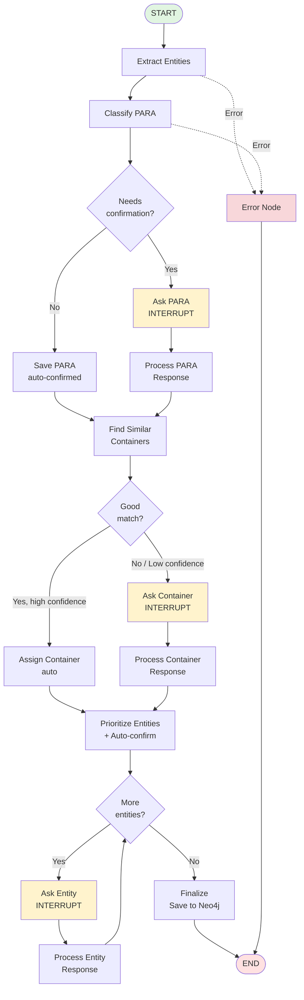

# LangGraph Workflow Updated - Интеграция с рефакторенным PipGraphManager

**Дата создания:** 2025-11-17
**Статус:** Implementation Guide
**Версия:** 2.0
**Связанный документ:** [03_PIPGRAPH_MANAGER_REFACTORING.md](./03_PIPGRAPH_MANAGER_REFACTORING.md)

---

## Обзор

Этот документ описывает **обновленную структуру LangGraph workflow**, использующую гранулярные методы PipGraphManager для полного L1/L2/L3 confirmation flow.

### Отличия от MVP

| Аспект | MVP (текущий) | Updated (целевой) |
|--------|---------------|-------------------|
| **Nodes** | 3 (extract, ask_user, finalize) | 8-10 (L1/L2/L3 разделены) |
| **State fields** | 10 полей | 25+ полей |
| **PipGraphManager usage** | 1 метод `process_note()` | 17 методов |
| **Confirmations** | Только L3 (первая сущность) | L1/L2/L3 (все сущности) |
| **Auto-confirm** | Нет | Да, для high-confidence |
| **Prioritization** | Нет | Да, по типу сущности |

---

## Обновленный State Model

### NoteWorkflowState (расширенный)

```python
from typing import TypedDict, Optional, List, Dict, Any
from datetime import datetime

class NoteWorkflowState(TypedDict, total=False):
    """
    Полное состояние для L1/L2/L3 workflow.

    total=False делает все поля опциональными, что необходимо
    для десериализации после interrupt/resume.
    """

    # ========================================
    # Входные данные
    # ========================================

    file_path: str
    """Путь к заметке в Obsidian"""

    content: str
    """Текст заметки"""

    # ========================================
    # L1: PARA Classification
    # ========================================

    para_classification: Optional[str]
    """Классификация PARA: "Project" | "Area" | "Resource" | "Archive" """

    para_confidence: Optional[float]
    """Уверенность LLM в классификации (0.0-1.0)"""

    needs_para_confirmation: bool
    """True если confidence < threshold"""

    para_user_choice: Optional[str]
    """Выбор пользователя (если modified)"""

    para_check_id: Optional[str]
    """UUID UserCheckStatus для L1"""

    # ========================================
    # L2: Container Assignment
    # ========================================

    container_type: Optional[str]
    """Тип контейнера: "Project" | "Area" | "Resource" """

    container_candidates: List[Dict[str, Any]]
    """Список существующих контейнеров с similarity scores"""

    selected_container_id: Optional[str]
    """UUID выбранного/созданного контейнера"""

    container_action: Optional[str]
    """Действие: "link_existing" | "create_new" | "skip" """

    container_check_id: Optional[str]
    """UUID UserCheckStatus для L2"""

    # ========================================
    # L3: Entity Confirmation
    # ========================================

    episode_uuid: str
    """UUID созданного эпизода"""

    entities: List[Dict[str, Any]]
    """Извлеченные сущности с metadata (priority, auto_confirm, etc.)"""

    entity_edges: List[Dict[str, Any]]
    """Связи между сущностями"""

    pending_clarifications: List[Dict[str, Any]]
    """Очередь вопросов (отсортированная по приоритету)"""

    current_clarification: Optional[Dict[str, Any]]
    """Текущий вопрос пользователю"""

    user_response: Optional[Dict[str, Any]]
    """Ответ пользователя на текущий вопрос"""

    confirmed_entity_uuids: List[str]
    """UUIDs подтвержденных сущностей"""

    modified_entity_uuids: List[str]
    """UUIDs измененных сущностей"""

    rejected_entity_uuids: List[str]
    """UUIDs отклоненных сущностей"""

    # ========================================
    # Workflow metadata
    # ========================================

    processing_stage: str
    """
    "l1_classify" | "l1_confirm" |
    "l2_find_containers" | "l2_confirm" |
    "l3_extract" | "l3_confirm" |
    "finalize" | "completed" | "error"
    """

    processing_started_at: str
    """ISO timestamp"""

    processing_completed_at: Optional[str]
    """ISO timestamp"""

    status: str
    """Общий статус: "processing" | "waiting_user" | "completed" | "error" """

    error: Optional[str]
    """Текст ошибки (если status = "error")"""
```

---

## Обновленная структура графа

### Полный граф L1 → L2 → L3



---

## Workflow Nodes - Детальная имплементация

### Node 1: extract_entities_node

```python
async def extract_entities_node(state: NoteWorkflowState) -> dict:
    """
    L3: Извлекает сущности БЕЗ сохранения в Neo4j.

    Использует новый метод PipGraphManager.extract_entities_from_note()
    вместо монолитного process_note().
    """
    logger.info(f"[extract_entities] Processing: {state['file_path']}")

    try:
        pipgraph = await get_pipgraph_manager()

        # НОВЫЙ метод - НЕ сохраняет в Neo4j!
        entities, episode_uuid = await pipgraph.extract_entities_from_note(
            note_content=state["content"],
            note_name=state["file_path"],
            reference_time=datetime.now(timezone.utc),
            source=EpisodeType.text,
            source_description=f"Obsidian note: {state['file_path']}"
        )

        logger.info(f"[extract_entities] Extracted {len(entities)} entities")

        # Сериализуем для хранения в state
        serialized_entities = [
            {
                "entity": serialize_entity(entity),
                "confidence": 0.85,  # TODO: получать от LLM
                "priority": None,  # Вычислим позже
                "auto_confirm": False,  # Вычислим позже
                "confirmation_status": "pending"
            }
            for entity in entities
        ]

        return {
            "entities": serialized_entities,
            "episode_uuid": episode_uuid,
            "processing_stage": "l1_classify",
            "status": "processing"
        }

    except Exception as e:
        logger.error(f"[extract_entities] Error: {e}", exc_info=True)
        return {
            "status": "error",
            "error": str(e),
            "processing_stage": "error"
        }
```

### Node 2: classify_para_node

```python
async def classify_para_node(state: NoteWorkflowState) -> dict:
    """
    L1: Классифицирует заметку по методу PARA через LLM.

    Использует PipGraphManager.classify_para_type()
    """
    logger.info(f"[classify_para] Classifying: {state['file_path']}")

    try:
        pipgraph = await get_pipgraph_manager()

        # НОВЫЙ метод - LLM call для PARA classification
        para_type, confidence = await pipgraph.classify_para_type(
            content=state["content"]
        )

        logger.info(
            f"[classify_para] Result: {para_type} (confidence: {confidence:.2f})"
        )

        # Определяем, нужно ли спрашивать пользователя
        # Threshold: 0.85
        needs_confirmation = confidence < 0.85

        return {
            "para_classification": para_type,
            "para_confidence": confidence,
            "needs_para_confirmation": needs_confirmation,
            "processing_stage": "l1_confirm" if needs_confirmation else "l2_find_containers"
        }

    except Exception as e:
        logger.error(f"[classify_para] Error: {e}", exc_info=True)
        return {
            "status": "error",
            "error": str(e)
        }
```

### Node 3: ask_para_confirmation_node

```python
async def ask_para_confirmation_node(state: NoteWorkflowState) -> dict:
    """
    L1: Спрашивает пользователя подтвердить PARA classification.

    INTERRUPT node - workflow останавливается здесь.
    """
    logger.info("[ask_para_confirmation] Preparing L1 question")

    question = {
        "level": "para_classification",
        "question_type": "para_classification",
        "question_text": f"Тип заметки: {state['para_classification']}?",
        "original_suggestion": state["para_classification"],
        "confidence": state["para_confidence"],
        "options": ["Project", "Area", "Resource", "Archive"],
        "suggested_action": "confirm"
    }

    logger.info(f"[ask_para_confirmation] Interrupting with question")

    # === INTERRUPT ===
    user_response = interrupt(question)

    logger.info(f"[ask_para_confirmation] Received: {user_response}")

    return {
        "current_clarification": question,
        "user_response": user_response,
        "status": "waiting_user"
    }
```

### Node 4: process_para_response_node

```python
async def process_para_response_node(state: NoteWorkflowState) -> dict:
    """
    L1: Обрабатывает ответ пользователя на PARA confirmation.

    Использует:
    - PipGraphManager.save_para_classification_check()
    - PipGraphManager.update_note_para_type()
    """
    logger.info("[process_para_response] Processing L1 response")

    user_resp = state["user_response"]
    original = state["para_classification"]

    try:
        pipgraph = await get_pipgraph_manager()

        # Определяем финальный выбор
        if user_resp["action"] == "confirm":
            final_choice = original
            status = "confirmed"
        elif user_resp["action"] == "modify":
            final_choice = user_resp["choice"]
            status = "modified"
        elif user_resp["action"] == "reject":
            final_choice = "Archive"  # Fallback
            status = "rejected"
        else:  # skip
            final_choice = original
            status = "skipped"

        # НОВЫЙ метод - сохраняем UserCheckStatus для L1
        check_id = await pipgraph.save_para_classification_check(
            note_path=state["file_path"],
            status=status,
            original_suggestion=original,
            user_choice=final_choice,
            confidence=state["para_confidence"],
            user_comment=user_resp.get("comment")
        )

        logger.info(f"[process_para_response] Created check: {check_id}")

        # Обновляем кэшированный para_type на Note node
        if status != "rejected":
            await pipgraph.update_note_para_type(
                note_path=state["file_path"],
                para_type=final_choice
            )

        return {
            "para_user_choice": final_choice,
            "para_check_id": check_id,
            "container_type": final_choice if final_choice != "Archive" else None,
            "processing_stage": "l2_find_containers"
        }

    except Exception as e:
        logger.error(f"[process_para_response] Error: {e}", exc_info=True)
        return {"status": "error", "error": str(e)}
```

### Node 5: save_para_auto_node

```python
async def save_para_auto_node(state: NoteWorkflowState) -> dict:
    """
    L1: Auto-confirm PARA classification (high confidence).

    Сохраняет UserCheckStatus с auto_confirmed=True.
    """
    logger.info("[save_para_auto] Auto-confirming PARA")

    try:
        pipgraph = await get_pipgraph_manager()

        # НОВЫЙ метод с auto-confirm
        check_id = await pipgraph.save_para_classification_check(
            note_path=state["file_path"],
            status="confirmed",
            original_suggestion=state["para_classification"],
            user_choice=state["para_classification"],
            confidence=state["para_confidence"],
            user_comment="Auto-confirmed (high confidence)"
        )

        # Обновляем Note
        await pipgraph.update_note_para_type(
            note_path=state["file_path"],
            para_type=state["para_classification"]
        )

        return {
            "para_check_id": check_id,
            "container_type": state["para_classification"],
            "processing_stage": "l2_find_containers"
        }

    except Exception as e:
        logger.error(f"[save_para_auto] Error: {e}", exc_info=True)
        return {"status": "error", "error": str(e)}
```

### Node 6: find_containers_node

```python
async def find_containers_node(state: NoteWorkflowState) -> dict:
    """
    L2: Находит существующие PARA контейнеры через semantic similarity.

    Использует PipGraphManager.find_similar_containers()
    """
    logger.info("[find_containers] Searching for containers")

    container_type = state.get("container_type")

    # Если Archive - пропускаем L2
    if not container_type or container_type == "Archive":
        logger.info("[find_containers] Archive type, skipping L2")
        return {
            "container_candidates": [],
            "processing_stage": "l3_prioritize"
        }

    try:
        pipgraph = await get_pipgraph_manager()

        # НОВЫЙ метод - поиск через embeddings
        candidates = await pipgraph.find_similar_containers(
            note_content=state["content"],
            container_type=container_type,
            limit=5
        )

        logger.info(f"[find_containers] Found {len(candidates)} candidates")

        # Проверяем, есть ли хороший match (confidence > 0.8)
        has_good_match = any(c["confidence"] > 0.8 for c in candidates)

        if has_good_match and candidates:
            # Auto-assign к топовому кандидату
            best_match = max(candidates, key=lambda c: c["confidence"])
            logger.info(
                f"[find_containers] Auto-assigning to: {best_match['name']} "
                f"(confidence: {best_match['confidence']:.2f})"
            )
            return {
                "container_candidates": candidates,
                "selected_container_id": best_match["id"],
                "container_action": "link_existing",
                "processing_stage": "l2_assign_auto"
            }
        else:
            # Спрашиваем пользователя
            return {
                "container_candidates": candidates,
                "processing_stage": "l2_confirm"
            }

    except Exception as e:
        logger.error(f"[find_containers] Error: {e}", exc_info=True)
        return {"status": "error", "error": str(e)}
```

### Node 7: ask_container_node

```python
async def ask_container_node(state: NoteWorkflowState) -> dict:
    """
    L2: Спрашивает пользователя выбрать/создать контейнер.

    INTERRUPT node.
    """
    logger.info("[ask_container] Preparing L2 question")

    candidates = state.get("container_candidates", [])

    question = {
        "level": "container_assignment",
        "question_type": "container_assignment",
        "question_text": f"К какому {state['container_type']} отнести заметку?",
        "container_type": state["container_type"],
        "candidates": candidates,
        "options": ["link_existing", "create_new", "skip"],
        "suggested_action": "link_existing" if candidates else "create_new"
    }

    logger.info("[ask_container] Interrupting with L2 question")

    # === INTERRUPT ===
    user_response = interrupt(question)

    logger.info(f"[ask_container] Received: {user_response}")

    return {
        "current_clarification": question,
        "user_response": user_response
    }
```

### Node 8: process_container_response_node

```python
async def process_container_response_node(state: NoteWorkflowState) -> dict:
    """
    L2: Обрабатывает ответ пользователя на container assignment.

    Использует:
    - PipGraphManager.create_para_container() (если create_new)
    - PipGraphManager.link_note_to_container()
    - PipGraphManager.save_container_assignment_check()
    """
    logger.info("[process_container_response] Processing L2 response")

    user_resp = state["user_response"]
    action = user_resp["action"]

    try:
        pipgraph = await get_pipgraph_manager()

        container_id = None
        container_name = None
        created_new = False

        if action == "link_existing":
            # Линкуем к существующему
            container_id = user_resp["selected_container_id"]
            container = next(
                (c for c in state["container_candidates"]
                 if c["id"] == container_id),
                None
            )
            container_name = container["name"] if container else "Unknown"

        elif action == "create_new":
            # НОВЫЙ метод - создаем контейнер
            container_id = await pipgraph.create_para_container(
                container_type=state["container_type"],
                name=user_resp["new_container_name"],
                metadata=user_resp.get("container_metadata", {})
            )
            container_name = user_resp["new_container_name"]
            created_new = True

            logger.info(f"[process_container_response] Created: {container_id}")

        elif action == "skip":
            # Пропускаем L2
            logger.info("[process_container_response] Skipped container assignment")
            return {"processing_stage": "l3_prioritize"}

        # Линкуем Note к Container
        if container_id:
            # НОВЫЙ метод - создаем [:IS_PART_OF] relationship
            await pipgraph.link_note_to_container(
                note_path=state["file_path"],
                container_id=container_id,
                container_type=state["container_type"]
            )

            # НОВЫЙ метод - сохраняем UserCheckStatus для L2
            check_id = await pipgraph.save_container_assignment_check(
                note_path=state["file_path"],
                status="confirmed",
                action=action,
                container_type=state["container_type"],
                container_id=container_id,
                container_name=container_name,
                created_new=created_new,
                container_metadata=user_resp.get("container_metadata")
            )

            logger.info(f"[process_container_response] Check ID: {check_id}")

            return {
                "selected_container_id": container_id,
                "container_action": action,
                "container_check_id": check_id,
                "processing_stage": "l3_prioritize"
            }

    except Exception as e:
        logger.error(f"[process_container_response] Error: {e}", exc_info=True)
        return {"status": "error", "error": str(e)}
```

### Node 9: prioritize_entities_node

```python
async def prioritize_entities_node(state: NoteWorkflowState) -> dict:
    """
    L3: Вычисляет приоритеты сущностей и фильтрует auto-confirm.

    Использует:
    - PipGraphManager.calculate_entity_priority()
    - PipGraphManager.should_auto_confirm()
    """
    logger.info("[prioritize_entities] Computing priorities")

    try:
        pipgraph = await get_pipgraph_manager()

        # Вычисляем priority и auto_confirm для каждой сущности
        entities_with_priority = []
        auto_confirmed_uuids = []

        for entity_data in state["entities"]:
            entity = deserialize_entity(entity_data["entity"])
            confidence = entity_data["confidence"]

            # НОВЫЕ методы - priority helpers
            priority = pipgraph.calculate_entity_priority(entity, confidence)
            should_auto = pipgraph.should_auto_confirm(entity, confidence)

            if should_auto:
                # Auto-confirm сущность
                auto_confirmed_uuids.append(entity.uuid)
                entity_data["confirmation_status"] = "auto_confirmed"
                entity_data["auto_confirm"] = True

                logger.info(
                    f"[prioritize_entities] Auto-confirm: {entity.name} "
                    f"(priority={priority}, conf={confidence:.2f})"
                )
            else:
                # Нужно спросить
                entity_data["auto_confirm"] = False

            entity_data["priority"] = priority
            entities_with_priority.append(entity_data)

        # Сортируем по приоритету (1 = highest)
        entities_with_priority.sort(key=lambda e: e["priority"])

        # Формируем очередь вопросов (не auto-confirmed)
        pending_clarifications = [
            {
                "entity_uuid": e["entity"]["uuid"],
                "entity_name": e["entity"]["name"],
                "entity_type": e["entity"]["labels"][0],
                "confidence": e["confidence"],
                "priority": e["priority"]
            }
            for e in entities_with_priority
            if not e["auto_confirm"]
        ]

        logger.info(
            f"[prioritize_entities] Total: {len(state['entities'])}, "
            f"Auto-confirmed: {len(auto_confirmed_uuids)}, "
            f"Need confirmation: {len(pending_clarifications)}"
        )

        return {
            "entities": entities_with_priority,
            "pending_clarifications": pending_clarifications,
            "confirmed_entity_uuids": auto_confirmed_uuids,
            "processing_stage": "l3_confirm" if pending_clarifications else "finalize"
        }

    except Exception as e:
        logger.error(f"[prioritize_entities] Error: {e}", exc_info=True)
        return {"status": "error", "error": str(e)}
```

### Node 10: ask_entity_confirmation_node

```python
async def ask_entity_confirmation_node(state: NoteWorkflowState) -> dict:
    """
    L3: Спрашивает пользователя подтвердить сущность.

    INTERRUPT node. Берет первый вопрос из pending_clarifications.
    """
    logger.info("[ask_entity_confirmation] Preparing L3 question")

    pending = state["pending_clarifications"]

    if not pending:
        # Все вопросы обработаны
        logger.info("[ask_entity_confirmation] No more questions")
        return {"processing_stage": "finalize"}

    # Берем первый вопрос (уже отсортирован по приоритету)
    current = pending[0]

    question = {
        "level": "entity_confirmation",
        "question_type": "entity_confirmation",
        "question_text": f"Подтвердите сущность: {current['entity_name']} ({current['entity_type']})?",
        "entity_uuid": current["entity_uuid"],
        "entity_name": current["entity_name"],
        "entity_type": current["entity_type"],
        "confidence": current["confidence"],
        "priority": current["priority"],
        "suggested_action": "confirm",
        "options": ["confirm", "modify", "reject", "skip"]
    }

    logger.info(
        f"[ask_entity_confirmation] Interrupting: {current['entity_name']} "
        f"(priority={current['priority']})"
    )

    # === INTERRUPT ===
    user_response = interrupt(question)

    logger.info(f"[ask_entity_confirmation] Received: {user_response}")

    return {
        "current_clarification": question,
        "user_response": user_response
    }
```

### Node 11: process_entity_response_node

```python
async def process_entity_response_node(state: NoteWorkflowState) -> dict:
    """
    L3: Обрабатывает ответ пользователя на entity confirmation.

    Использует:
    - PipGraphManager.modify_entity_attributes() (если modify)
    - PipGraphManager.save_entity_confirmation_check()
    - PipGraphManager.reject_entity() (если reject)
    """
    logger.info("[process_entity_response] Processing L3 response")

    current_q = state["current_clarification"]
    user_resp = state["user_response"]
    action = user_resp["action"]
    entity_uuid = current_q["entity_uuid"]

    try:
        pipgraph = await get_pipgraph_manager()

        modifications = None
        modified_fields = None

        if action == "modify":
            # НОВЫЙ метод - применяем модификации
            changes = user_resp.get("modifications", {})
            await pipgraph.modify_entity_attributes(
                entity_uuid=entity_uuid,
                changes=changes
            )

            # Формируем FieldModification records
            modifications = [
                {
                    "field_name": field,
                    "original_value": None,  # TODO: получить оригинал
                    "new_value": value,
                    "timestamp": datetime.now(timezone.utc).isoformat()
                }
                for field, value in changes.items()
            ]
            modified_fields = list(changes.keys())

            logger.info(f"[process_entity_response] Modified: {entity_uuid}")

        elif action == "reject":
            # НОВЫЙ метод - отклоняем сущность
            await pipgraph.reject_entity(entity_uuid)
            logger.info(f"[process_entity_response] Rejected: {entity_uuid}")

        # НОВЫЙ метод - сохраняем UserCheckStatus для L3
        check_id = await pipgraph.save_entity_confirmation_check(
            entity_uuid=entity_uuid,
            status=action if action != "skip" else "skipped",
            user_action=action,
            confidence=current_q["confidence"],
            modified_fields=modified_fields,
            modifications=modifications,
            user_comment=user_resp.get("comment"),
            system_suggestion="confirm"
        )

        logger.info(f"[process_entity_response] Check ID: {check_id}")

        # Обновляем списки
        confirmed = state.get("confirmed_entity_uuids", [])
        modified = state.get("modified_entity_uuids", [])
        rejected = state.get("rejected_entity_uuids", [])

        if action == "confirm":
            confirmed.append(entity_uuid)
        elif action == "modify":
            modified.append(entity_uuid)
        elif action == "reject":
            rejected.append(entity_uuid)

        # Убираем обработанный вопрос из очереди
        pending = state["pending_clarifications"][1:]  # Удаляем первый

        return {
            "confirmed_entity_uuids": confirmed,
            "modified_entity_uuids": modified,
            "rejected_entity_uuids": rejected,
            "pending_clarifications": pending,
            "processing_stage": "l3_confirm" if pending else "finalize"
        }

    except Exception as e:
        logger.error(f"[process_entity_response] Error: {e}", exc_info=True)
        return {"status": "error", "error": str(e)}
```

### Node 12: finalize_node

```python
async def finalize_node(state: NoteWorkflowState) -> dict:
    """
    Финализация: сохраняет только confirmed/modified сущности в Neo4j.

    Использует PipGraphManager.bulk_save_confirmed_entities()
    """
    logger.info("[finalize] Saving confirmed entities to Neo4j")

    try:
        pipgraph = await get_pipgraph_manager()

        # Собираем confirmed + modified сущности
        confirmed_uuids = (
            state.get("confirmed_entity_uuids", []) +
            state.get("modified_entity_uuids", [])
        )

        confirmed_entities = []
        for entity_data in state["entities"]:
            entity_uuid = entity_data["entity"]["uuid"]
            if entity_uuid in confirmed_uuids or entity_data.get("auto_confirm"):
                entity = deserialize_entity(entity_data["entity"])
                confirmed_entities.append(entity)

        logger.info(f"[finalize] Saving {len(confirmed_entities)} entities")

        # НОВЫЙ метод - bulk save только confirmed
        success = await pipgraph.bulk_save_confirmed_entities(
            entities=confirmed_entities,
            episode_uuid=state["episode_uuid"],
            entity_edges=state.get("entity_edges", [])
        )

        if success:
            logger.info("[finalize] Workflow completed successfully")
            return {
                "status": "completed",
                "processing_stage": "completed",
                "processing_completed_at": datetime.now(timezone.utc).isoformat()
            }
        else:
            logger.error("[finalize] Failed to save entities")
            return {
                "status": "error",
                "error": "Failed to save entities to Neo4j"
            }

    except Exception as e:
        logger.error(f"[finalize] Error: {e}", exc_info=True)
        return {
            "status": "error",
            "error": str(e)
        }
```

---

## Conditional Logic

### should_ask_para_confirmation

```python
def should_ask_para_confirmation(
    state: NoteWorkflowState
) -> Literal["ask_para", "save_auto"]:
    """Нужно ли спрашивать пользователя про PARA?"""

    if state.get("needs_para_confirmation", False):
        return "ask_para"
    else:
        return "save_auto"
```

### should_ask_container

```python
def should_ask_container(
    state: NoteWorkflowState
) -> Literal["ask_container", "assign_auto", "skip_l2"]:
    """Нужно ли спрашивать пользователя про контейнер?"""

    # Если Archive - пропускаем L2
    if state.get("container_type") == "Archive":
        return "skip_l2"

    # Если есть auto-assign
    if state.get("container_action") == "link_existing":
        return "assign_auto"

    # Спрашиваем
    return "ask_container"
```

### has_more_entities

```python
def has_more_entities(
    state: NoteWorkflowState
) -> Literal["ask_entity", "finalize"]:
    """Есть ли еще сущности для подтверждения?"""

    pending = state.get("pending_clarifications", [])

    if pending:
        return "ask_entity"
    else:
        return "finalize"
```

---

## Создание и компиляция графа

```python
from langgraph.graph import StateGraph, END
from langgraph.checkpoint.aiosqlite import AsyncSqliteSaver

def create_full_workflow() -> StateGraph:
    """
    Создает полный L1/L2/L3 workflow.
    """
    workflow = StateGraph(NoteWorkflowState)

    # ========================================
    # Add nodes
    # ========================================

    # L3: Entity extraction
    workflow.add_node("extract_entities", extract_entities_node)

    # L1: PARA classification
    workflow.add_node("classify_para", classify_para_node)
    workflow.add_node("ask_para_confirmation", ask_para_confirmation_node)
    workflow.add_node("process_para_response", process_para_response_node)
    workflow.add_node("save_para_auto", save_para_auto_node)

    # L2: Container assignment
    workflow.add_node("find_containers", find_containers_node)
    workflow.add_node("ask_container", ask_container_node)
    workflow.add_node("process_container_response", process_container_response_node)
    workflow.add_node("assign_container_auto", assign_container_auto_node)

    # L3: Entity confirmation
    workflow.add_node("prioritize_entities", prioritize_entities_node)
    workflow.add_node("ask_entity_confirmation", ask_entity_confirmation_node)
    workflow.add_node("process_entity_response", process_entity_response_node)

    # Finalization
    workflow.add_node("finalize", finalize_node)

    # ========================================
    # Add edges
    # ========================================

    # Start
    workflow.set_entry_point("extract_entities")

    # L3 → L1
    workflow.add_edge("extract_entities", "classify_para")

    # L1: Conditional PARA confirmation
    workflow.add_conditional_edges(
        "classify_para",
        should_ask_para_confirmation,
        {
            "ask_para": "ask_para_confirmation",
            "save_auto": "save_para_auto"
        }
    )

    workflow.add_edge("ask_para_confirmation", "process_para_response")
    workflow.add_edge("process_para_response", "find_containers")
    workflow.add_edge("save_para_auto", "find_containers")

    # L2: Conditional container assignment
    workflow.add_conditional_edges(
        "find_containers",
        should_ask_container,
        {
            "ask_container": "ask_container",
            "assign_auto": "assign_container_auto",
            "skip_l2": "prioritize_entities"
        }
    )

    workflow.add_edge("ask_container", "process_container_response")
    workflow.add_edge("process_container_response", "prioritize_entities")
    workflow.add_edge("assign_container_auto", "prioritize_entities")

    # L3: Looping entity confirmation
    workflow.add_conditional_edges(
        "prioritize_entities",
        has_more_entities,
        {
            "ask_entity": "ask_entity_confirmation",
            "finalize": "finalize"
        }
    )

    workflow.add_edge("ask_entity_confirmation", "process_entity_response")

    workflow.add_conditional_edges(
        "process_entity_response",
        has_more_entities,
        {
            "ask_entity": "ask_entity_confirmation",
            "finalize": "finalize"
        }
    )

    # End
    workflow.add_edge("finalize", END)

    return workflow


# ========================================
# Compiled app
# ========================================

_checkpointer = AsyncSqliteSaver.from_conn_string("workflow_checkpoints.db")
_workflow = create_full_workflow()
app = _workflow.compile(checkpointer=_checkpointer)
```

---

## Helper функции

### get_pipgraph_manager

```python
async def get_pipgraph_manager() -> PipGraphManager:
    """
    Создает новый PipGraphManager instance для node.

    Важно: каждая node создает НОВЫЙ manager.
    Не храним в state (см. state_serialization_details.md).
    """
    graphiti = await get_graphiti()
    return PipGraphManager(graphiti)
```

### serialize_entity / deserialize_entity

```python
def serialize_entity(entity: EntityNode) -> dict:
    """Сериализация для хранения в LangGraph state"""
    return {
        "uuid": entity.uuid,
        "name": entity.name,
        "labels": entity.labels,
        "summary": entity.summary,
        "created_at": entity.created_at.isoformat() if entity.created_at else None,
    }

def deserialize_entity(data: dict) -> EntityNode:
    """Десериализация из LangGraph state"""
    return EntityNode(
        uuid=data["uuid"],
        name=data["name"],
        labels=data["labels"],
        summary=data.get("summary", ""),
        created_at=datetime.fromisoformat(data["created_at"]) if data.get("created_at") else None,
    )
```

---

## Метрики и производительность

### Ожидаемые метрики

**Latency:**
- L1 PARA classification: < 2 секунды (LLM call)
- L2 Container search: < 1 секунда (embedding search)
- L3 Entity extraction: 3-5 секунд (LLM call)
- Interrupt latency: < 500ms
- Resume latency: < 300ms

**Auto-confirm rate:**
- Ожидаемый: >50% сущностей auto-confirmed
- Цель: >70% при хорошем качестве LLM

**User questions:**
- L1: 1 вопрос (если confidence < 0.85)
- L2: 0-1 вопрос (зависит от matches)
- L3: 30-50% от извлеченных сущностей

---

## Заключение

Этот обновленный workflow **полностью использует** 17 новых методов PipGraphManager для гранулярного управления L1/L2/L3 подтверждениями.

**Ключевые преимущества:**
- ✅ Чистое разделение: LangGraph (оркестрация) vs PipGraphManager (CRUD)
- ✅ Каждая node < 50 строк (простота тестирования)
- ✅ Auto-confirm снижает user friction
- ✅ Приоритизация обеспечивает UX
- ✅ Полная история в UserCheckStatus nodes

**Следующий шаг:** Читай [05_IMPLEMENTATION_ROADMAP.md](./05_IMPLEMENTATION_ROADMAP.md) для плана имплементации.
