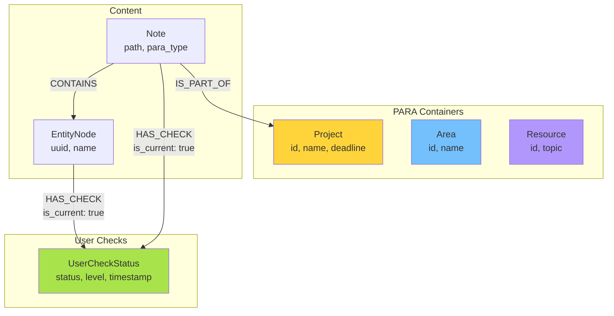
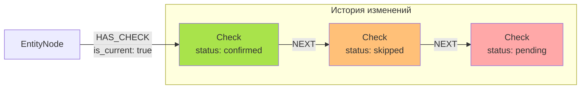

Отлично. Вот чистовая версия документа `03_GRAPH_SCHEMA.md`.

Я сделал акцент на визуализации и ясности. Диаграммы Mermaid помогут быстро понять структуру, а канонические Cypher-запросы служат готовыми шаблонами для реализации. Все свойства и связи соответствуют моделям данных из предыдущего документа.

---
--- START OF FILE 03_GRAPH_SCHEMA.md ---

# Схема графа Neo4j

**Дата создания:** 2025-11-17
**Статус:** Спецификация для реализации
**Версия:** 1.0

---

## Введение

Этот документ описывает **полную схему графа Neo4j** для системы многоуровневых подтверждений. Он включает типы нод (Labels), типы связей (Relationships), их свойства, а также индексы и ограничения, необходимые для MVP.

---

## 1. Типы нод (Labels)

### 1.1 `UserCheckStatus`

-   **Назначение:** Событие подтверждения пользователя.
-   **Ключевые свойства:**
    -   `id`: `string` (unique)
    -   `status`: `string` ("pending", "confirmed", "modified", ...)
    -   `confirmation_level`: `string` ("para_classification", "container_assignment", "entity")
    -   `timestamp`: `datetime`
    -   `confidence`: `float`
    -   `modifications`: `string` (JSON)
    -   `...` (см. `02_DATA_MODELS.md`)

### 1.2 `Project`, `Area`, `Resource` (PARA Containers)

-   **Назначение:** Высокоуровневые контейнеры для организации заметок.
-   **Ключевые свойства `Project`:**
    -   `id`: `string` (unique)
    -   `name`: `string`
    -   `status`: `string` ("active", "completed", ...)
    -   `deadline`: `date`
-   **Ключевые свойства `Area`:**
    -   `id`: `string` (unique)
    -   `name`: `string`
    -   `active`: `boolean`
-   **Ключевые свойства `Resource`:**
    -   `id`: `string` (unique)
    -   `topic`: `string`

### 1.3 `Note` (расширение)

-   **Назначение:** Заметка из Obsidian с кэшированными данными.
-   **Ключевые свойства:**
    -   `path`: `string` (unique)
    -   `para_type`: `string` (кэш)
    -   `project_id`: `string` (кэш)
    -   `_para_check_status`: `string` (кэш)

### 1.4 `EntityNode` (расширение)

-   **Назначение:** Извлеченная из текста сущность.
-   **Ключевые свойства:**
    -   `uuid`: `string` (unique)
    -   `name`: `string`
    -   `labels`: `[string]` (например, `["Person"]`)
    -   `attributes`: `map` (содержит вложенные `_current_check_status`, `_confidence` и др.)

---

## 2. Типы связей (Relationships)

### 2.1 `HAS_CHECK`

-   **Назначение:** Связывает сущность или заметку со статусом её подтверждения.
-   **Направление:** `(EntityNode|Note)-[:HAS_CHECK]->(UserCheckStatus)`
-   **Свойства:**
    -   `is_current`: `boolean` (`true` для текущего статуса, `false` для истории).

### 2.2 `NEXT`

-   **Назначение:** Формирует цепочку истории подтверждений (от нового к старому).
-   **Направление:** `(NewerCheck:UserCheckStatus)-[:NEXT]->(OlderCheck:UserCheckStatus)`
-   **Свойства:** Нет.

### 2.3 `IS_PART_OF`

-   **Назначение:** Связывает заметку с её PARA контейнером.
-   **Направление:** `(Note)-[:IS_PART_OF]->(Project|Area|Resource)`
-   **Свойства:**
    -   `assigned_at`: `datetime`
    -   `user_confirmed`: `boolean`

### 2.4 Существующие связи

Система также использует существующие связи из Graphiti: `CONTAINS`, `MENTIONS`, `ASSIGNED_TO` и др. Они не изменяются.

---

## 3. Визуальные диаграммы

### 3.1 Общая схема графа



### 3.2 История подтверждений (цепочка `NEXT`)



---

## 4. Индексы и ограничения (для MVP)

### 4.1 Constraints (Ограничения)

Обеспечивают целостность данных.

```cypher
// Уникальность ID
CREATE CONSTRAINT unique_entity_uuid IF NOT EXISTS FOR (e:EntityNode) REQUIRE e.uuid IS UNIQUE;
CREATE CONSTRAINT unique_check_id IF NOT EXISTS FOR (c:UserCheckStatus) REQUIRE c.id IS UNIQUE;
CREATE CONSTRAINT unique_project_id IF NOT EXISTS FOR (p:Project) REQUIRE p.id IS UNIQUE;
CREATE CONSTRAINT unique_area_id IF NOT EXISTS FOR (a:Area) REQUIRE a.id IS UNIQUE;
CREATE CONSTRAINT unique_resource_id IF NOT EXISTS FOR (r:Resource) REQUIRE r.id IS UNIQUE;
CREATE CONSTRAINT unique_note_path IF NOT EXISTS FOR (n:Note) REQUIRE n.path IS UNIQUE;

// Обязательные поля
CREATE CONSTRAINT required_check_status IF NOT EXISTS FOR (c:UserCheckStatus) REQUIRE c.status IS NOT NULL;
CREATE CONSTRAINT required_check_timestamp IF NOT EXISTS FOR (c:UserCheckStatus) REQUIRE c.timestamp IS NOT NULL;
```

### 4.2 Indexes (Индексы)

Критически важны для производительности.

```cypher
// Поиск по статусу (для dashboards)
CREATE INDEX index_check_status IF NOT EXISTS FOR (c:UserCheckStatus) ON (c.status);

// Поиск по времени (для аналитики)
CREATE INDEX index_check_timestamp IF NOT EXISTS FOR (c:UserCheckStatus) ON (c.timestamp);

// Композитный индекс для частых запросов
CREATE INDEX index_check_status_timestamp IF NOT EXISTS FOR (c:UserCheckStatus) ON (c.status, c.timestamp);

// Быстрый доступ к сущностям и контейнерам по ID
CREATE INDEX index_entity_uuid IF NOT EXISTS FOR (e:EntityNode) ON (e.uuid);
CREATE INDEX index_project_id IF NOT EXISTS FOR (p:Project) ON (p.id);
CREATE INDEX index_note_path IF NOT EXISTS FOR (n:Note) ON (n.path);
```

---

## 5. Канонические паттерны запросов

### 5.1 Получить текущий статус сущности

```cypher
MATCH (e:EntityNode {uuid: $entity_uuid})-[:HAS_CHECK {is_current: true}]->(check:UserCheckStatus)
RETURN check;
```

### 5.2 Получить полную историю сущности

```cypher
MATCH (e:EntityNode {uuid: $entity_uuid})-[r:HAS_CHECK]->(current:UserCheckStatus)
WHERE r.is_current = true
MATCH history_path = (current)-[:NEXT*0..]->()
WITH nodes(history_path) AS history
UNWIND history as check
RETURN check
ORDER BY check.timestamp DESC;
```

### 5.3 Найти все `pending` сущности

```cypher
MATCH (e:EntityNode)-[:HAS_CHECK {is_current: true}]->(c:UserCheckStatus {status: 'pending'})
RETURN e.uuid, e.name, labels(e)[0] as type, c.confidence, c.timestamp
ORDER BY c.confidence ASC, c.timestamp ASC
LIMIT 20;
```

### 5.4 Обновление статуса (транзакция)

Этот блок должен выполняться в одной транзакции.

```cypher
// 1. Найти текущий статус и сбросить is_current
MATCH (entity:EntityNode {uuid: $entity_uuid})-[r:HAS_CHECK {is_current: true}]->(old_check:UserCheckStatus)
SET r.is_current = false

// 2. Создать новый статус
WITH entity, old_check
CREATE (new_check:UserCheckStatus $properties) // $properties - это dict с данными новой ноды

// 3. Связать с entity как текущий
CREATE (entity)-[:HAS_CHECK {is_current: true}]->(new_check)

// 4. Связать с историей
CREATE (new_check)-[:NEXT]->(old_check)

RETURN new_check;
```

---

## 6. Целевая производительность (MVP)

| Операция | Целевое время | Требования |
| :--- | :--- | :--- |
| Получить текущий статус | < 50ms | Индекс на `uuid` |
| Найти все `pending` | < 100ms | Индекс на `status` |
| Полная история (10 статусов) | < 100ms | Обход `[:NEXT]` |
| Создать новый статус | < 50ms | Транзакция |

---

**Следующий документ:** [04_LANGGRAPH_WORKFLOW.md](./04_LANGGRAPH_WORKFLOW.md)