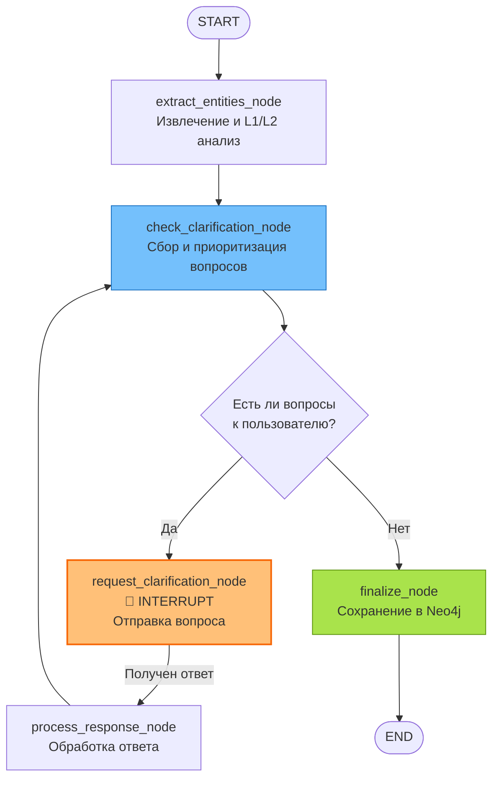

Конечно. Вот чистовая версия документа `04_LANGGRAPH_WORKFLOW.md`.

Этот документ — сердце всей системы. Я постарался сделать его максимально наглядным: диаграмма показывает общий поток, а описание узлов и логики переходов дает четкое представление о том, что происходит на каждом шаге. Особое внимание уделено механизму `interrupt`/`resume`, так как это ключевая особенность архитектуры.

---
--- START OF FILE 04_LANGGRAPH_WORKFLOW.md ---

# LangGraph Workflow

**Дата создания:** 2025-11-17
**Статус:** Спецификация для реализации
**Версия:** 1.0

---

## Введение

Этот документ описывает **архитектуру LangGraph workflow** для управления асинхронным процессом обработки заметок. Он включает описание состояния, узлов графа, условной логики и ключевого механизма `interrupt`/`resume` для взаимодействия с пользователем.

---

## 1. Архитектура workflow

### 1.1 Диаграмма



### 1.2 Принцип работы

1.  **Extract**: Система извлекает сущности из заметки, классифицирует её по PARA (L1) и ищет подходящие контейнеры (L2).
2.  **Check**: Система собирает все необходимые уточнения (L1, L2, L3) в единый список и приоритизирует их.
3.  **Request (Interrupt)**: Если есть вопросы, workflow **останавливается** и отправляет самый важный вопрос пользователю через WebSocket. Состояние сохраняется.
4.  **Process**: Когда пользователь отвечает (возможно, спустя долгое время), workflow **возобновляется**. Ответ обрабатывается, данные в графе обновляются.
5.  **Цикл**: Процесс возвращается к шагу **Check** для определения следующего вопроса.
6.  **Finalize**: Когда вопросов не остается, workflow завершается, сохраняя финальные результаты.

---

## 2. Состояние (NoteProcessingState)

Состояние — это `TypedDict`, который передается между узлами графа.

```python
from typing import TypedDict, List, Dict, Optional

class NoteProcessingState(TypedDict):
    """Состояние обработки заметки в LangGraph."""

    # Входные данные
    file_path: str
    content: str

    # Извлеченные данные
    entities: List[Dict]                      # Сериализованные EntityNode
    para_suggestion: Optional[tuple]          # (type, confidence) для L1
    container_suggestions: Optional[List[Dict]] # Предложения для L2

    # Очередь уточнений
    pending_clarifications: List[Dict]        # Список всех вопросов
    current_clarification: Optional[Dict]     # Текущий вопрос к пользователю
    user_response: Optional[Dict]             # Ответ пользователя

    # Статусы для отслеживания прогресса
    para_classification_check: Optional[Dict]
    container_assignment_check: Optional[Dict]
```

---

## 3. Узлы графа (Nodes)

### 3.1 `extract_entities_node`

-   **Назначение:** Первичная обработка текста.
-   **Действия:**
    1.  Вызывает `PipGraphManager` для извлечения `EntityNode` из текста заметки.
    2.  Создает начальные `UserCheckStatus` ноды со статусом `pending` для каждой сущности.
    3.  Вызывает сервис для L1-классификации (`para_suggestion`).
    4.  Вызывает сервис для поиска L2-контейнеров (`container_suggestions`).
-   **Выход:** Обновляет состояние полями `entities`, `para_suggestion`, `container_suggestions`.

### 3.2 `check_clarification_node`

-   **Назначение:** Формирование очереди вопросов.
-   **Действия:**
    1.  Собирает все необходимые уточнения:
        -   L1 (если `para_classification_check` еще не пройден).
        -   L2 (если L1 пройден, но `container_assignment_check` нет).
        -   L3 (все сущности со статусом `pending`).
    2.  Применяет логику `auto_confirm` к сущностям с высокой уверенностью.
    3.  Сортирует все вопросы по приоритету (L1 > L2 > L3, внутри L3 по типу сущности).
    4.  Помещает отсортированный список в `pending_clarifications`.
-   **Выход:** Обновляет `pending_clarifications`.

### 3.3 `request_clarification_node` (с Interrupt)

-   **Назначение:** Остановка workflow для получения ответа.
-   **Действия:**
    1.  Берёт первый вопрос из `pending_clarifications` и помещает его в `current_clarification`.
    2.  Вызывает `interrupt(current_clarification)`.
    3.  **Workflow останавливается**. Состояние сохраняется в `AsyncSqliteSaver`.
    4.  Возобновление произойдет только после получения `user_response`.
-   **Выход:** Возвращает `user_response` после возобновления.

### 3.4 `process_response_node`

-   **Назначение:** Обработка ответа пользователя.
-   **Действия:**
    1.  Анализирует `user_response` и `current_clarification`.
    2.  Вызывает соответствующий CRUD-сервис для обновления графа Neo4j:
        -   **L1/L2**: Создает/обновляет `UserCheckStatus` для `Note`, создает связь `IS_PART_OF`.
        -   **L3**: Обновляет статус `UserCheckStatus` для `EntityNode` (на `confirmed`, `modified` и т.д.).
    3.  Очищает `current_clarification` и `user_response`.
-   **Выход:** Обновляет состояние, удаляя обработанный вопрос.

### 3.5 `finalize_node`

-   **Назначение:** Завершение обработки.
-   **Действия:**
    1.  Логирует успешное завершение.
    2.  Может отправлять финальное уведомление пользователю.
-   **Выход:** Конец workflow.

---

## 4. Условная логика (Conditional Edges)

### 4.1 `should_continue_clarifications`

-   **Назначение:** Определяет, нужно ли задавать вопросы.
-   **Логика:**
    -   Если `pending_clarifications` **не пуст** → перейти к `request_clarification_node`.
    -   Если `pending_clarifications` **пуст** → перейти к `finalize_node`.

---

## 5. Механизм Interrupt/Resume

### 5.1 Техническая реализация

-   **Thread ID**: Каждая сессия обработки заметки получает уникальный `thread_id`, обычно `f"note:{file_path}"`. Это ключ, по которому LangGraph сохраняет и восстанавливает состояние.
-   **Checkpointer**: `AsyncSqliteSaver` используется для персистентного хранения состояния в файле SQLite. Для production-среды его можно заменить на Redis.
-   **WebSocket**: Служит каналом для отправки `clarification` клиенту и получения `user_response` от него.

### 5.2 Жизненный цикл

1.  **Запуск:** Приходит запрос на обработку заметки. Сервер создает `thread_id` и запускает workflow с начальным состоянием.
2.  **Interrupt:** Workflow доходит до `request_clarification_node` и останавливается. Сервер отправляет `clarification` клиенту.
3.  **Отключение:** Пользователь может закрыть приложение. Состояние надежно сохранено.
4.  **Возобновление:** Пользователь отправляет ответ. Сервер находит нужный `thread_id` и возобновляет workflow, передавая `user_response`.
5.  **Продолжение:** Workflow продолжает работу с того места, где остановился.

---

## 6. Приоритизация уточнений

Вопросы в `check_clarification_node` сортируются по следующему алгоритму:

1.  **По уровню (Level):**
    1.  L1: PARA Classification
    2.  L2: Container Assignment
    3.  L3: Entity Confirmation
2.  **Внутри L3 (по типу сущности):**
    1.  `Person`, `Organization` (высокий приоритет)
    2.  `Task`, `Decision` (средний приоритет)
    3.  `Idea`, `Source` (низкий приоритет)
3.  **По уверенности (Confidence):**
    -   При равных приоритетах выше будет вопрос с **меньшей** уверенностью системы.

Этот подход гарантирует, что пользователь сначала решает самые важные структурные вопросы, а затем переходит к деталям.

---

**Следующий документ:** [05_IMPLEMENTATION_PHASES.md](./05_IMPLEMENTATION_PHASES.md)